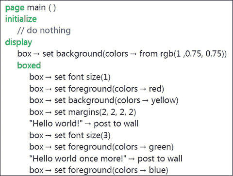
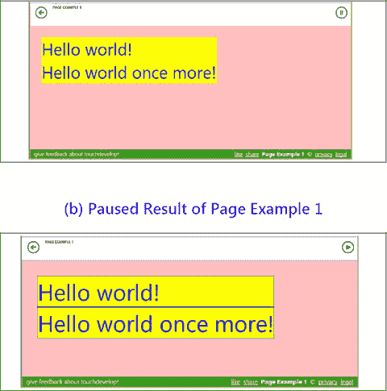
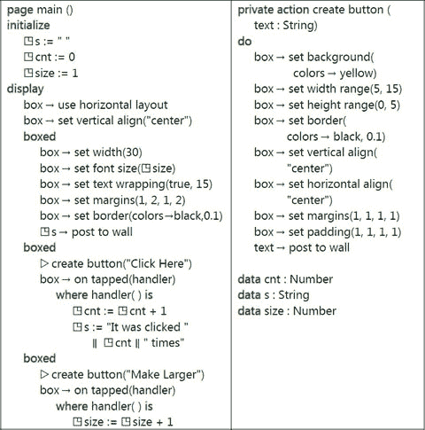
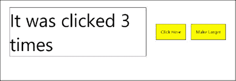
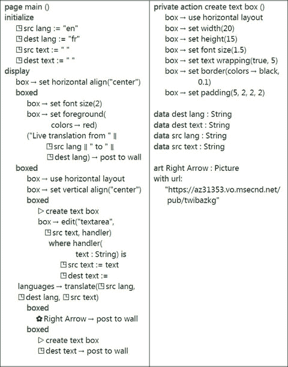
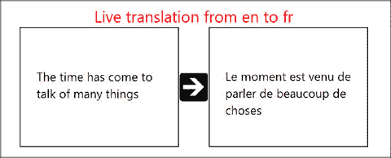
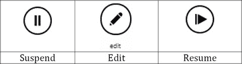

# 10. 使用框和页面的用户界面

10.1 页面概述 10.2 框概述 10.3 框和页面示例 10.4 使用页面 10.5 用户界面的实时编辑 10.6 框和页面的 API 支持 关键词 全局变量 字体大小 图形元素 当前页面 整个页面

一个充分利用屏幕空间、设计精良的用户界面，对于赋予程序专业的外观和感觉至关重要。TouchDevelop 中的页面（page）和框（box）结构为在屏幕上布局信息提供了强大的手段。一个有助于脚本开发者的独特功能是：可以在更改当前屏幕上显示信息的格式时暂停正在运行的脚本，然后可以恢复脚本的执行。


## 10.1 页面概述

`页面`的调用方式与操作类似。然而，当它被调用时，它将占据整个屏幕。屏幕上显示的所有内容都由该屏幕所属的代码（或由该页面调用的操作）创建。

页面以类似栈的方式管理。当页面 A 中的代码导致页面 B 被显示时，B 便接管屏幕。但是，当 B 结束或用户点击返回按钮时，屏幕会恢复显示 B 出现之前 A 所显示的内容。类似地，页面 B 也可能导致页面 C 被显示，而当 C 结束时，屏幕会再次回到显示页面 B。

页面的代码分为两个主要部分：初始化部分和显示部分。当页面被调用时，屏幕会被清空，然后执行初始化部分中的代码。这部分代码可以执行脚本语言中的所有语句，但不能在屏幕上显示任何内容。如果它试图在此空白屏幕上更改任何内容，脚本将停止执行并报错。初始化部分的目的是初始化全局变量，特别是那些将在页面显示部分使用的全局变量。

页面的显示部分负责在屏幕上渲染图像和文本。下面的`box`构造用于管理屏幕上信息的布局。显示部分中的代码有一个主要限制：它不能对任何全局变量进行赋值。如果显示部分的代码试图执行此类赋值，或调用试图执行此类赋值的操作，脚本将停止执行并报错。

对初始化部分和显示部分内容的限制，给脚本开发者带来了一定的编程风格要求。然而，这些限制也提供了一个显著的好处：它们允许脚本开发者在脚本执行暂停期间修改屏幕的布局和内容，然后以新的屏幕布局生效来恢复执行。因此，开发者可以纠正和/或改进脚本的用户界面，而无需停止脚本并从头开始重新运行。

## 10.2 盒子概述

页面的显示部分负责在屏幕上渲染视觉元素。在该屏幕区域内，任何可以在墙上显示的值都可以在这里显示。

不过，有一个特殊功能仅可在页面的显示部分中使用。这个新功能叫作`盒子`，它在脚本中通过关键字`boxed`引入。任何图形元素集合都可以被“盒子化”，这意味着该集合可以被视为一个称为盒子的单一单元。这个盒子本身便成为一个图形元素。

一个盒子代表屏幕上的一个矩形区域。矩形的大小通常会默认为恰好包裹其内容所需的大小。或者，可以指定一个或两个维度的尺寸，或将其约束在所需的范围内。如果需要，还可以为盒子添加滚动条。

图形用户界面的一个重要部分是信息输入功能。可以将代码附加到盒子上，当盒子被点击（或用鼠标单击）时执行这些代码。包含文本的盒子可以被标记为可编辑的，并且可以附加代码到该盒子，每当文本内容被更改时执行这些代码。附加的代码必须采用变更处理器的形式。对于点击事件，变更处理器是一个无参数的操作。对于文本更改操作，它是一个接受单个`字符串`参数的操作；该字符串是更新后文本的一个副本。

## 10.3 盒子和页面的示例

页面可以通过使其成为脚本启动时执行的第一个操作来显示，也可以通过使用`push`语句来显示。如果在开始创建脚本时选择了名为`pages`的脚本模板，则会自动选择第一种方式。这里讨论的第一个示例就是通过这种方式创建的。

### 10.3.1 页面示例 1 (`/bvhugenw`)

图 10-1 与脚本模板非常相似。但为了说明几个要点，进行了一些修改。

`boxed`关键字创建了一个新的盒子。它是一个容器盒子，因为它旨在容纳绘制在屏幕上的图形元素。该盒子的内容和格式由其下方缩进的代码指定。在此示例中，有两行文本被写入墙，这意味着它们被写入作为盒子的内容。脚本运行后，屏幕会显示如图 10-2(a) 所示的内容。

文本行一个接一个地上下排列，并在盒子内左对齐。图形元素的垂直布局并左对齐是默认设置。这两个默认值都可以被覆盖。



图 10-1  
页面示例 1 (`/bvhugenw`)

该示例的意外之处在于，两行文本的大小和颜色完全相同。原因在于，盒子内部定义的图形元素（本例中为两个文本字符串）在盒子内的所有语句执行完毕之前不会被渲染。只有对前景色的最后一次更改和对字体大小的最后一次更改才会生效。

这两行文本本身也是盒子，但它们被称为叶子盒子，因为它们不包含任何更低层级的盒子。通过点击屏幕右上角的暂停按钮，可以查看屏幕上所有盒子的范围。图 10-2(b) 显示了暂停脚本后的浏览器窗口。细蓝线分别包围了两行文本。这两个叶子盒子合起来构成了容器盒子的全部内容，并对应于`boxed`构造内部的代码。这就是为什么容器盒子的背景颜色是黄色的。容器盒子周围的粉色区域对应整个页面——它是绘制盒子的框架。语句 `box` → `set margins(2, 2, 2, 2)` 影响了容器盒子在该外部框架内的位置。

正如页面示例 1 的代码所示，通过在显示部分的代码中直接使用`box`变量，可以为框架指定某些类型的格式。

叶子盒子可以通过多种方式创建，包括在墙上张贴文本，或从脚本的图库部分将图像张贴到墙上。叶子盒子中文本的格式继承自其外层的容器盒子。



图 10-2  
(a) 页面示例 1 的运行结果


### 10.3.2 页面示例 2 (`/hnimxaiw`)

第二个示例介绍了点击框时执行的事件，并展示了页面中初始化部分的必要性（图 10-3）。

页面的显示部分定义了三个框。由于显示部分调用了方法 `box → use horizontal layout`，这三个框在屏幕上从左到右绘制。此外，这些框垂直对齐，使它们的中心点位于一条直线上。

第一个框包含从全局变量 `s` 复制的文本，并使用由全局变量 `size` 指定大小的字体进行绘制。代码还设置了该框的属性，以便在文本容纳不下时自动换行，并在框周围绘制实线。

第二个和第三个框都设计为可点击。它们被绘制成相同大小并使用相同颜色。因此，为了避免重复编写两个框的代码，设置每个框属性的代码被定义在名为 `create button` 的操作内部。每当在该操作内部使用标识符 `box` 时，它都指向当前正在定义的框。

在为每个框调用 `create button` 操作后，会调用 `on tapped` 方法为框附加一个变更处理程序。对于点击操作，变更处理程序采用无参数操作的形式，并且该操作必须在脚本中使用 `where` 子句在此处定义。

变更处理程序内部的代码可以执行 TouchDevelop 脚本允许的任何操作，但以下情况除外：为局部变量赋值、更改当前框的任何属性或直接更改正在显示的内容。如果点击框的操作要对当前页面产生任何影响，变更处理程序必须通过全局变量来传递更改。

显示“Click Here”文本的框的变更处理程序会递增一个名为 `cnt` 的全局变量，然后使用 `cnt` 的新值来构造一个存储在全局变量 `s` 中的字符串值。需要注意的是，`s` 被用于提供在页面中绘制的第一个框内显示的内容。

类似地，显示“Make Larger”文本的框的变更处理程序会递增一个全局变量，该变量指定了页面上第一个框中显示文本所使用的字号。

运行脚本时，第一个框最初是空的。然而，当点击“Click Here”框时，第一个框会变为显示字符串“It was clicked 1 times”。随后每次点击操作都会将该数字从 1 变为 2，再变为 3，以此类推。屏幕上框内容的改变之所以发生，是因为每当发生可能影响页面的事件时，整个页面都会被重新绘制。重新绘制页面的原因包括：



**图 10-3** 页面示例 2 (`/hnimxaiw`)

-   在页面上执行变更处理程序，
-   点击屏幕右上角的挂起按钮，然后恢复脚本，
-   显示另一个页面然后返回此页面，
-   任何全局变量或记录被修改。

在分别点击“Click Here”和“Make Larger”按钮几次后的屏幕如图 10-4 所示。请注意，第一个框的文本换行属性已设置，并且当字号增大时，字符串会被换行成两行文本。由于没有指定框的高度，它会自动增高以容纳这两行文本。



**图 10-4** 运行页面示例 2 的结果

### 10.3.3 页面示例 3 (`/wrsonnwh`)

第三个示例脚本展示了如何使用变更处理程序处理可编辑文本以及如何嵌套框来实现图形元素的期望布局。

图 10-5 中显示的脚本允许用户在左侧框中输入英文文本。每当用户暂停输入时，就会调用变更处理程序。它的输入参数是当前文本版本的一份副本。该输入参数通常被原样分配给与该框关联的全局变量。（编辑器确保总是存在这样一个变量，并且它是 `String` 类型。）然而，可以向变更处理程序添加额外的操作。在本例中，这个额外操作是调用必应语言翻译服务，将英文输入翻译成法语，法语版本的文本会显示在右侧框中。

使用该脚本翻译一个句子后的屏幕截图如图 10-6 所示。



**图 10-5** 页面示例 3 (`/wrsonnwh`)

此脚本的生产版本可能会允许用户选择翻译的源语言和目标语言。这个更好的版本可能会使用语言的全称，而不是两个字母的缩写。它可能只会在用户点击两个框之间的箭头时执行翻译。当用户在左侧框中输入文本时，部分翻译结果不断弹出和变化可能会令人不安。此外，每次翻译文本时都会进行网络连接，对于通过手机网络通信的平板设备来说，这可能是不希望的。这些增强功能留待读者作为练习。



**图 10-6** 页面示例 3 生成的翻译

## 10.4 使用页面

页面的显示部分处理的是运行脚本的浏览器的整个窗口。该窗口实际上就是显示部分内部立即执行的任何代码（即未嵌套在框结构内的代码）的当前框。

### 10.4.1 进入和离开页面

页面只是一种特殊的操作。如果它是公共的且没有任何参数，它可以作为脚本的入口点被调用。它也可以像普通操作一样被调用。例如，如果脚本定义了一个名为 `show` 的页面，那么可以通过执行调用 `▷ show` 来显示该页面。当脚本代码显示在屏幕上时，调用语句显示为 push `▷ show`，表明 TouchDevelop 运行时维护着一个页面栈。

不用作脚本入口点的页面可以接受输入参数，但不能有任何输出参数。

可以通过点击网页左上角出现的返回箭头来退出（终止）页面。在 Windows 手机上，按下返回键可以达到同样的效果。也可以通过执行语句 `wall → pop page` 来退出页面。该语句通常用在变更处理程序内部。下面是一个示例。

```
boxed
    “Click here when done” → post to wall
    box → on tapped(handler)
        where   handler( ) is
            wall → pop page
```


### 10.4.2 编码限制

页面的初始化部分不能在页面上绘制任何元素。它可以声明并使用局部变量，但这些变量无法在页面的显示部分内访问（它们属于超出作用域范围）。通常，初始化部分用于初始化显示部分所需的全局变量。

页面的显示部分可以使用但不能赋值给全局变量。（即使变更处理程序定义在显示部分内，它们也不被视为显示部分的一部分。）显示部分可以正常使用局部变量，并可以使用循环、if 语句等常规控制结构。其主要用途是在当前页面上渲染图形元素。

附加到当前页面上的方框的变更处理程序可以使用并赋值给全局变量。它们可以使用但不能赋值给显示部分中的局部变量（前提是这些局部变量可见）。常规作用域规则在此适用。它们不能在屏幕上绘制任何元素，也不能设置当前方框的任何属性。

当控制权从变更处理程序返回、或当另一个页面退出后当前页面再次成为活动页面、或当某个全局变量或记录被更改时，页面显示部分中的所有语句都会重新执行，整个页面也会被重新绘制。相比之下，初始化部分的代码仅在创建页面的新实例并将其推入页面堆栈时执行一次。

标识符 `box` 指代当前方框，可以在任何存在活动当前方框的上下文中使用。如果在某个动作内部引用了 `box`，则根据控制权到达该动作的方式，可能存在也可能不存在当前方框。如果不存在当前方框，则会引发运行时错误。当控制权位于页面的显示部分内、或位于从页面调用的某个动作内、或位于附加到方框的变更处理程序内时，始终存在当前方框。当页面的初始化部分正在执行时，则不存在当前方框。

即使存在当前方框，其访问权限也可能仅限于只读（例如获取 `box` → `pixels per em` 的当前值）。只有在页面的显示部分内或从显示部分调用的动作内，才允许调用设置当前方框属性的方法。

## 10.5 用户界面的实时编辑

在脚本执行过程中，页面很容易调试和修改。脚本开发者无需每次做小改动时都停止脚本并从开头重新启动。当脚本在浏览器中运行时，浏览器窗口右上角会显示一个暂停按钮。暂停按钮如图 10-7 所示。



图 10-7

用户界面编辑图标

点击该按钮会在当前屏幕上显示的每个方框周围绘制一条非常细的蓝线，同时暂停按钮会被替换为恢复按钮，如图 10-7 所示。

此时脚本不再运行。点击由细蓝线构成的某个矩形内部，该矩形会附加一个更粗的红色虚线矩形，并会在屏幕上显示一个标有“编辑”的按钮。编辑按钮如图 10-7 所示。这条红色虚线矩形表示已选中的方框。双击则会改为选中外层包裹的方框。当方框结构嵌套足够深时，三击等操作也类似。

点击编辑按钮会调用脚本编辑器，并精确定位到所选方框对应的代码上。在足够宽的显示屏幕上，浏览器窗口会被分割，左侧显示当前页面，右侧显示所选方框的代码。（如果页面视图占用了太多屏幕空间，可以点击其左上角的关闭按钮将其移除。）

现在可以编辑脚本代码。改动可以很小，也可以很大。对于整个脚本中的哪些代码可以更改，没有任何限制。当修改完成并需要查看是否达到预期效果时，应先关闭当前页面的视图（如果尚未关闭），然后点击屏幕左侧的恢复按钮。

恢复脚本执行会导致当前页面的显示部分被重新执行，页面会被重新绘制，以反映对代码所做的任何更改。可以按需多次重复执行“运行-暂停-编辑-恢复”这一循环，直到用户界面达到完美状态。

需要注意的是，如果对代码进行了重大更改，例如更改了脚本中其他地方调用的动作，那么可能需要从头重新启动脚本才能看到其完整效果。


## 框与页面的 API 支持

`box` 标识符命名了一个拥有 `Box` 数据类型的服务。该类型只有一个实例，它是一个单例。

TouchDevelop 中的框（box）和页面（page）构造是脚本语言的新增功能，目前仍在开发中。表 10-1、表 10-2 和表 10-3 列出了撰写本文时 `box` 服务提供的方法。但是，可能会提供额外的方法，并且/或者当前某些方法可能会被修改为以不同的方式工作。有关这些构造的最可靠和最新的信息来源是 TouchDevelop 网站。

### 表 10-3：`box` 服务的布局方法

| 方法 | 描述 |
| --- | --- |
| `use horizontal layout` | 将框和其他项目从左到右水平排列 |
| `use vertical layout` | 将框和其他项目从上到下垂直排列 |
| `use overlay layout` | 将此框内的框和其他显示项目排列为相互叠加的图层 |
| `set horizontal align(s: String)` | `s` 是 "left"、"right"、"center" 和 "justify" 之一，指示框内文本和其他项目的排列方式 |
| `set vertical align(s: String)` | `s` 是 "top"、"bottom"、"center" 和 "baseline"（用于文本）之一，指示框内文本和其他项目的垂直排列方式 |

### 表 10-2：`box` 服务的文本处理方法

| 方法 | 描述 |
| --- | --- |
| `set font size(n : Number)` | 设置框中显示文本的字体大小；`1.0` 是当前的默认大小。 |
| `set text wrapping(wrap: Boolean, min: Number)` | 指定长文本行是否应换行，以及多短的长度不宜拆分 |
| `set horizontal align(s: String)` | 指定如何格式化框中的文本；参数是 "left"、"right"、"center" 或 "justify" 之一 |
| `pixels per em` | 返回字母 'm' 以像素为单位的宽度 |
| `edit(style: String, v: String, changehandler: Action)` | 显示来自全局变量 `v` 的文本，该文本可被编辑。`style` 参数是 "textline"、"textarea"、"number" 或 "password" 之一。每次文本更改时都会调用 `changehandler`。 |

### 表 10-1：`box` 服务的通用方法

| 方法 | 描述 |
| --- | --- |
| `set background(c : Color)` | 设置背景颜色 |
| `set foreground(c : Color)` | 设置框中绘制项目的颜色 |
| `set height(h : Number)` | 为框设置精确高度 |
| `set height range(min : Number, max : Number)` | 为框设置高度范围 |
| `set width(w : Number)` | 为框设置精确宽度 |
| `set width range(min : Number, max : Number)` | 为框设置宽度范围 |
| `set border(c : Color, w : Number)` | 设置框边缘线条的颜色和宽度 |
| `set horizontal stretch(f: Number)` | 控制如何计算框宽：`f = 0.0` 表示收缩以适合内容，`f = 1.0` 表示扩展以填充框架，`f = 0.5` 表示扩展到框架宽度的 50%。 |
| `set padding(t: Number, r: Number, b: Number, l: Number)` | 指定围绕框保留多少空间：`t`、`r`、`b` 和 `l` 分别决定上、右、下和左侧。 |
| `on tapped(handler: Action)` | 为框关联一个处理程序动作，当框被点击时调用 |

 开放获取 本章采用知识共享署名-非商业性使用-禁止演绎 4.0 国际许可协议 ([`​creativecommons.​org/​licenses/​by-nc-nd/​4.​0/​`](http://creativecommons.org/licenses/by-nc-nd/4.0/)) 授权。只要您给予原作者和来源适当的致谢，提供指向知识共享许可协议的链接，并标明您是否修改了许可材料，该协议允许以任何媒介或格式进行任何非商业用途的使用、共享、分发和复制。您无权根据此许可协议分享本章或其中部分内容的改编材料。除非在材料的致谢行中另有说明，本章中的图片或其他第三方材料均包含在本章的知识共享许可协议范围内。如果某材料未包含在本章的知识共享许可协议中，且您的预期使用不受法规允许或超出允许范围，您需要直接向版权所有者获取许可。

