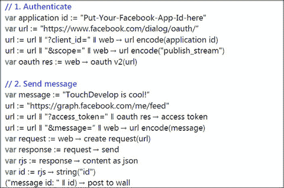
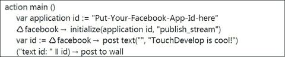

# 认证 Web 服务

11.1 注册您的应用 11.2 身份认证 11.3 库 11.4 高级主题

互联网上有很多 Web 服务允许客户端应用程序查询和存储各种结构化的信息。某些 Web 服务要求用户进行身份认证才能使用受保护的资源。

## 注册您的应用

一个常见的 Web 服务调用来源是 Facebook 的图形 API¹。通过此 API，您可以查询和提交图片、状态更新、评论等。所有交互都是以特定 Facebook 用户的名义进行的。该用户必须授权应用程序访问其信息的任何部分。

OAuth v2.0 是一种由微软、Facebook、谷歌等公司支持的通用 Web 服务认证机制。TouchDevelop 支持规范第 4.2 节中定义的 OAuth 2.0 隐式授权流程协议 ([`​tools.​ietf.​org/​html/​rfc6749`](http://tools.ietf.org/html/rfc6749))。目前不支持其他协议。在为受保护的 Web 服务协商访问令牌后，TouchDevelop 提供处理并创建 JSON 和 XML 等格式的结构化数据的能力。

在您使用 OAuth 机制访问 Web 服务之前，您需要向 Web 服务的提供商注册您正在开发的应用。每个 Web 服务都有其自己的注册机制；您必须查找并遵循您要使用的服务提供的说明。

在注册过程中的某个时刻，系统会要求您提供“重定向 URI”。您必须精确地输入以下重定向 URI。

`https://www.touchdevelop.com/[userid]/oauth`

其中 `[userid]` 是您的 TouchDevelop 用户 ID。这是一个简短的字符合，例如 `pboj`，这恰好是 TouchDevelop Samples 用户的用户 ID。请将浏览器指向 [`​www.​touchdevelop.​com/​me`](https://www.touchdevelop.com/me) 来查找您的用户 ID。您将被重定向到一个新的 URL，可能会在要求登录之后。新的 URL 格式为 `https://www.touchdevelop.com/[userid]`。

只有您在账户下发布的 TouchDevelop 脚本才能使用此重定向 URI。有关如何处理您要使用的 OAuth 提供者要求每个应用具有唯一重定向 URI 的情况的说明，请参阅后面关于唯一重定向 URI 的章节。


## 11.2 身份验证

OAuth 2.0 身份验证通过 `web` → `oauth v2` 动作处理。该动作接收 OAuth URL，其中包含 `client_id` 以及可选的 scope 或其他参数。请**不要**包含 `state` 和 `redirect_uri` 参数；它们由 TouchDevelop 自动添加。

```
var oauth res := web → oauth v2(url)
```

响应中包含访问令牌或错误详情（如有）。然后，您可以根据服务要求，使用该访问令牌对每个请求进行签名。

```
var access token := oauth res → access token
var call := "http://....?access_token=" ∥ web → url encode(access token)
```

您可以使用 `is expiring` 动作轻松测试访问令牌是否缺失或（即将过期）。

```
if oauth res → is expiring(100) then
     // 糟糕，最好请求一个新令牌。
else do nothing
```

**表 11-2**  
OAuth 响应类型的属性

| 方法 | 描述 |
| --- | --- |
| `access token : String` | 授权服务器颁发的访问令牌。 |
| `error : String` | 单个 ASCII [USASCII] 错误代码。 |
| `error description : String` | （可选）一个人可读的错误代码。 |
| `error uri : String` | （可选）一个 URI，用于标识包含错误信息的人可读网页，用于向客户端开发者提供有关错误的附加信息。 |
| `expires in : Number` | （可选）访问令牌的生命周期（秒）。 |
| `is error : Boolean` | 指示此响应是否为错误。 |
| `is expiring(lookup : Number) : Boolean` | （可选）指示令牌是否可能在接下来的若干秒内过期。 |
| `is invalid : Boolean` | 如果当前实例无用，则返回 true。 |
| `others : String Map` | （可选）OAuth 2.0 规范未涵盖的其他键值对。 |
| `post to wall` | 显示该响应。 |
| `action scope : String` | （可选）如果与客户端请求的 scope 相同，则为可选；否则，为访问令牌的 scope，如 OAuth 2.0 规范第 3.3 节所述。 |

**表 11-1**  
与 OAuth 2.0 相关的通用方法

| 方法 | 描述 |
| --- | --- |
| `web → oauth v2(oauth url : String) : OAuth Response` | 使用 OAuth 2.0 进行身份验证，并接收访问令牌或错误。 |

图 11-1 展示了如何使用 TouchDevelop 提供的 OAuth 功能来向 Facebook 发布消息：

1.  它构建一个 URL，该 URL 将针对特定的“scope”（定义了您的应用请求何种权限）触发您应用的 Facebook 身份验证过程。
2.  然后，它发送包含待发布文本的实际消息。请注意，不仅消息文本被编码在 URL 中，而且先前的身份验证调用所获得的 `access_token` 也被编码在 URL 中。

如果您使用不同的网络服务，或想要发布其他类型的信息，可能需要将 `access_token` 传递到网络请求的头部字段中，并且可能必须将有效负载作为 POST 网络请求的主体发送。请查阅您要使用的网络服务的文档。



**图 11-1**  
使用 OAuth 向 Facebook 发布消息

## 11.3 库

以下 TouchDevelop 库已经为多个 API 实现了 OAuth 2.0 身份验证。每个库都包含关于如何注册应用程序以便使用它们的详细说明。只需在“添加库引用”对话框中搜索库的名称即可。

- Microsoft Live
- Facebook
- Google
- Yammer
- FourSquare
- Instagram
- Meetup

图 11-2 展示了如何使用 TouchDevelop 提供的 Facebook 库在 Facebook 上发布消息。在使用 `♻ facebook` 表达式之前，您必须在脚本中添加对 Facebook 库的引用。



**图 11-2**  
使用 Facebook 库

## 11.4 高级主题

### 11.4.1 唯一重定向 URI

某些 OAuth 提供商（例如 Microsoft Live）要求每个应用程序使用具有唯一域名的唯一重定向 URI。在这种情况下，仅特定于您用户 ID 的基本重定向 URI 将不起作用。相反，您可以使用以下重定向 URI 方案：

```
https://[rdid]-[userid].users.touchdevelop.com/oauth
```

其中，`[rdid]` 是您可以为应用选择的唯一标识符（“重定向域名 ID”，少于 64 个小写字母数字 ASCII 字符），而 `[userid]` 和以前一样是您的 TouchDevelop 用户 ID。

```
oauth res := web → oauth v2(url ∥ "&tdredirectdomainid=[rdid]")
```

将身份验证 URL 传递给 `web` → `oauth v2` 时，请添加一个 `tdredirectdomainid` 查询参数来指定您的 `[rdid]`。

### 11.4.2 重定向 URI 中的状态变量

某些 OAuth 提供商无法在重定向 URI 中传递 `state` 参数，这会破坏 TouchDevelop 的 OAuth 支持。在这种情况下，请向身份验证 URL 添加一个 `tdstateinredirecturi=true` 查询参数。

```
oauth res := web → oauth v2(url ∥ "&tdstateinredirecturi=true")
```

 开放获取 本章根据知识共享署名-非商业性使用-禁止演绎 4.0 国际许可协议 ([`creativecommons.org/licenses/by-nc-nd/4.0/`](http://creativecommons.org/licenses/by-nc-nd/4.0/)) 的条款进行许可，该许可允许任何非商业用途，只要您给予原作者和出处适当的署名，提供知识共享许可协议的链接，并指明是否修改了许可材料，即可在任何媒介或格式中共享、分发和复制。您没有在本许可下分享源自本章或其部分内容的改编材料的权限。本章中的图片或其他第三方材料已包含在本章的知识共享许可协议中，除非在材料的署名行中另有说明。如果材料未包含在本章的知识共享许可协议中，且您的预期使用不受法定法规允许或超出允许范围，您将需要直接向版权所有者获取许可。脚注 1

[`developers.facebook.com/docs/reference/api/`](http://developers.facebook.com/docs/reference/api/)

