# 编辑 TouchDevelop 脚本

A.1 起始点  
A.2 编辑步骤  
A.3 额外步骤  
A.4 更多高级编辑功能  
关键词：主要动作、插入点、编辑动作、浏览器窗口、脚本编辑器

本附录提供了一个使用在浏览器内运行的编辑器创建 TouchDevelop 脚本的实际示例。它无法涵盖编辑器的所有功能。建议进行一些尝试以熟悉该编辑器。要输入的脚本如图 A-1 所示。它以名称 rotor 和代码名称 `/gtbd` 发布。

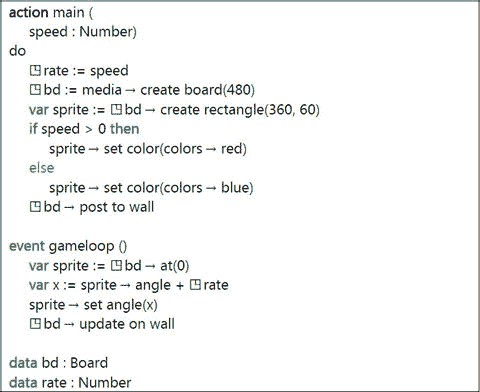

**图 A-1**  
rotor 程序 `/gtbd`


## A.1 起点

登录 TouchDevelop 网站后，你当前所在的网页是 URL 为 [`https://www.touchdevelop.com/app/`](https://www.touchdevelop.com/app/) `#` 的页面。此网页被称为中心页面。

在中心页面的左上方，**我的脚本**标题下应该有一组磁贴。如果你之前创建或下载过一些脚本，这里会显示最近使用过的脚本的磁贴。如果你想要编辑其中某个脚本，只需点击其磁贴，然后点击标有 **编辑** 的大型橙色磁贴。如果你没有看到之前创建或下载的脚本的磁贴，请点击标有 **查看更多** 的磁贴，浏览器将显示一个包含更多脚本磁贴的网页，列表末尾还有一个标有 **加载更多** 的按钮。点击该按钮会按预期执行操作，用更多磁贴扩展列表，并在末尾添加一个新的 **加载更多** 按钮。

在我们的示例中，我们将创建一个全新的脚本，因此点击标有 **创建脚本** 的磁贴。这会让浏览器显示一个可滚动的脚本模板列表。列表的顶部区域如图 A-2 所示。我们应该浏览列表，看看是否有我们想要创建的脚本类型的模板。在我们的示例中，我们点击名为 **空白** 的模板，因为其他模板似乎都不合适。

浏览器现在显示了一个文本框，我们需要在其中输入新脚本的名称。文本框中已提供了一个默认名称，类似于"我的脚本 5"，但我们将把它改为"rotor"。输入该文本后，我们点击标有 **创建** 的按钮。

浏览器现在显示 TouchDevelop 脚本编辑器的网页。如图 A-3 的截图所示，该网页分为三栏。

*   较窄的左栏包含标有 **我的脚本**、**运行** 和 **撤销** 的按钮。**撤销** 按钮非常有用，因为它可以撤销任何误操作导致的编辑效果。
*   较宽的第二栏有一个新脚本本身的磁贴，点击该磁贴会弹出一个脚本属性页面，可以在其中更改脚本的名称，以及许多其他属性，这些属性在脚本完成前暂时不需要用到。

在初始磁贴下方有几个标题，分别对应脚本的每个可能部分。每个标题下，都会有一个磁贴代表已添加到脚本中的每个操作、每个页面、每个事件……等。目前，只有一个名为 **main** 的操作的磁贴。

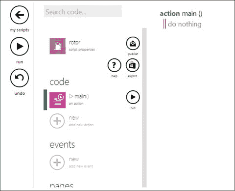

图 A-3 编辑器网页

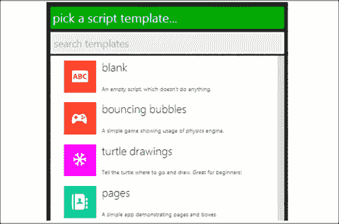

图 A-2 最初的几个脚本模板

*   浏览器窗口的其余部分专用于第三栏，即编辑窗口。开始时，该窗口包含主操作（main action）的代码。模板中提供了一个什么也不做的最小化版本的操作。

## A.2 编辑步骤

在按照下面详述的编辑步骤操作时，屏幕内容会多次变化。出于篇幅考虑，本附录中只收录了部分截图。

### 开始操作 – 提供一个输入参数

主操作（main action）的脚本将被修改，使其拥有一个参数。其代码将如下所示。

```
action main( speed : Number )
do
// 什么都不做
```

1.  如果主操作的代码没有显示，请点击主编辑器网页第二栏中 **代码** 标题下的主操作磁贴（如图 A-3 所示）。
2.  我们的脚本需要为其主操作（main action）提供一个输入参数，因此请点击主操作代码第一行的任意位置——即写着 "`action main()`" 的那一行。这将改变网页的第二栏。
3.  在第二栏中，有一个大的灰色加号符号和文字"添加输入参数"。点击该加号符号。第三栏中显示的 main 代码会立即发生变化，显示一个名为 `p`、类型为 `Number` 的输入参数。
4.  我们不想保留参数的名称 `p`，因此请点击显示 `p: Number` 的代码行的任意位置。网页会随之变化，第二栏显示参数 p 的详细信息，第三栏则指示我们当前聚焦于脚本的哪个部分。
5.  在第二栏中，参数的名称 `p` 显示在一个可编辑内容的文本框中。使用鼠标或触摸屏上的手指选中名称 `p`，并输入替换名称：speed。（编辑器已猜出了参数的正确类型，因此无需更改。如果我们想要不同的类型，点击 `Number` 类型的磁贴将允许我们选择其他类型。）点击第三栏的任意位置，代码将重新显示，并带有新的参数名称。

### 向操作中添加第一条语句

要插入的第一条语句是 `◳rate := speed`

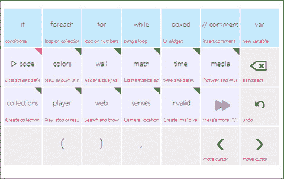

图 A-5 右侧键盘

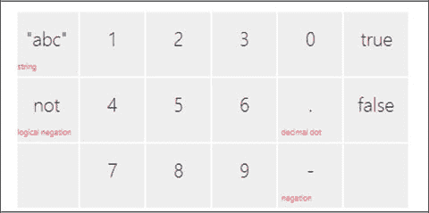

图 A-4 左侧键盘

1.  点击写着"什么都不做"的注释的任意位置。这将导致注释消失，并替换为一个竖条，指示后续编辑操作的插入点。更重要的是，浏览器窗口底部会并排出现两个键盘。这两个键盘如图 A-4 和图 A-5 所示。左侧键盘用于输入或编辑常量（数字、字符串和布尔值）。右侧键盘用于输入语句和表达式。
2.  右侧键盘的顶行显示了不同类型的语句。我们希望插入一个对新变量的赋值，因此点击标有 **var** 的磁贴。代码会发生变化，显示对一个名为 x 的新变量的赋值，其右侧为空。红色条位于右侧，指示编辑器将在何处插入新项目。见图 A-6。窗口底部的右侧键盘也发生了变化；现在只显示可以出现在代码当前插入点的项目。
3.  键盘中有一个磁贴标有 **speed**。点击该磁贴。标识符 speed 被插入到赋值的右侧。
4.  右侧已完成，但左侧并不是我们想要的变量。选中赋值的左侧。这会导致插入条出现在名称 x 的右侧。此外，屏幕底部的右侧键盘再次发生变化。有一个标有 **重命名** 的磁贴。点击它。
5.  在键盘上输入所需的名称 rate。然后点击屏幕下方任意位置。操作的代码会重新显示，语句显示为 `var rate := speed`。
6.  我们不希望 rate 是一个局部变量，因此点击该语句的任意位置，然后点击左侧。插入条会出现在名称 rate 旁边，右侧键盘也会重新出现。
7.  点击标有 **提升到`▯data`** 的磁贴。这将导致代码重新显示，赋值现在显示为 `◳rate := speed`。窗口中的第二栏也发生了变化；脚本的 data 部分中出现了一个名为 rate 的全局变量。


好的，作为高级文档工程师和翻译员，我将遵循您提供的注意事项，将给定的英文文本翻译成中文。


### 添加第二条和第三条语句

要插入的两条语句如下：

```
◳bd := media→ create board(480)
var sprite := ◳bd → create rectangle(360,60)
```

1.  点击先前插入的赋值语句的右侧；这将使插入标记出现在标识符 `speed` 之后。现在按下回车键。随即出现一个空行，插入标记位于其左端。
2.  点击键盘上的 `var` 图块，开始为新的变量编写一条新的赋值语句。
3.  点击标记为 `media` 的图块。API 中的每个服务或资源都有一个对应的图块。如果您没有看到所需的服务，可以点击标记为“there's more”的特殊图块。（如图 A-5 所示。）
4.  点击 `media` 图块后，标识符 `media` 会出现在语句代码中，并且键盘会发生变化。键盘上的图块现在全部标记为 `media` 服务提供的所有方法。点击 `create board` 图块。
5.  代码中会出现一个对 `create board` 方法的调用，其默认参数为 `640`。编辑器的插入点显示在 `640` 数值的右侧。点击键盘上的退格键图块三次，按顺序删除 `'0'`、`'4'`、`'6'` 这三个字符。然后点击左侧键盘上标记为 `'4'`、`'8'`、`'0'` 的图块，输入新数字 `480`。
6.  按照上面为变量 `rate` 给出的相同步骤，将赋值左侧的变量名更改为 `bd`，并将其提升为全局变量。
7.  在上一条语句下方插入一个新的空行。简单的方法是点击添加下方按钮，如图 A-6 所示。它是当前语句下方的加号符号。（或者，将插入点移动到语句的右端，然后按下键盘上的回车键。）
8.  使用与之前相同的技巧，插入以下语句：

```
var sprite := ◳bd → create rectangle(360,60)
```

（要将全局变量 `◳bd` 插入右侧，请在键盘上找到标记为 `◳data` 的键；点击该键后，会出现一个标记为 `bd` 的键，每个已定义的全局变量对应一个键，应点击该键。）

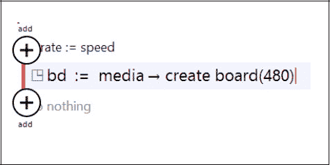

*图 A-6 — 添加上方和添加下方按钮*

### 插入 `if` 语句

要插入的语句如下：

```
if speed > 10 then
  sprite → set color(colors → red)
else
  sprite → set color(colors → blue)
◳bd → post to wall
```

1.  点击输入的最后一条语句，然后点击添加下方按钮。接着点击右侧键盘顶行中标记为 `if` 的图块。一个空的 `if-then-else` 语句会被插入到脚本中。
2.  当前插入点位于应放置条件表达式的位置，点击右侧键盘中标有 `speed` 的键。然后点击标有 `>` 的键，最后点击左侧键盘中标有 `0` 的键。
3.  点击 `if` 语句的 `then` 子句中的 `do nothing` 注释，然后通过点击标有 `sprite` 和 `set color` 的键来插入下一条语句的初始版本。
4.  新语句将 `colors→random` 作为 `set color` 的参数。点击名称 `random` 将其选中。然后点击右侧键盘中标有退格键的图块，删除 `→random` 部分。最后点击右侧键盘中标有 `red` 的图块。
5.  选中 `else` 关键字作为插入点，并类似地插入语句 `sprite → set color(colors → blue)`。
6.  点击关键字 `if`，使得整个 `if` 语句被添加上方和添加下方按钮包围。点击添加下方按钮，插入点变为 `if` 语句下方的新行。使用前面描述的类似步骤，插入最后一行 `◳bd→post to wall`。

### 定义游戏循环事件

最后几步提供了游戏循环事件的代码。代码如下所示：

```
event gameloop( )
  var sprite := ◳bd → at(0)
  var x := sprite → angle + ◳rate
  sprite → set angle(x)
  ◳bd → update on wall
```

1.  如有必要，点击窗口中远离刚输入代码的任何位置，以便第二列显示脚本的不同组件。应该有一个标题为 `events` 的部分。点击该标题下方的加号符号。
2.  屏幕上将显示一个可滚动的不同事件类型的列表。点击标有 `gameloop()` 的项。此新事件将作为脚本的组件之一出现在第二列中，并且游戏循环事件的代码将出现在第三列中。
3.  使用与之前覆盖的相同步骤，可以插入处理该事件的四个语句。

### 尝试运行脚本

至此，我们应该测试脚本。

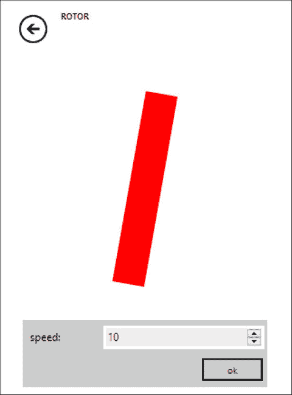

*图 A-7 — 正在运行的脚本*

1.  屏幕左侧列中有一个标有 `run` 的按钮。点击此按钮开始运行脚本。由于脚本需要一个输入参数，屏幕上会出现一个对话框。在文本输入字段中输入一个数字，例如 `10`，然后点击 `OK` 按钮。
2.  运行中的脚本的显示画面如图 A-7 所示。要暂停脚本，请点击浏览器窗口右上角的 `stop` 按钮。要恢复运行脚本，请点击之前相同位置的按钮（它已变为 `run` 按钮）。
3.  要退出脚本的执行，请点击左上角标有左箭头的按钮。这将返回到编辑器。

## A.3 附加步骤

### 修订脚本

如果脚本的行为不符合预期或需要改进，可以轻松返回并编辑代码。在列出脚本组件的屏幕上，只需点击动作名称或事件名称，即可在编辑器窗口的第三列显示其代码。

### 发布脚本

如果代码值得与他人分享，或者仅仅是为了将其保存到云端，则可以发布该脚本。只需点击指向上方的箭头（下方标有 `publish`），该箭头出现在第二列中脚本属性图块的右侧。

点击 `publish` 按钮后，屏幕应显示一条消息，其下方带有按钮。一个按钮标记为 `publish`，另一个标记为 `publish as hidden`。这两个按钮提供了选择将脚本设为可见或隐藏的选项。

如果标记为可见，那么任何在 TouchDevelop 网站上搜索特定语言特性或脚本功能示例的人都可能被引导至此脚本。它也可能出现在新脚本列表或特色脚本列表中。如果标记为隐藏，则不会出现在此类搜索中（但任何知道脚本代码名称的人仍然可以访问它）。

## A.4 更多高级编辑功能


### A.4.1 将代码重构为新的操作

删除一系列语句并用它们创建新的操作称为重构。TouchDevelop 编辑器让这一过程变得简单。为了演示，下面给出了从转子脚本的主操作中重构几个语句的步骤。

1. 选择序列中的第一行。在主操作中赋值给变量 `sprite` 的语句被选中，如图 A-8 所示。
2. 点击窗口右侧出现的标有“标记”`mark` 的按钮。代码列表显示会变为如图 A-9 所示。要重构的代码行范围由两条粗红线标出。
3. 现在将底部红线向下拖动，直到它紧邻要转移到重构操作的最后一条语句下方。屏幕应显示一组选中的行，类似图 A-10 所示。
4. 在浏览器窗口显示的第二列中，有几个标题和几个按钮。在显示“将选定内容提取到操作中”`extract selection into action` 的标题下方，在文本框中输入新操作的合适名称，替换默认名称 `do stuff`。图 A-11 显示了输入新名称 `update sprite` 后的文本框。
5. 现在点击“提取”`extract` 按钮，新操作就创建好了。重构的操作会获得允许其正确工作所需的任何参数。一条语句会插入到主操作中，替换被重构的代码。

需要注意的是，被标记的语句组也可以先标记最后一行，然后向上移动顶部水平红线来选择。或者可以标记组中的任意一行，然后调整两个终点线。

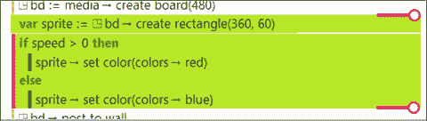

图 A-10 — 标记要提取的最后一行

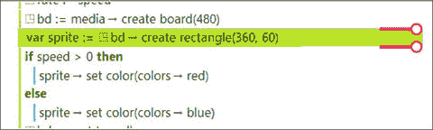

图 A-9 — 标记要提取的第一行

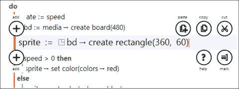

图 A-8 — 选择第一行

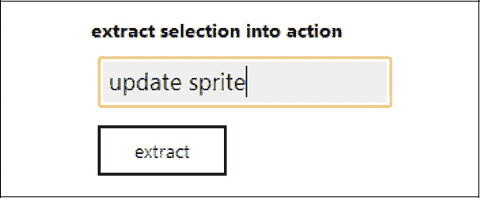

图 A-11 — 为提取的代码命名

### A.4.2 复制和粘贴代码

如果已按照类似上述步骤标记了某段代码行，则可以剪切这些行并临时保存在编辑器的剪贴板上。

接下来，可以选择任何操作或事件中的另一处代码位置。右侧会出现一个标有“粘贴”`paste` 的按钮。点击该按钮可将剪切后的代码插入到所选行的旁边。

粘贴的代码会出现在所选行的上方或下方，具体取决于多种因素。为了强制正确定位，请始终先在需要粘贴代码的位置插入一个空行。然后点击“粘贴”`paste` 按钮会使粘贴的代码替换该空行。

### A.4.3 用高级别结构包围代码

有时需要一些复杂的编辑操作。例如，可能需要将一组现有的语句变为新的 `if` 语句的 `then` 子句。只需使用之前描述的相同步骤来标记这组代码行即可。

在编辑器窗口的第二列中，有一个标题显示“用以下内容包围”`surround with`，其下方有标有 `if`、`for each`、`for`、`while` 和 `boxed` 的按钮。每个按钮的功能都与其名称完全一致。


开源许可 本章根据知识共享署名-非商业性使用-禁止演绎 4.0 国际许可协议 ([`creativecommons.org/licenses/by-nc-nd/4.0/`](http://creativecommons.org/licenses/by-nc-nd/4.0/)) 许可，该许可允许以任何媒介或格式进行任何非商业性使用、共享、分发和复制，前提是您对原始作者和来源给予适当的署名，提供指向知识共享许可协议的链接，并指明您是否修改了许可材料。根据本许可，您无权分享源自本章或其部分的改编材料。除非在材料的署名行中另有说明，否则本章中的图像或其他第三方材料均包含在本章的知识共享许可协议中。如果材料未包含在本章的知识共享许可协议中，并且您的预期用途不被法定法规允许或超出允许范围，您将需要直接获得版权持有人的许可。

