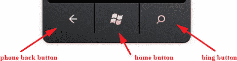
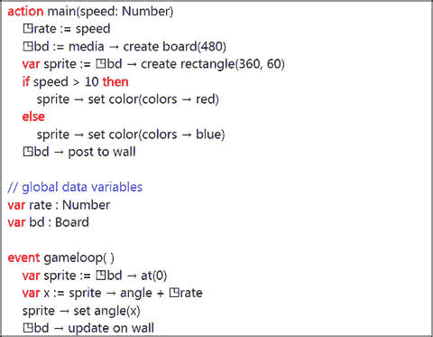
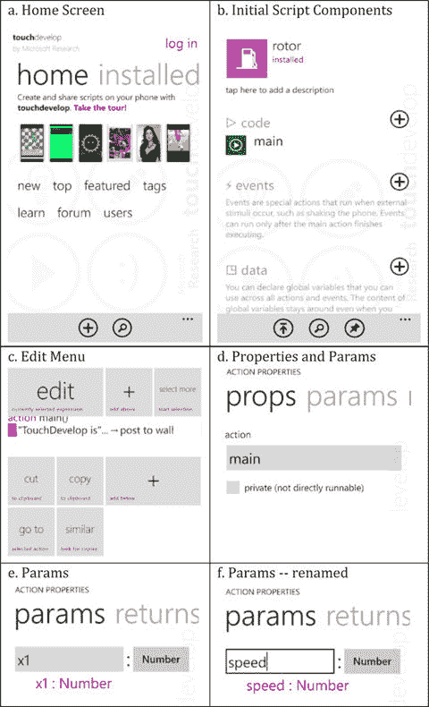
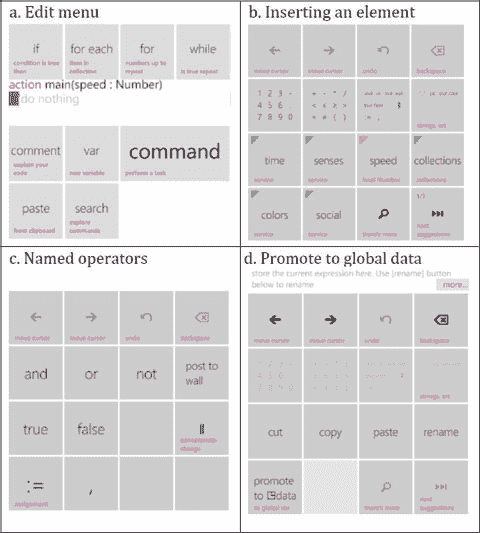
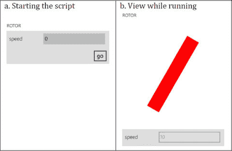

# Windows Phone 上的 TouchDevelop 编辑器

E.1 示例程序 E.2 返回按钮、撤销与错误 E.3 编辑示例 E.4 附加步骤 E.5 将代码重构为新操作 关键词 主操作 空白 有效选择 Windows Phone 编辑步骤

本附录提供了一个在 Windows Phone 上使用 `TouchDevelop` 编辑器的完整示例。它并未涵盖编辑器的所有功能。建议进行一些实验以熟悉该编辑器。

### E.1 示例程序

要输入的脚本如图 A-1 所示。该脚本以名称 `rotor` 发布，代码名为 `/cqxk`。

### E.2 返回按钮、撤销与错误

手机在触控屏下方有三个按钮。编辑脚本时经常使用的一个重要按钮是手机返回按钮。其主要作用是将屏幕返回到之前的状态。它通常有助于从错误中恢复。例如，如果在编辑会话中不小心触碰到 `bing` 按钮并启动了 `bing` 搜索引擎，返回按钮将退出 `bing` 并返回编辑器。

在编辑过程中，每个编辑菜单的顶行都提供了一个撤销按钮。当该按钮未变暗时，点击此撤销按钮将完全如其所述执行操作。

**图 A-1** rotor 程序 `/cqxk`

### E.3 编辑示例

当按照下面详述的编辑步骤操作时，屏幕内容会多次更改。由于篇幅限制，本章仅能包含部分截图。

### 开始使用

图 A-2 开始使用截图

1.  启动 TouchDevelop。
2.  点击底部的 + 按钮。图 [A-2a]
3.  将脚本重命名为 `rotor`。
4.  查看所有脚本组件。图 [A-2b]。点击标识符 `main`。
5.  查看初始的 `main` 操作及其默认主体。
6.  点击操作内部语句的任意位置。
7.  点击编辑菜单中的 `cut` 按钮图 [A-2c]
8.  点击屏幕顶部行（以关键字 `action` 开头）的任意位置。
9.  点击 `edit` 按钮。图 [A-2d]
10. 点击 `params` 一词或将屏幕向左拖动以选择 `params`。（`params` 名称称为枢轴点；有多个可选择的枢轴点，用于显示操作的不同功能。）
11. 点击底部的 '`+`' 按钮。图 [A-2e]
12. 点击默认参数名称 `x1` 并输入名称 `speed` 作为替换。图 [A-2f]
13. 点击手机的返回按钮。

### main 操作中的第二行代码

图 A-3 编辑第一行

1.  点击第一行代码下方的空白区域，然后点击 + （添加表达式）按钮。
2.  点击第 2 行第 3 列按钮（标记为 and 或 …）；然后选择 '`:=`'。
3.  点击标记为 `media` 的按钮，这指的是媒体资源。
4.  点击 `create board`，这指的是其中一种媒体方法。
5.  点击第 2 行第 1 列按钮（标记为 1 2 3 …）。
6.  点击 `backspace` 按钮 3 次。
7.  依次点击 4、8 和 0 按钮，输入 480。
8.  点击 '`....`' 变量名，并将其重命名为 `bd`，然后点击手机返回按钮。
9.  点击 `bd` 变量名，然后点击 `promote` 到 `◳data` 按钮。

#### main 操作中的第三行代码

1.  点击最后一行代码下方的空白区域，点击 '+'（添加表达式）按钮。
2.  点击 `◳data` 按钮，然后点击 `bd` 按钮以插入此全局变量。
3.  点击标记为下一建议的右下按钮，多点击几次直到出现 create rectangle 按钮。点击它。
4.  点击第 2 行第 1 列按钮（1 2 3 …），然后编辑 200，将其变成 360。
5.  使用移动光标按钮，将光标移到 2 和 0 数字之间，然后将 2 替换为 6。
6.  哎呀，我们想将整个表达式保存到一个变量中；拖动以高亮显示整行代码。选项菜单已更改；点击 `extract to var` 按钮。
7.  点击手机返回按钮，看看发生了什么。
8.  点击最后一行代码（仅由变量 `sprite` 组成），然后点击 `cut` 按钮。

### 开始使用 if 语句

1.  点击屏幕底部的 + 按钮。
2.  点击标记为 `if` 的按钮。
3.  点击标记为 `speed` 的按钮。
4.  点击第 2 行第 2 列按钮（标记为 + `- …`）。
5.  点击 > 按钮。
6.  点击第 2 行第 1 列按钮（标记为 1 2 3 …），然后点击 1，再点击 0，生成数字 10。

### if 语句的 'then' 子句

1.  点击以 `if` 关键字开头的代码行下方的空白区域；点击 '`+`'（添加表达式）。
2.  点击标记为 `sprite` 的按钮，多次点击 `next suggestions` 按钮，直到出现 `set color` 按钮；点击它。
3.  点击提供的默认参数值中的标识符 `random`，然后点击 `backspace` 按钮删除该标识符。
4.  点击下一个 `suggestions`，直到出现 `red` 作为选项；点击它。
5.  then 子句完成（如果还有要添加到此子句的语句，我们可以点击下方空白处）；点击手机返回按钮。

### if 语句的 else 子句

1.  点击关键字 `else`，然后点击 '`+`'（在下方添加）；然后点击标记为 `command` 的按钮。
2.  以类似于“then 子句”标题下步骤 2-4 的方式，输入代码行 `sprite` → `set color`（`colors` → `blue`）；点击手机返回按钮。

### main 操作的最后一条语句

1.  点击关键字 `if` 以选择整个 if 语句；点击 '`+`' 在下方添加；点击 `command` 按钮。
2.  选择 `◳data`，选择 `bd`；点击下一个 `suggestions` 以找到 `post to wall` 方法并点击它。
3.  点击手机返回按钮，我们就完成了整个 main 操作。
4.  再次点击手机返回按钮；我们可以看到 main 操作以及两个全局数据项之一。

### gameloop 事件

1.  点击 events 一词右侧的 '`+`' 按钮。
2.  点击 `gameloop` 标识符。
3.  点击屏幕底部的 '`+`' 按钮以添加代码；点击 `command` 按钮。
4.  使用类似于上述“第三行代码”标题下步骤 2-6 的方式，输入代码行 `var sprite := ◳bd` → `at(0)`。
5.  类似地输入代码行 `var x := sprite` → `angle` + `◳rate`。
6.  类似于“then 子句”标题下步骤 2-4 的方式，输入代码行 `sprite` → `set angle(x)`。
7.  输入代码行 `◳bd` → `update on wall`。
8.  点击手机返回按钮，返回脚本组件。

### 尝试运行脚本

1.  点击 `main` 名称左侧的方形中的三角形，以运行脚本。
2.  为 speed 输入一个值（例如 10），然后点击 `go`。图 [A-4a]
3.  点击手机返回按钮以停止执行。图 [A-4b]
4.  再次点击手机返回按钮以返回脚本组件。

## E.4 附加步骤

### 修改脚本

如果脚本的行为不符合预期或需要改进，可以轻松返回并编辑代码。在列出脚本组件的屏幕上，只需点击操作或事件的名称，即可打开该操作或事件的代码。

图 A-4 运行脚本

如有必要，滚动到需要更改或插入新代码的代码行，点击该行。然后编辑菜单提供编辑该行、删除该行（剪切按钮）、在上方插入或在下方插入的选项。

如果正在编辑现有代码行，可以点击要更改的部分，删除该部分，并插入新的程序元素。编辑菜单的选择应是直观的。

### 发布脚本

如果代码值得与他人分享，或者需要保存到 Web 服务器上的永久存储中，则可以发布该脚本。点击底部的向上箭头开始该过程。

在脚本可以发布之前，需要 Windows Live ID 或 Facebook ID。可以选择将脚本隐藏或使其可见。如果标记为可见，则任何在 TouchDevelop 网站上搜索特定语言功能或脚本功能示例的人都可能被引导至此脚本。它也可以出现在新脚本列表或特色脚本列表中。如果标记为隐藏，则不会出现在此类搜索结果中（但任何知道该脚本代码名称的人仍然可以访问它）。

### 缺少按钮？

共有 23 种不同的资源，每种资源或数据类型都可能提供大量方法。一个脚本可能包含非常多的变量。编辑器不会为所有有效选项都提供对应的按钮。

如果某个资源、变量或方法没有对应的按钮，可以使用一个通用按钮。这个按钮上有一个放大镜图标，标签为“还有更多”。它可以在图 B.3b 和图 B.3d 的底行看到。点击该按钮会弹出一个可滚动和搜索的有效选项列表。滚动列表并点击所需项即可将其插入脚本。或者，输入名称的前几个字符，列表会跳转到所需位置。

### 将代码重构为新的操作

首先需要选中某个操作或事件中的一组连续语句。具体操作是：选中序列中的第一行。当编辑菜单出现时，点击标有`选择更多`的按钮。然后可以拖动中央窗口中的代码，将选中范围从一条语句扩展到多条语句。

当所有语句均被选中（由选中内容左侧显示的实心条表示）后，点击标有`提取`的按钮。这会将选中的语句从当前操作中删除，插入到新创建的操作中，并用对新操作的调用替换这些语句。TouchDevelop 会要求为该新操作命名。该操作会附带参数，以确保提取出的代码无需进一步编辑即可正常运行。

 开放获取 本章采用知识共享署名-非商业性使用-禁止演绎 4.0 国际许可协议（[`​creativecommons.​org/​licenses/​by-nc-nd/​4.​0/​`](http://creativecommons.org/licenses/by-nc-nd/4.0/)）进行许可。该协议允许任何非商业用途的使用、分享、分发和复制，无论媒介或格式，前提是您适当标注原作者和来源，提供指向知识共享许可协议的链接，并注明您是否修改了许可材料。根据本许可协议，您无权分享基于本章或其部分内容改编的材料。除非在材料的署名行中另有说明，本章中的图片或其他第三方材料均包含在本章的知识共享许可协议范围内。如果材料未包含在本章的知识共享许可协议中，且您的预期使用未被法定法规允许或超出允许范围，您需要直接向版权所有者获取许可。

