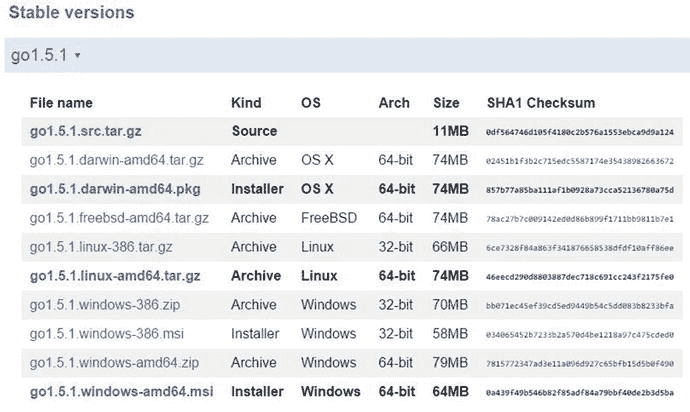
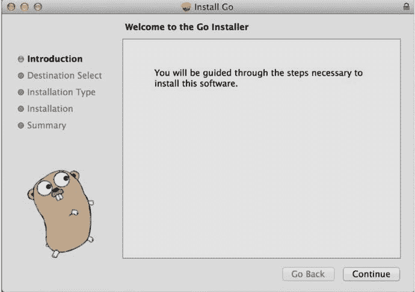
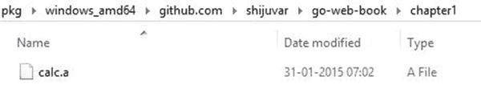
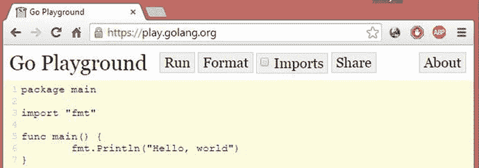

# 1. 开始使用 Go

电子补充材料 本章的在线版本 (doi:[10.1007/978-1-4842-1052-9_1](http://dx.doi.org/10.1007/978-1-4842-1052-9_1)) 包含补充材料，仅供授权用户使用。

世间万物皆在演化，计算机与计算机编程语言也不例外。基于过往经验，构建应用程序的思路与方法也在不断演进。尽管高度演化的现代计算机已拥有众多 CPU 核心（32、64、128 乃至更多），但我们仍无法通过现有的大多数编程语言和工具，充分发挥现代计算机硬件的全部潜力。即便是在配备多核 CPU 的高性能服务器上，我们的程序运行依然缓慢。

在过去十年间，许多现有编程语言都伴随着众多新特性不断演进。语言设计者基于编程语言理论（PLT）及其他学术思想不断添加这些特性，这使得语言本身变得更为复杂。在当今的计算环境中，许多人更倾向于用简约务实的方式来编写应用程序。

人们会选用在某些特定领域表现出色的编程语言。有些编程语言非常适合快速应用开发，但在编写高性能应用方面表现不佳；另一些编程语言在编写高性能应用时效率极高，却难以高效地开发应用程序。倘若存在一种通用语言，能够以更高的效率、性能、生产力及更快的编译时间来开发各类应用，那将是再好不过了。Go 语言恰好满足这些标准。

本章将向你展示为何 Go 是解决现代编程挑战的绝佳编程语言，并帮助你了解将 Go 应用于下一个项目时的用例。

### 认识 Go

Go，亦被称为 Golang，是一种通用编程语言，由 Google 的一支团队以及开源社区的众多[贡献者](http://golang.org/CONTRIBUTORS)（[`http://golang.org/contributors`](http://golang.org/contributors)）共同开发。该语言于 2009 年 11 月宣布，首个版本于 2012 年 12 月发布。Go 是一个开源项目，采用 BSD 风格许可证进行分发。Go 项目的官方网站是 [`http://golang.org/`](http://golang.org/)。它是一种静态类型、原生编译、带垃圾回收的并发编程语言，在基本语法上主要归属于 C 语言家族。接下来，让我们看看 Go 的一些特性，以理解其设计原则。

#### 简约务实的设计语言

Go 编程语言可以简单地用三个词来描述：简洁、简约、务实。如果你深入研究 Go 的语言设计，就会发现它采取了一种简约而务实的设计思路。这种简洁性可以从 Go 的所有语言特性中体现出来，包括其类型系统。如今，许多编程语言提供了过多的特性，使得应用程序对开发者而言变得更为复杂。Go 的设计目标是成为一种简洁、简约的语言，提供开发高效软件系统所需的一切必要特性。

尽管 Go 的语言特性较少，但其务实的设计并未对生产力造成影响。新的 Go 程序员能快速学会该语言，并轻松开始开发具有生产质量的应用。Go 简单地将过去三十年间的许多语言特性弃之不用，专注于实际实践而非学术理论和编程语言理论（PLT）。

从实践的角度来看，你可能会说 Go 是一种面向对象编程（OOP）语言。但 Go 的面向对象方式与 C++、Java 和 C# 等编程语言不同。从学术角度看，Go 并非一种完全的面向对象语言。与许多现有的 OOP 语言不同，Go 不支持继承，甚至连 `class` 关键字都没有。它通过其简单的类型系统，以组合优于继承的方式来实现功能。与其他面向对象编程语言相比，Go 的接口类型设计展现了其独特性。

那么 Go 是一种面向对象语言吗？答案既是也不是。Go 语言包含了以面向对象方式编写应用所需的全部“电池”（即基础组件），但它并非一种完全的 OOP 语言，因为它缺少一些传统的 OOP 特性。

**注意**  
编程语言理论（PLT）是计算机科学的一个分支，涉及编程语言及其各自特性的设计、实现、分析、表征和分类。

#### 兼具高生产力的静态类型语言

Go 是一种静态类型编程语言，其语法大致源自 C 语言。与 C 和 C++ 类似，它原生编译为机器码，因此无需即时（JIT）编译即可运行程序。（Java 和 C# 等编程语言使用 JIT 编译来运行应用程序。）

在编写应用程序时，动态类型语言提供了巨大的生产力和表现力，因为你无需担心所使用变量的数据类型。在动态类型语言中，表达式的类型仅在运行时才能确定，这使得语法层面具有更高水平的生产力和表现力，能够快速构建应用，尤其是 Web 应用。但在使用动态类型语言时，应用的性能与可维护性会受到影响。有时，用动态类型语言编写的应用，其调试体验会因缺乏类型安全而变得非常困难。即便在今天，开发者仍会使用静态类型语言为其动态类型语言生成代码。例如，JavaScript 开发者会使用微软 TypeScript 这样的静态类型语言来确保类型安全，最终再编译为 JavaScript 代码。

尽管静态类型语言能提供类型安全和性能，但使用它们可能会影响应用开发的生产力，并且编译大型程序可能耗时很长。如果能有一种语言，兼具静态类型语言和动态类型语言的优势，将静态类型语言的性能与类型安全同动态类型语言的生产力融为一体，那将是再好不过了。

Go 正是这样一种完美的融合：它兼具静态类型语言的强大能力与动态类型语言的高生产力。Go 可以被称作一种现代 C 语言，它不仅编译速度比 C 更快，还兼具了动态类型语言的高生产力。


#### 并发是语言层面的内置特性

计算机硬件已发展到拥有众多 CPU 核心和更强大的性能，但现代计算机的潜力无法通过当前使用的编程语言和工具来充分发挥。当生产级应用在高性能服务器上运行时，即使 CPU 利用率很低，也会出现性能问题。在某些编程环境中，虽然提供了并发和并行能力以实现更高的效率和性能，但这些特性通常以独立的库和框架形式存在，而非语言层面的内置特性，这增加了编写并发应用的复杂性。

在 Go 语言中，并发是语言的内置功能，专为在现代计算机上编写高性能并发应用而设计。并发是 Go 语言的独特特性之一，被认为是其主要的卖点。Go 的并发通过两个独特特性实现：goroutine 和通道。`goroutine` 是一个可以与其他 goroutine 并发执行的函数。它是一种轻量级的执行线程，许多 goroutine 可以在单个线程中执行，从而提升程序的性能和效率。`goroutine` 最重要的特性是由 Go 运行时管理并执行。许多编程语言都支持编写并发程序，但它们仅限于已执行线程间的通信和同步。而且，大多数现有语言通过框架提供对并发的支持，而非语言内置特性，因此使用这些语言实现并发时会受到限制。

Go 提供了通道，使 goroutine 之间能够进行通信并同步其执行。通过通道，你可以将数据从一个 goroutine 发送到另一个。通道还提供了更高层次的 goroutine 同步级别，确保两个 goroutine 在已知状态下运行。并发是使用 Go 语言构建更高效、性能更卓越的软件系统的主要原因。

#### Go 编译程序速度快

编写 C 和 C++ 应用面临的挑战之一是编译程序所需的时间，这对开发大型 C 和 C++ 应用的开发者来说非常痛苦。Go 语言旨在解决现有编程环境中的编程挑战。其编译器效率极高，能够快速编译程序；一个大型 Go 应用可以在几秒内完成编译，这对许多转向 Go 编程环境的 C 和 C++ 开发者极具吸引力。

#### Go 是一种通用语言

不同的编程语言用于开发不同类型的应用。C 和 C++ 被广泛用于系统编程和性能要求极高的系统。同时，使用 C 和 C++ 也会影响应用开发的效率。其他一些编程语言，如 Ruby 和 Python，提供了快速应用开发能力，从而带来更高的生产力。尽管服务器端 JavaScript 平台 `Node.js` 适合构建轻量级的 JSON API 和实时应用，但在执行 CPU 密集型编程任务时则会失效。另一类编程语言用于构建原生移动应用，例如 Objective C 和 Swift，它们仅限于移动应用开发。多种编程语言被用于各种用例，如系统编程、分布式计算、Web 应用开发、企业应用和移动应用开发。

使用 Go 最大的实际好处是，它可以用于构建各种应用，包括需要高性能的系统，也适用于快速应用开发场景。尽管 Go 最初是作为系统编程语言设计的，但它也用于开发企业级业务应用和强大的后端服务器。Go 提供了高性能，同时保持了应用开发的高生产力，这要归功于其简约而务实的设计。Go 生态系统（包括 Go 工具链、Go 标准库和 Go 第三方库）提供了构建各种 Go 应用所需的基本工具和库。Go Mobile 项目增加了对 Android 和 iOS 平台原生移动应用构建的支持，为 Go 带来了更多可能性。

在云计算时代，Go 是一种现代编程语言，可用于构建系统级应用、分布式应用、网络程序、游戏、Web 应用、RESTful 服务、后端服务器、原生移动应用以及针对云优化的下一代应用。Go 是许多革命性创新系统的选择，例如 Docker 和 Kubernetes。软件容器化生态系统中的大多数工具都是用 Go 编写的。

> **注意**：Docker 是一个革命性的软件容器平台，而 Kubernetes 是一个容器集群管理器。两者都是用 Go 编写的。

#### Go 生态系统

Go 不仅仅是一种简单的编程语言；它还是一个生态系统，提供了编写各种高效软件系统所需的基本工具和特性。Go 生态系统包含以下组件：

- Go 语言
- Go 库
- Go 工具链

Go 语言提供了基本的语法和特性，让你能够编写程序。这些程序利用库来实现可复用的功能模块，并借助工具链进行代码格式化、编译、运行测试、安装程序以及创建文档。

库在 Go 生态系统中扮演着关键角色，因为 Go 被设计为一种模块化的编程语言，用于编写高度可维护和可组合的应用。库以包的形式提供可复用的功能模块。你可以使用 Go 包以模块化和可复用的方式编写软件组件，从而在 Go 程序间共享，并轻松维护你的应用。Go 应用的设计理念是通过包编写小的软件组件，然后用这些较小的包组合成 Go 应用。库可以从标准库和第三方库中获得。当你从标准库安装 Go 包时，它们会被安装到 Go 的安装目录中。当你安装 Go 时，环境变量 `GOROOT` 会自动添加到你的系统中，用于指定 Go 的安装目录。标准库包含大量包，提供了编写真实世界应用所需的广泛功能。例如，标准库中的 `"net/http"` 包可用于编写强大的 Web 应用和 RESTful 服务。

> **注意**：有关标准库包的文档，请访问 [`golang.org/pkg/`](http://golang.org/pkg/)。

如果你需要 Go 标准库未提供的额外功能，可以借助 Go 开发者社区提供的第三方库，这个社区非常热衷于开发并提供许多有用的第三方 Go 包。例如，如果你想使用 MongoDB 数据库，你可以利用一个名为 `"mgo"` 的第三方包。

Go 工具链是 Go 生态系统的重要组成部分，它提供了多种工具支持服务：构建、测试和安装 Go 程序；格式化 Go 代码；创建文档；获取和安装 Go 包等等。


### 安装 Go 工具

在你的电脑上安装 Go 非常简单。它为 FreeBSD、Linux、Mac OS X 和 Windows 操作系统提供了二进制发行版；并支持 32 位（386）和 64 位（amd64）x86 处理器架构。这些二进制发行版可以在 [`http://golang.org/dl/`](http://golang.org/dl/) 获取。（如果你的操作系统和架构组合没有对应的二进制发行版，你可以通过[源码](http://golang.org/doc/install/source)安装 Go。）

图 1-1 展示了 Mac、Windows 和 Linux 平台的安装程序包和归档源码，这些都在 Go 网站下载页面上列出。Go 为 Mac 和 Windows 操作系统都提供了安装程序。Mac OS X 提供了一个包安装程序，它可以将 Go 发行版安装到 `/usr/local/go`，并将 `/usr/local/go/bin` 目录添加到 `PATH` 环境变量中。



图 1-1.
适用于多个操作系统的 Go 二进制发行版

在 Mac OS 上，你也可以使用 Homebrew ([`http://brew.sh/`](http://brew.sh/)) 来安装 Go。以下命令可以在 Mac OS 上安装 Go：

`brew install go`

Windows 操作系统提供了一个 MSI 安装程序，它可以将 Go 发行版安装到 `c:\Go` 目录。该安装程序还会将 `c:\Go\bin` 目录添加到 `PATH` 环境变量中。图 1-2 展示了在 Mac OS 上运行的包安装程序。



图 1-2.
Mac OS 的 Go 安装程序

如前所述，成功安装 Go 后，系统会设置 `GOROOT` 环境变量，其值为 Go 工具安装的位置：`/usr/local/go`（或在 Windows 下为 `c:\Go`）。

你也可以将 Go 工具安装到自定义位置。如果这样做，你需要手动配置 `GOROOT` 环境变量，将其设置为你系统中 Go 工具的安装位置。

注意：关于下载和安装 Go 工具的完整说明，请访问 [`http://golang.org/doc/install`](http://golang.org/doc/install)。

#### 检查安装

你可以在终端窗口中输入一些 Go 命令来测试 Go 的安装。要验证 Go 工具的安装，请打开终端并输入以下命令：

`go version`

以下是在 Mac X 系统上显示的结果：

`go version go1.4.1 darwin/amd64`

以下是在 Windows 系统上显示的结果：

`go version go1.4.1 windows/amd64`

以下命令可以提供 Go 工具的帮助信息：

`go help`

### 设置工作环境

Go 遵循一些约定，这些约定以特定方式组织代码，有助于更轻松地编译、安装和共享 Go 代码。本节将讨论如何在工作区中将 Go 代码组织为包。

#### Go 工作区

Go 程序必须保存在一个称为工作区的目录层次结构中，它本质上是 Go 程序的根目录。

一个工作区在其根目录下包含三个子目录：

- `src`：此目录包含按包组织的 Go 源文件。
- `pkg`：此目录包含 Go 包对象。
- `bin`：此目录包含可执行命令（可执行程序）。

当你开始使用 Go 时，第一步是设置一个存放 Go 程序的工作区。你必须创建一个包含三个子目录的目录来设置 Go 工作区。Go 开发者将 Go 程序作为包写入 `src` 目录。Go 源文件按称为包（package）的目录进行组织，其中单个目录用于单个包。你可以在 Go 中编写两种类型的包：

- 生成可执行程序的包
- 生成共享库的包

Go 工具会构建 Go 包，如果是共享库，则将生成的二进制文件安装到 `pkg` 目录；如果是可执行程序，则安装到 `bin` 目录。因此，`pkg` 和 `bin` 目录用于根据包的类型存储包输出。请记住，你可以为你的 Go 程序设置多个工作区（Go 开发者通常为他们的 Go 程序使用单个工作区）。

#### `GOPATH` 环境变量

你在工作区中编写 Go 程序，需要手动指定该工作区，以便 Go 运行时知道其位置。你可以通过设置 `GOPATH` 环境变量来指定工作区的位置。要开始使用 Go，请创建一个工作区并设置 `GOPATH` 环境变量。

#### 代码组织路径

你将 Go 程序作为包写入 `GOPATH src` 目录。单个目录用于单个包。Go 的设计初衷是为了能轻松地与 GitHub 和 Google Code 等远程仓库协同工作。当你在远程源码仓库中维护你的程序时，请使用该源码仓库的根目录作为你的基础路径。

例如，如果你在 `github.com/user` 有一个 GitHub 帐户，它就应该作为你的基础路径。假设你在 `github.com/user` 下编写了一个名为 `"mypackage"` 的包；你的代码组织路径将是 `%GOPATH%/src/github.com/user/mypackage`。当你将这个包导入到其他程序时，导入包的路径将是 `github.com/user/mypackage`。如果你在本地系统中维护源码，你可以直接在 `GOPATH src` 目录下编写程序。假设你在本地系统上编写了一个名为 `mypackage` 的包；你的代码组织路径将是 `%GOPATH%/src/mypackage`，导入包的路径将是 `mypackage`。

### 编写 Go 程序

一旦你创建了工作区并设置了 `GOPATH` 环境变量，你就可以开始使用 Go 了。让我们编写几个简单的 Go 程序来入门。


#### 编写 Hello World 程序

让我们从编写一个 Hello World 程序开始，如代码清单 1-1 所示。

**代码清单 1-1.** Go 语言版本的 Hello World 程序

```
1 package main
2 import "fmt"
3 func main() {
4       fmt.Println("Hello, world")
5 }
```

**第 1 行：** Go 程序以包（package）的形式组织，这里将包名指定为 `main`。如果你将包命名为 `main`，它在 Go 中具有特殊含义：生成的二进制文件将是一个可执行程序。

**第 2 行：** `"fmt"` 包提供了格式化与打印数据的功能，该包从标准库中导入。关键字 `import` 用于导入包。

**第 3 行：** 关键字 `func` 用于定义一个函数。`main` 函数是可执行程序的入口点，将在应用程序运行时被执行。`main` 包中会包含一个 `main` 函数。

**第 4 行：** `Println` 函数由 `fmt` 包提供，用于打印数据。请注意，`Println` 函数名以大写字母开头。在 Go 中，所有以大写字母开头的标识符都会被导出到其他包，从而可以在其他包中调用。

让我们使用 Go 工具来编译并运行这个示例程序。导航到包目录，然后输入 `run` 命令来运行程序。假设包目录的位置是 `github.com/user/hello`：

```
cd $GOPATH/src/github.com/user/hello
go run main.go
```

上述命令会简单地打印出“Hello, world”这一短语。`run` 命令会编译源码并运行程序。你也可以将 `build` 和 `install` 命令与 Go 工具一起使用，来构建和安装 Go 程序，生成可供之后运行的二进制可执行文件。

`build` 命令会编译包，并将生成的二进制文件放入包文件夹中：

```
cd $GOPATH/src/github.com/user/hello
go build
```

生成的二进制文件名与目录名相同。如果你将此程序写在一个名为 `hello` 的目录中，那么生成的二进制文件将名为 `hello`（在 Windows 下为 `hello.exe`）。使用 `build` 命令编译源码后，你可以通过输入二进制文件名来运行程序。

`install` 命令会编译包，并将生成的二进制文件安装到 `GOPATH` 的 `bin` 目录中：

```
cd $GOPATH/src/github.com/user/hello
go install
```

你可以在系统上的任何位置运行此命令：

```
go install github.com/user/hello
```

生成的二进制文件名与目录名相同。现在，你可以通过输入位于 `GOPATH` 的 `bin` 目录下的二进制文件名来运行程序：

```
$GOPATH/bin/hello
```

如果你已经将 `$GOPATH/bin` 添加到了 `PATH` 环境变量中，那么只需在系统上的任何位置输入二进制文件名即可：

```
hello
```

#### 编写一个库

在 Go 中，你可以编写两种类型的程序：可执行程序和可重用的库。之前的示例程序是可执行程序。现在让我们编写一个共享库，为其他程序提供可重用的代码片段。在 `$GOPATH/src/github.com/shijuvar/go-web-book/chapter1/calc` 位置创建一个包目录。

代码清单 1-2 展示了一个简单的包，它提供了两个数值相加和相减的功能。

**代码清单 1-2.** Go 语言版本的共享库程序

```
1 package calc
2
3 func Add(x, y int) int {
4       return x + y
5 }
6 func Subtract(x, y int) int {
7       return x - y
8 }
```

**第 1 行：** 包名指定为 `calc`。包名和包目录名必须相同。

**第 3 行：** 使用关键字 `func` 定义了一个名为 `Add` 的函数。此函数名以大写字母开头，因此 `Add` 函数将被导出到其他包。如果函数名以小写字母开头，则不会导出到其他包，其访问权限将仅限于同一个包内。与使用 C++、Java 和 C# 编程不同，你无需使用 `private` 和 `public` 关键字来指定标识符的访问权限。你可以从整个语言特性中看到 Go 语言的简洁性。`Add` 方法接受两个整数参数并返回一个整数值。

**第 6 行：** `Subtract` 函数与 `Add` 函数类似，但用于计算两个整数类型之间的差值。

让我们构建并安装这个包。在终端窗口中导航到包目录，并输入以下命令：

```
go install
```

`install` 命令会编译源码，并将生成的二进制文件安装到 `GOPATH` 的 `pkg` 文件夹中（参见图 1-3）。在 `pkg` 目录中，`calc` 包将安装在特定于平台的目录下的 `github.com/shijuvar/go-web-book/chapter1/calc` 位置。



**图 1-3.** install 命令将 calc 包安装到 pkg 文件夹

`install` 命令的行为根据你创建的是可执行程序还是可重用库而略有不同。当你对可执行程序运行 `install` 时，生成的二进制文件会被安装到 `GOPATH` 的 `bin` 目录中；而对于库，则会安装到 `GOPATH` 的 `pkg` 目录中。

现在，你可以从位于 `GOPATH` 中的任何程序重用这个包。在 Go 中，通过包来实现代码重用非常容易。你已经创建了第一个库包。让我们从另一个可执行程序中重用该包的代码（参见代码清单 1-3）。

**代码清单 1-3.** 在 Go 程序中重用 calc 包

```
1 package main
2
3 import (
4       "fmt"
5       "github.com/shijuvar/go-web-book/chapter1/calc"
6 )
7
8 func main() {
9       var x, y int = 10, 5
10      fmt.Println(calc.Add(x, y))
11      fmt.Println(calc.Subtract(x, y))
12 }
```

**第 1 行：** 创建一个可执行程序。

**第 3 至 6 行：** 这些行导入了标准库中的 `"fmt"` 包和你自己的库中的 `"calc"` 包。你可以使用单个 `import` 语句来导入多个包。来自标准库的包使用短路径，例如 `"fmt"` 包。对于你自己的包，在导入时必须指定完整路径。对外部包使用完整路径可以避免包名冲突，并且你可以对多个路径不同的外部包使用相同的名称。

**第 8 行：** `main` 函数，是 `main` 包的入口点。

**第 9 行：** 声明了两个变量 `x` 和 `y`，数据类型为 `int`。Go 使用 `var` 关键字声明变量，你可以在单个语句中声明多个变量。如果你在声明变量的同时为变量赋值，可以使用更简短的语句：

```
x, y := 10, 5
```

当你使用 Go 的更简短变量声明语句时，无需指定变量类型，因为 Go 编译器可以根据你赋给变量的值推断出类型。Go 在保持其为静态类型语言的同时，提供了动态类型语言的生产力。Go 编译器也可以使用 `var` 语句进行类型推断：

```
var x, y = 10, 5
```

**第 10 至 11 行：** 你调用了 `calc` 包的导出函数，重用了库提供的功能。

要运行该程序，请在程序目录中输入以下命令：

```
go run main.go
```


### 测试 Go 代码

Go 生态系统提供了开发 Go 应用所需的所有基本工具，包括无需借助任何外部库或工具即可测试 Go 代码的能力。标准库中的 `testing` 包提供了编写自动化测试的功能，而 Go 工具则提供了运行自动化测试的支持。在开发软件系统时，为应用程序代码编写自动化测试是确保质量并提高可维护性的重要实践。如果你的代码有测试覆盖，你就可以毫无顾虑地重构应用程序代码。

让我们为上一节创建的 `calc` 包编写一些测试。你需要创建一个以 `_test.go` 结尾的源文件，并在其中通过添加以 `"Test"` 开头、且仅接受一个类型为 `*testing.T` 参数的函数来编写测试。

在 `calc` 包目录下，创建一个名为 `calc_test.go` 的新源文件，其中包含清单 1-4 所示的代码。

**清单 1-4.** 测试 `calc` 包

```go
package calc

import "testing"

func TestAdd(t *testing.T) {
    var result int
    result = Add(15,10)
    if result != 25 {
        t.Error("Expected 25, got ", result)
    }
}
func TestSubtract(t *testing.T) {
    var result int
    result = Subtract(15,10)
    if result != 5 {
        t.Error("Expected 5, got ", result)
    }
}
```

- **第 1 行：** 指定包名为 `calc`。
- **第 3 行：** 从标准库导入 `"testing"` 包，该包提供了编写测试的基本功能，并与 `Go test` 命令协同工作。
- **第 5 行：** 添加一个名为 `"TestAdd"` 的测试，其签名为 `func (t *testing.T)`，用于验证 `calc` 包中 `Add` 函数的功能。
- **第 12 行：** 添加一个名为 `"TestSubtract"` 的测试，其签名为 `func (t *testing.T)`，用于验证 `calc` 包中 `Subtract` 函数的功能。

要使用 Go 工具运行这些测试，请在包目录下输入以下命令：

```bash
go test
```

`go test` 命令会根据测试所用的约定，识别并执行包文件中的测试。它将显示以下结果：

```
PASS
ok      github.com/shijuvar/go-web-book/chapter1/calc   0.310s
```

### 使用 Go Playground

Go Playground 是一个允许你在 Web 浏览器中编写和运行 Go 程序的工具（参见图 1-4）。通过使用此工具，你无需在系统上安装 Go 即可编写和运行 Go 程序。



**图 1-4.** Go Playground

> **注：** 基于浏览器的 Go Playground 工具可通过 [`https://play.golang.org/`](https://play.golang.org/) 访问。

Go Playground 还可用于与其他开发者共享 Go 代码。点击 **Share** 按钮会生成一个可共享的 URL，用于与他人分享你的代码。

### 使用 Go Mobile

你已经知道，Go 作为一种通用编程语言，可用于构建多种类型的应用程序。它也可用于为 Android 和 iOS 构建原生移动应用程序。Go Mobile 项目为构建原生移动应用程序提供了工具和库。它包含一个名为 `gomobile` 的命令行工具，可帮助你构建这些应用程序。

你可以采用以下两种开发策略将 Go 集成到你的移动技术栈中：

- 完全用 Go 开发原生移动应用程序
- 通过从 Go 包生成绑定，并从 Java（安卓端）和 Objective-C（iOS 端）调用它们，来开发 SDK 应用程序

第一种策略是使用 Go Mobile 提供的包和工具，在你的移动项目中全面使用 Go。在此，你可以使用 Go 开发安卓和 iOS 应用程序。在第二种策略中，你可以从移动应用程序中重用 Go 库包，而无需对现有应用程序进行重大更改。通过此策略，你可以为 Android 和 iOS 应用程序共享一个通用的代码库。你可以用 Go 将通用功能一次性编写为库包，然后通过绑定调用 Go 包，将其集成到平台特定代码中。

> **注：** 你可以在 [`https://github.com/golang/mobile`](https://github.com/golang/mobile) 找到关于 Go Mobile 项目的更多信息。

### Go 作为 Web 和微服务语言

本书的主要重点是使用 Go 进行 Web 开发。在现代计算领域，一场数字化转型正在进行中，HTTP API（通常是 RESTful API）正成为 Web 应用、移动应用、大数据解决方案和物联网（IoT）的支柱。这些基于 Web 的 API 为许多现代应用提供后端支持，使开发者能够集成各种应用程序。

过去，开发大型应用一直采用单体架构方法，即单个应用包含运行所需的所有逻辑组件。由于各种逻辑组件之间的紧耦合，这些应用非常难以维护和扩展。为了解决单体应用架构中发现的各类问题，开发者倾向于采用微服务架构风格，将单体应用分解为一组小型服务（微服务），每个服务作为一个独立单元运行。这些独立的服务通过 RESTful API 或消息代理进行通信。Go 正逐渐成为构建 RESTful API 和微服务的首选语言。

对于应用逻辑和 UI 渲染逻辑都驻留在服务器端应用程序中的传统 Web 应用，Go 可能不是语言首选。然而，对于构建现代 Web 应用（其中 API，通常是 RESTful API，作为服务器端实现来开发）来说，Go 是语言首选。通过使用这些后端服务，你可以构建前端 Web 应用。单页应用（SPA）架构已被广泛用于构建这些 Web 应用。这些后端服务也可用于构建移动应用程序。

Go 提供了 `HTTP` 包，允许你通过利用 Go 内置的并发机制来构建高性能的 Web 应用和 RESTful 服务。在 Go 中，你可以用更少的代码行快速构建一个 HTTP 服务器，并开始监听指定的 HTTP 端口。默认情况下，对 Web 服务器的每个 HTTP 请求都将使用 goroutine 并发处理，这是 Go 中一种独立于其他函数并发运行函数的机制。你可以在单台服务器上运行数百万个 goroutine，这使你能够使用 Go 构建大规模可扩展的 Web 应用和 Web API。

Go 的简洁性也体现在 Go Web 编程中，这大大提高了开发者的生产力。当你用其他编程语言构建基于 Web 的系统时，可能需要使用一个功能完备的 Web 框架，例如 Ruby 的 Rails、Python 的 Django 或 C# 的 ASP.NET MVC。在 Go 中，许多 Web 框架都是作为第三方包提供的。但即使不使用功能完备的 Web 框架，你也可以仅通过使用 Go 内置包和一些轻量级的第三方库来构建高度可扩展的 Web 系统。

> **注：** 在第 9 章中，你将学习如何在不使用 Web 框架的情况下，用 Go 构建一个可扩展的 Web API。

前面讨论过微服务架构，其中独立运行的服务被广泛用于通过 RESTful API 进行通信。Go 是构建这些 RESTful 服务的绝佳选择，并且由于其语言的简洁性、并发能力、性能以及开发分布式应用的能力，它正成为微服务架构中构建独立服务（微服务）的首选语言。


### 使用 Go 语言的微服务架构

微服务架构是一种分布式应用程序架构，而 Go 语言是构建分布式系统的绝佳选择。诸如 `Node.js` 这类技术虽擅长构建轻量级 RESTful API，但在构建分布式应用时往往会力不从心。Go 是微服务架构应用的首选语言，它可用于应用架构的所有组件，包括作为独立单元运行的小型服务、用于独立服务间通信的 RESTful 服务，以及通过 AMQP 等异步协议实现独立服务间通信的消息代理。

### 本章摘要

Go 是一种现代、静态类型、原生编译、垃圾回收的编程语言，它既能让你编写高性能的应用，又因其简洁的语法和实用的设计而提升了开发效率。在 Go 中，并发是核心语言层的内置特性，让你能为现代计算机编写高效的软件系统。Go 生态系统包含了语言、库和工具，为开发各类应用提供了所有必需功能。Go Mobile 项目提供了用于构建 Android 和 iOS 平台原生移动应用的包和工具。Go 是构建可扩展、基于 Web 的后端系统和微服务的优秀编程语言。

