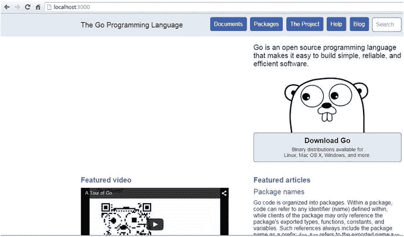

# Go 语言基础

第 1 章 概述了 Go 编程语言，并讨论了它与其他编程语言的不同之处。在本章中，你将学习使用包编写可复用代码的 Go 基础，以及如何处理数组和集合。你还将学习 Go 语言的基础知识，例如 `defer`、`panic` 和 `recover`，并了解 Go 独特的错误处理能力。

#### 包

对于 Go 开发者而言，开发应用的设计理念是开发可复用的、较小的软件组件片段，然后通过组合这些组件来构建应用。Go 通过其包生态系统提供了模块化、可组合性和代码复用性。Go 鼓励你通过包编写可维护且可复用的代码片段，使你能够用这些较小的包来组合应用。Go 包是一个至关重要的概念，它让你能够实现许多 Go 的设计原则。与 Go 的其他特性一样，包的设计也注重简洁性和实用性。

Go 源文件被组织到称为包的目录中，并且包名必须与包含 Go 源文件的目录名相同。你将扩展名为 `.go` 的 Go 源文件组织到目录中，同一目录下的源文件包名相同。标准库中的包位于 `GOROOT` 目录，即 Go 的安装目录。你在 `GOPATH` 目录中编写 Go 程序作为包，这些包易于被其他包复用。

**注意：** 标准库包的文档可在 [`http://golang.org/pkg/`](http://golang.org/pkg/) 找到。访问 [`http://godoc.org/`](http://godoc.org/) 可获取标准库和第三方库的包文档。

#### 包 main

在 Go 中，你可以编写两种类型的程序：可执行程序和共享库。当编写可执行程序时，必须将 `main` 作为包名，以使该包成为可执行程序：包 `main` 告诉 Go 编译器该包应编译为可执行程序。在官方 Go 文档中，可执行程序通常被称为命令（commands）。可执行程序的入口点是 `main` 包中的 `main` 函数；`main` 包中的 `main` 函数是可执行程序的入口点。当你编写作为共享库的包时，包中不应包含 `main` 包或 `main` 函数。

清单 2-1 是包 `main` 的代码块。

**清单 2-1.** 包含 main 函数的包 main

```
package main

import (
    "fmt"
)

func main() {
    fmt.Println("Hello World!")
}
```

当你使用 Go 工具构建上述程序时，Go 编译器会生成一个可执行二进制文件作为输出。如前所述，如果你想要在 Go 中构建可执行程序，你必须编写一个包含 `main` 函数作为程序入口点的 `main` 包。

#### 包别名

在编写 Go 包时，你无需担心包名歧义；你甚至可以使用与标准库相同的包名。当你从 `GOPATH` 位置导入自己的包时，你需要引用包位置的完整路径以避免包名歧义。你可以从两个不同的位置使用同名的两个包，但在程序中引用时应避免名称歧义。包别名帮助你解决引用多个同名包时的名称歧义问题。

清单 2-2 是一个使用包别名来引用包的示例程序。

**清单 2-2.** 使用包别名避免名称歧义

```
package main

import (
      mongo "lib/mongodb/db"
      mysql "lib/mysql/db"
)

func main() {
    mongo.Get() //调用包 "lib/mongodb/db" 的方法
    mysql.Get() //调用包 "lib/mysql/db" 的方法
}
```

这里导入了两个同名为 `db` 的包，但它们使用不同的别名进行引用，并且通过别名来访问其导出的标识符。

#### 函数 init

当编写包时，你可能需要为包提供一些初始化逻辑，例如初始化包变量、初始化数据库对象，以及为包提供一些引导逻辑。`init` 函数有助于向包中提供初始化逻辑，它会在程序执行开始时被执行。

清单 2-3 是一个使用 `init` 函数初始化数据库会话对象的示例程序。

**清单 2-3.** 使用 init 函数

```
package db

import (
    "gopkg.in/mgo.v2"
)

var Session *mgo.Session //数据库会话对象

func init() {
    // 初始化代码在此
    Session, err := mgo.Dial("localhost")
}

func get() {
        //使用 Session 对象的 get 逻辑
}

func add() {
        //使用 Session 对象的 add 逻辑
}

func update() {
        //使用 Session 对象的 update 逻辑
}

func delete() {
        //使用 Session 对象的 delete 逻辑
}
```

在这段代码中，一个 MongoDB 会话对象在 `init` 函数中被创建。当你将包 `db` 导入其他包时，`init` 函数将在程序执行开始时被调用，其中包含了包的初始化逻辑。假设你从 `main` 包中引用了包 `db`，那么 `init` 函数将在 `main` 函数执行之前被调用。


#### 使用空白标识符

在某些场景下，你可能需要引用一个包，仅仅是为了调用它的 `init` 方法，以执行被引用包中的初始化逻辑，而不使用其他标识符。假设你希望从 `main` 包中调用 `db` 包的 `init` 函数（参见列表 2-3），但不使用其他函数。你在 `main` 包中引用了 `db` 包，以便调用 `init` 函数来初始化数据库会话对象。如果你导入了一个包，但没有引用该包中的任何标识符，Go 编译器会报错。请记住，你无法通过显式引用来直接调用 `init` 函数；它会在你引用包时自动被调用。当你引用包时，这些包的 `init` 函数会在程序执行的开始阶段被调用。

如果你只想引用一个包来调用其 `init` 方法，你可以使用空白标识符（`_`）作为包的别名。编译器会忽略未使用包标识符的错误，但仍然会调用 `init` 函数，如列表 2-4 所示。

列表 2-4. 使用空白标识符 ( _ ) 仅调用 init 方法

```
package main

import (
    "fmt"
    _ "lib/mongodb/db"
)

func main() {
    // 在此处实现代码
}
```

在列表 2-4 中，`db` 包被导入时使用了空白标识符（`_`）作为包别名。此处你希望调用 `db` 包的 `init` 函数，但不想使用其他包标识符。

#### 导入包

Go 源文件按目录组织成包，包提供了代码的可重用性，供其他包使用。如果你想在其他共享库和可执行程序中重用包代码，必须将这些包导入到你的程序中。你可以使用关键字 `import` 将包导入到你的 Go 程序中。`import` 语句告诉 Go 编译器，你想要引用该特定包提供的代码。当你将包导入到程序中时，你可以重用被引用包中所有导出的标识符。如果你希望导出变量、常量以及函数供其他程序使用，标识符的名称必须以大写字母开头。参见列表 2-5。

列表 2-5. 导入包的 import 语句

```
import (
    "bytes"
    "fmt"
    "unicode"
)
```

在此列表中，导入了 `bytes`、`fmt` 和 `unicode` 包。在 Go 中导入多个包的惯用方式是将 `import` 语句写在一个 `import` 块中，如这里所示。

当导入一个包时，Go 编译器会先搜索 `GOROOT` 目录，如果在该目录中找不到包，则再查找 `GOPATH` 目录。如果 Go 编译器在 `GOROOT` 或 `GOPATH` 位置都找不到该包，当你尝试构建程序时，它将生成一个错误。

#### 安装第三方包

Go 开发者社区非常热情，通过 `github.com` 和 `code.google.com` 等代码分享网站提供了许多有用的第三方包。你可以使用 Go 工具导入并重用这些第三方包。`go get` 命令从远程仓库获取包。

以下 `go get` 命令获取第三方包 `negroni` 并将其安装到 `GOPATH` 位置：

```
go get github.com/codegangsta/negroni
```

`go get` 命令会递归地从仓库位置获取该包及其依赖包。一旦包被获取到 `GOPATH` 中，你就可以从所有位于 `GOPATH` 位置的程序中导入并重用这些包。在许多其他开发者生态系统中，你需要在项目级别导入这些包；你必须为每个单独的项目分别安装包。而在 Go 中导入包时，你实际上是从一个公共位置导入：`GOPATH/pkg` 目录，因此你可以体会到 Go 许多特性（包括包生态系统）的简洁性和实用性。

#### 编写包

让我们编写一个示例包，以供其他程序重用。列表 2-6 是一个简单的包，用于交换字符的大小写状态。

列表 2-6. 库包

```
package strcon

import (
    "bytes"
    "unicode"
)

// SwapCase 交换字符的大小写状态。
func SwapCase(str string) string {
    buf := &bytes.Buffer{}
    for _, r := range str {
        if unicode.IsUpper(r) {
            buf.WriteRune(unicode.ToLower(r))
        } else {
            buf.WriteRune(unicode.ToUpper(r))
        }
    }
    return buf.String()
}
```

该包名为 `strcon`。提供包名的惯用方式是使用简短、简单的小写名称，不要使用下划线或混合大小写字母。标准库的包名是命名包时很好的参考。

让我们构建并安装 `strcon` 包，以便其他程序使用。该包提供了一个名为 `SwapCase` 的方法，用于交换字符串中字符的大小写状态。它重用了标准库中的 `bytes` 和 `unicode` 包来实现字符大小写的交换。由于 `SwapCase` 方法名以大写字母开头，当此包被引用时，它将被导出给其他程序。`SwapCase` 方法遍历一个字符串并改变每个字符的大小写：

```
for _, r := range str {
    if unicode.IsUpper(r) {
        buf.WriteRune(unicode.ToLower(r))
    } else {
        buf.WriteRune(unicode.ToUpper(r))
    }
}
```

关键字 `range` 允许你遍历数组和集合。通过遍历字符串值，你可以提取每个字符作为值并交换其大小写。在 `range` 块的左侧，你可以提供两个变量来获取集合中每个项的 `key` 和 `value`。在此代码块中，使用了用于获取字符值的 `value`，但程序中未使用 `key`。在这种情况下，你可以使用空白标识符（`_`）来避免编译器错误。每当你想要忽略左侧的 `key` 或 `value` 变量声明时，在 `range` 中使用空白标识符是一种常见做法。

在包目录位置执行以下命令，构建包并将其安装到 `GOPATH` 的 `pkg` 子目录下：

```
go install
```

让我们编写一个示例程序来重用 `strcon` 包的代码（参见列表 2-7）。

列表 2-7. 在 main.go 中重用 strcon 包

```
package main

import (
    "fmt"
    "strcon"
)

func main() {
    s := strcon.SwapCase("Gopher")
    fmt.Println("转换后的字符串是:", s)
}
```

我们导入 `strcon` 包来重用其中交换字符串字符大小写的代码。在包目录的终端中键入以下命令来运行程序：

```
go run main.go
```

运行程序后，你应该会看到以下结果：

```
gOPHER
```

由于列表 2-7 中的程序编写在 `main` 包下，`go build` 命令会在包目录中生成一个可执行二进制文件。`go install` 命令会构建包并将生成的二进制文件安装到 `GOPATH/bin` 子目录中。


#### Go 工具

Go 工具是 Go 生态系统中非常重要的组成部分。在前面的章节中，你已使用 Go 工具来构建和运行 Go 程序。在终端中，输入不带任何参数的 `go` 命令即可获取 Go 工具所提供命令的文档。

以下是 Go 命令的文档：

`Go 是一个用于管理 Go 源代码的工具。`

`用法：`
`go 命令 [参数]`

`这些命令包括：`
`build       编译包及其依赖`
`clean       删除目标文件`
`doc         显示包或符号的文档`
`env         打印 Go 环境信息`
`fix         在包上运行 go tool fix`
`fmt         在包源文件上运行 gofmt`
`generate    通过处理源文件生成 Go 文件`
`get         下载并安装包及其依赖`
`install     编译并安装包及其依赖`
`list        列出包`
`run         编译并运行 Go 程序`
`test        测试包`
`tool        运行指定的 go 工具`
`version     打印 Go 版本`
`vet         在包上运行 go tool vet`

`使用 "go help [命令]" 获取关于某个命令的更多信息。`

`其他帮助主题：`
`c           Go 与 C 之间的调用`
`buildmode   构建模式说明`
`filetype    文件类型`
`gopath      GOPATH 环境变量`
`environment 环境变量`
`importpath  导入路径语法`
`packages    包列表说明`
`testflag    测试标志说明`
`testfunc    测试函数说明`

`使用 "go help [主题]" 获取关于该主题的更多信息。`

要获取任何特定命令的文档，请输入：

`go help [命令]`

以下是获取 `install` 命令文档的命令：

`go help install`

以下是 `install` 命令的文档：

`用法：go install [构建标志] [包]`
`Install 编译并安装由导入路径指定的包及其依赖。`
`关于构建标志的更多信息，请参见 'go help build'。`
`关于指定包的更多信息，请参见 'go help packages'。`
`另请参阅：go build, go get, go clean。`

#### 格式化 Go 代码

Go 工具提供了 `fmt` 命令来格式化 Go 代码。在将源文件提交到版本控制系统之前，格式化 Go 程序是一种良好的实践。`go fmt` 命令会为源代码应用预定义的样式以格式化源文件，从而确保花括号的正确放置，确保制表符和空格的使用规范，并按字母顺序对包导入进行排序。`go fmt` 命令可以应用于包级别或特定的源文件。

列表 2-8 展示了应用 `go fmt` 之前的 `import` 块。

列表 2-8. 应用 `go fmt` 之前的导入包块

```
import (
    "log"
    "net/http"
    "encoding/json"
)
```

列表 2-9 展示了应用 `go fmt` 之后的 `import` 块：

列表 2-9. 应用 `go fmt` 之后的导入包块

```
import (
    "encoding/json"
    "log"
    "net/http"
)
```

执行 `go fmt` 命令后，`import` 包块会按字母顺序重新排列。

注意

编写 `import` 块的惯用方式是以按字母顺序排列的标准库包开头，接着是按字母顺序排列的自定义包，并在标准库包和自定义包之间留一个空行。

#### Go 文档

文档是使软件易于访问和维护的重要组成部分。它当然必须写得清晰准确，同时也必须易于编写和维护。理想情况下，文档应与代码耦合，这样它就能随代码一起演变。程序员越容易生成良好的文档，对所有人来说情况就越好。

Go 提供了 `godoc` 工具，用于提供 Go 包的文档。它会解析 Go 源代码（包括注释），并生成 HTML 或纯文本格式的文档。简而言之，`godoc` 工具从源文件中的注释生成文档。如果你想从命令提示符访问文档，请输入：

`godoc [包]`

例如，如果你想获取 `fmt` 包的文档，请在终端中输入以下命令：

`godoc fmt`

该命令会将 `fmt` 包的文档显示在终端上。

`godoc` 工具还提供可通过 Web 界面浏览的文档。要通过基于 Web 的界面访问文档，请启动由 `godoc` 工具提供的 Web 服务器。在终端中输入以下命令：

`godoc -http=:3000`

该命令会在端口 3000 启动一个 Web 服务器，使你能够在 Web 浏览器中访问文档。然后，你可以轻松导航到标准库和 `GOPATH` 位置的包文档。参见图 2-1。



图 2-1. 从 Web 浏览器访问 godoc 文档

### 处理集合

在处理实际应用程序时，你必须利用多种数据结构来管理应用数据。当你将应用数据持久化到数据库系统时，可能会使用保存应用数据的数据结构对象的值。当从数据库读取数据时，你可能需要将数据放入各种形式的数据结构中以供其他用途，例如渲染用户界面。集合是可以容纳数据结构的集合的数据结构，这些数据结构包括内置类型和用户自定义类型。Go 提供了三种数据结构来管理数据集合：数组、切片和映射。


#### 数组

数组是一种固定长度的数据类型，包含单一类型元素的序列。通过指定数据类型和长度来声明数组。

清单 2-10 是一个声明数组的代码块。

**清单 2-10.** 声明一个包含五个元素的整数数组

```
var x [5]int
```

声明了一个数组 `x`，用于存储五个 `int` 类型的元素，因此数组 `x` 将由五个整数元素组成。

清单 2-11 是一个声明数组并赋值的示例程序。

**清单 2-11.** 声明数组并赋值

```
package main

import (
    "fmt"
)

func main() {
    var x [5]int
    x[0] = 10
    x[1] = 20
    x[2] = 30
    x[3] = 40
    x[4] = 50
    fmt.Println(x)
}
```

你应该会看到以下输出：

```
[10 20 30 40 50]
```

你可以使用数组字面量来声明并初始化数组，如清单 2-12 所示。

**清单 2-12.** 使用数组字面量初始化数组

```
x := [5]int{10, 20, 30, 40, 50}
```

你也可以使用多行语句来初始化数组（见清单 2-13）。

**清单 2-13.** 使用多行语句声明数组

```
x := [5]int{
  10,
  20,
  30,
  40,
  50,
}
```

注意，即使在最后一个元素后面也添加了一个逗号，因为这是 Go 语言的要求。这样做便于使用，例如可以轻松地移除初始化块中的一个元素或将其注释掉，而无需移除注释。

当你使用数组字面量声明数组时，可以使用 `...` 来替代指定长度。Go 编译器可以根据你在数组声明中指定的元素识别数组的长度。

清单 2-14 是一个使用 `...` 声明并初始化数组的代码块。

**清单 2-14.** 使用 `...` 初始化数组

```
x := [...]int{10, 20, 30, 40, 50}
```

当使用数组字面量初始化数组时，你可以为特定元素初始化值。

清单 2-15 是一个为特定位置赋值的示例程序。

**清单 2-15.** 为特定元素初始化值

```
package main

import "fmt"

func main() {
    x := [5]int{2: 10, 4: 40}
    fmt.Println(x)
}
```

你应该会看到以下输出：

```
[0 0 10 0 40]
```

在清单 2-15 中，值 `10` 被分配给第三个元素（索引 2），值 `40` 被分配给第五个元素（索引 4）。

#### 切片

切片是一种与数组非常相似的数据结构，但没有指定长度。它是在数组类型之上构建的一种抽象，提供了一种更方便的方式来处理集合。与常规数组不同，切片是动态数组，其长度可以在后续阶段随着数据的增加或减少而改变。当要存储在集合中的元素数量无法预测时，切片是非常有用的数据结构。

在用 Go 开发应用程序时，你经常会在代码中看到切片。如果你想读取数据库表并将数据放入集合类型中，请使用切片而不是数组，因为你无法预测集合的长度。切片提供了一个名为 `append` 的内置函数，可以快速地将元素追加到切片中。

清单 2-16 是一个声明空切片（nil slice）的代码块。

**清单 2-16.** 声明空切片

```
var x []int
```

声明了一个切片 `x`，没有指定长度。这将创建一个长度为零的整数空切片。由于切片是动态数组，你可以在稍后修改它们的长度。

在 Go 中，有几种创建和初始化切片的方法：你可以使用内置函数 `make` 或切片字面量。

#### 使用 `make` 函数创建切片

当你使用 `make` 函数声明切片时，可以显式指定切片的长度和容量。

清单 2-17 是一个声明长度为 5、容量为 10 的切片的代码块。

**清单 2-17.** 使用 `make` 函数指定切片中的长度和容量

```
x := make([]int, 5, 10)
```

如果未指定切片容量，则容量与长度相同。

清单 2-18 是一个声明切片时未指定容量的代码块。

**清单 2-18.** 使用 `make` 函数指定切片中的长度

```
x := make([]int, 5)
```

#### 使用切片字面量创建切片

创建和初始化切片的一种常见方法是使用切片字面量，它不需要在 `[]` 运算符中指定长度。初始长度和容量由初始化的元素数量决定。

清单 2-19 是一个通过切片字面量声明并初始化切片的代码块。

**清单 2-19.** 使用切片字面量初始化切片

```
x := []int{10, 20, 30, 40, 50}
```

此代码创建并初始化了一个长度为 5、容量为 5 的切片。

当你使用切片字面量创建切片时，你也可以为特定长度初始化一个切片，而不必提供所有元素，如清单 2-20 所示。

**清单 2-20.** 为特定长度初始化切片而不提供元素

```
x := []int{4: 0}
```

此代码创建了一个长度为 5、容量为 5 的切片。索引 `4` 处提供了一个零值。

你可以使用切片字面量创建空切片，如清单 2-21 所示。

**清单 2-21.** 创建空切片

```
x := []int{}
```

此代码创建了一个没有值元素的空切片。当你想从函数返回空集合时，空切片非常有用。

#### 切片函数

Go 提供了两个内置函数来方便地操作切片：`append` 和 `copy`。`append` 函数通过获取现有切片并将所有后续元素追加到其中来创建一个新切片。

清单 2-22 展示了 `append` 的一个示例。

**清单 2-22.** 使用 `append` 函数的切片

```
package main

import "fmt"

func main() {
    x := []int{10, 20, 30}
    y := append(x, 40, 50)
    fmt.Println(x, y)
}
```

你应该会看到以下输出：

```
[10 20 30] [10 20 30 40 50]
```

`copy` 函数通过将现有切片中的元素复制到另一个切片中来创建一个新切片。

清单 2-23 展示了 `copy` 函数的一个示例。

**清单 2-23.** 使用 `copy` 函数的切片

```
package main

import "fmt"

func main() {
    x := []int{10, 20, 30}
    y := make([]int, 2)
    copy(y, x)
    fmt.Println(x, y)
}
```

你应该会看到以下输出：

```
[10 20 30] [10 20]
```

运行此程序后，切片 `x` 为 `[10, 20, 30]`，切片 `y` 为 `[10, 20]`。由于切片 `y` 的长度为 2，它从切片 `x` 复制了前两个元素。如果你将切片 `y` 的长度指定为 3，它将从切片 `x` 复制所有三个元素。


#### 长度与容量

如前几节所述，切片在声明时可指定其长度和容量。切片的长度是指切片引用的元素数量；容量是指底层数组中的元素数量。切片不能保存超出其容量的值；如果你尝试添加更多元素，将会发生运行时错误。切片可以通过 `append` 函数来增长。当使用 `append` 函数添加元素时，它会检查容量是否足够，若不足，则自动增加容量。你可以通过 `len` 函数获取长度值，通过 `cap` 函数获取容量值。

清单 2-24 展示了长度与容量的概念。

**清单 2-24.** 切片长度与容量

```
package main

import "fmt"

func main() {

        x := make([]int, 2, 5)

        x[0] = 10

        x[1] = 20

        fmt.Println(x)

        fmt.Println("Length is", len(x))

        fmt.Println("Capacity is", cap(x))

        x = append(x, 30, 40, 50)

        fmt.Println(x)

        fmt.Println("Length is", len(x))

        fmt.Println("Capacity is", cap(x))

        fmt.Println(x)

        x = append(x, 60)

        fmt.Println("Length is", len(x))

        fmt.Println("Capacity is", cap(x))

        fmt.Println(x)

}
```

在这段代码中，声明了一个长度为 `2`、容量为 `5` 的切片 `x`。随后向切片 `x` 追加了两个元素。此时，容量对切片 `x` 而言是足够的；但当你尝试再向切片 `x` 追加一个元素时，切片会自动扩容，容量随之增大。

运行该程序，你将看到如下输出：

```
[10 20]

Length is 2

Capacity is 5

[10 20 30 40 50]

Length is 5

Capacity is 5

[10 20 30 40 50]

Length is 6

Capacity is 12

[10 20 30 40 50 60]
```

从输出中可以看出，当第二次使用 `append` 函数时，切片的容量增加到了 12。

#### 遍历切片

Go 提供了一个 `range` 关键字，可用于遍历集合。`range` 关键字会遍历一个元素集合，每次迭代返回两个值：第一个值是元素的索引位置，第二个值是该索引位置包含的值的副本。

清单 2-25 展示了使用 `range` 遍历切片的示例。

**清单 2-25.** 遍历切片

```
package main

import "fmt"

func main() {

    x := []int{10, 20, 30, 40, 50}

    for k, v := range x {

        fmt.Printf("Index: %d Value: %d\n", k, v)

    }

}
```

你将看到如下输出：

```
Index: 0 Value: 10

Index: 1 Value: 20

Index: 2 Value: 30

Index: 3 Value: 40

Index: 4 Value: 50
```

### 映射

映射（map）是一种数据结构，提供键值对的无序集合。（在其他编程语言中，类似于映射的数据结构称为哈希表或字典。）请记住，映射是无序的集合，因此在遍历时无法预测数据的顺序。

在 Go 中，有多种创建和初始化映射的方法。与切片类似，可以使用内置函数 `make` 或映射字面量来创建和初始化映射。

清单 2-26 是一个示例程序，演示了如何创建并初始化一个映射，以及如何遍历该集合。

**清单 2-26.** 创建映射并遍历集合

```
package main

import "fmt"

func main() {

    dict := make(map[string]string)

    dict["go"] = "Golang"

    dict["cs"] = "CSharp"

    dict["rb"] = "Ruby"

    dict["py"] = "Python"

    dict["js"] = "JavaScript"

    for k, v := range dict {

        fmt.Printf("Key: %s Value: %s\n", k, v)

    }

}
```

声明了一个名为 `dict` 的映射，其中键（`[]` 运算符内的类型）和值都被指定为字符串类型：

```
dict := make(map[string]string)
```

通过给定的键（此处键 `"go"` 对应值 `"Golang"`）为映射赋值：

```
dict["go"] = "Golang"
```

最后，使用 `range` 遍历集合，并打印集合中每个元素的键和值：

```
for k, v := range dict {

    fmt.Printf("Key: %s Value: %s\n", k, v)

}
```

你将看到如下输出：

```
Key: cs Value: CSharp

Key: rb Value: Ruby

Key: py Value: Python

Key: js Value: JavaScript

Key: go Value: Golang
```

**注意：** 由于映射是无序的集合，因此每次运行时的数据顺序都会不同。

你可以通过提供键来访问映射中元素的值（见清单 2-27）：

**清单 2-27.** 从映射中访问元素的值

```
lan, ok := dict["go"]
```

当通过键访问元素时，会返回两个值：第一个值是结果（元素的值）；第二个值是布尔值，指示查找是否成功。Go 提供了一种便捷的写法，如清单 2-28 所示。

**清单 2-28.** 以惯用方式从映射中访问元素的值

```
if lan, ok := dict["go"]; ok {

    fmt.Println(lan, ok)

}
```

### Defer、Panic 和 Recover

Go 是一种极简主义编程语言，提供了开发应用程序所需的核心功能。尽管极简，但 Go 具备开发高可靠性应用程序所需的所有能力。例如，语言特性 `defer`、`panic` 和 `recover` 允许你通过显式引发 panic 然后从中恢复，从而妥善清理对象。

#### Defer

如果你曾在 C# 和 Java 等编程语言中使用过 `try/catch/finally` 块，可能会使用 `finally` 块来释放在 `try` 块中分配的资源。当执行流程离开 `try` 语句时，`finally` 块中的语句会运行。即使控制流因处理异常而进入 `catch` 块，这个 `finally` 块也仍会被调用。使用 `defer`，你可以在 Go 中实现清理代码，这比其他语言中使用 `finally` 块更为高效。虽然 `defer` 主要用于实现清理代码，但它的用途不止于此。例如，通过与 `recover` 结合使用，你可以从一个引发 panic 的函数中重新获得控制权。

`defer` 语句会将一个函数调用（或一条代码语句）推入一个列表。这个保存的“函数调用”列表会在外围函数返回后执行。后添加的函数会先从延迟函数列表中被调用。假设你先将函数 `f1`、然后是 `f2`、最后是 `f3` 添加到延迟列表中，则执行顺序将是 `f3`、`f2`、然后 `f1`。

清单 2-29 是一个使用 `defer` 清理数据库会话对象的代码块。

**清单 2-29.** 用于清理资源的 Defer 语句

```
session, err := mgo.Dial("localhost") //MongoDB 会话对象

defer session.Close()

c := session.DB("taskdb").C("categories")

//使用 session 对象的代码语句
```

此代码块创建了一个 MongoDB 数据库的会话对象。在下一行，代码语句 `session.Close()` 被添加到延迟列表中，以便在外围函数返回后清理数据库会话对象的资源。你可以将任意数量的代码语句和函数添加到延迟列表中。


#### Panic

`panic`函数是一个内置函数，可让您停止正常的控制流程并使函数崩溃。当您从函数中调用`panic`时，它会停止函数的执行，所有延迟函数都会被执行，并且调用者（`caller`）函数会得到一个正在崩溃的函数。请记住，所有延迟函数在执行停止前都会正常执行。在开发应用程序时，您很少会调用`panic`函数，因为您的职责是提供适当的错误消息，而不是停止正常的控制流程。但在某些场景下，如果没有继续正常控制流程的可能性，您可能需要调用`panic`函数。例如，如果您无法连接到数据库服务器，继续执行应用程序就没有任何意义。

清单 2-30 是一个代码块，如果连接数据库时出现错误，它会调用`panic`。

**清单 2-30.** 使用`panic`函数使函数崩溃

```
session, err := mgo.Dial("localhost") // Create MongoDB Session object
if err != nil {
        panic(err)
}
defer session.Close()
```

此代码块尝试建立与 MongoDB 数据库的连接并创建一个`session`对象。如果在建立数据库连接时出现错误，您会调用`panic`。它会停止执行，并且调用者函数会得到一个正在崩溃的函数。

#### Recover

`recover`函数是一个内置函数，通常用在延迟函数内部，用于重新获得对正在崩溃的函数的控制权。`recover`函数仅在延迟函数内部有用，因为延迟语句是在函数崩溃时唯一可以执行某些操作的方式。

清单 2-31 是一个演示 panic 恢复的示例程序。

**清单 2-31.** 使用`recover`从崩溃函数中恢复

```
package main
import "fmt"
func doPanic() {
        defer func() {
                if e := recover(); e != nil {
                   fmt.Println("Recover with: ", e)
                }
        }()
        panic("Just panicking for the sake of demo")
        fmt.Println("This will never be called")
}
func main() {
        fmt.Println("Starting to panic")
        doPanic()
        fmt.Println("Program regains control after panic recover")
}
```

在前面的程序中，从`main`函数调用了`doPanic`函数。在`doPanic`函数内部，一个匿名函数被添加到了延迟列表中，在该匿名函数中调用`recover`来从崩溃函数中重新获得控制权。出于演示目的，通过提供一个字符串值来调用`panic`函数。当一个函数崩溃时，所有延迟函数都会被执行。因为`recover`函数在延迟函数内部被调用，所以程序执行的控制权被重新获得。当调用`recover`时，会接收到由`panic`函数提供的值。

**注意**

在`doPanic`函数中`panic`调用之后提供的语句不会执行，但在`main`函数中对`doPanic`函数调用之后的语句会执行，因为控制权已从崩溃的函数中重新获得。

您应该会看到以下输出：

```
Starting to panic
Recover with:  Just panicking for the sake of demo
Program regains control after panic recover
```

#### 错误处理

Go 中的错误处理与其他编程语言不同。大多数编程语言使用`try/catch`块来处理异常；在 Go 中，一个函数可以返回多个值。通过利用这个特性，Go 函数通常会返回一个内置`error`类型的值，以及函数返回的其他值。返回错误值的惯用方式是在其他返回值之后提供该值。当您查看标准库包时，可以看到许多函数返回一个`error`值。因此，当您调用标准库包的函数时，可以检查`error`值是否为`nil`。如果返回了非`nil`的`error`值，您可以识别出遇到了异常。您可以将相同的方法用于 Go 函数，这些函数可以从函数中返回多个值，包括一个`error`值。

清单 2-32 是一个代码块，通过调用标准库函数演示了错误处理。

**清单 2-32.** Go 中的错误处理

```
f, err := os.Open("readme.ext")
if err != nil {
    log.Fatal(err)
}
```

在这个代码块中，调用了`os`包的`Open`函数来打开一个文件。`Open`函数返回两个值：`File`对象和`error`值。如果函数返回一个非`nil`的`error`值，则存在错误，并且文件将无法打开。这里，如果发生错误，会记录该`error`值。

清单 2-33 是一个自定义函数，它返回多个值，包括一个`error`值。

**清单 2-33.** 定义带有错误值的函数

```
func GetById(id string) (models.Task, error) {
    var task models.Task
   // Implementation here
    return task,nil // multiple return values
}
```

当您编写提供`error`值的函数时，如果没有发生错误，可以返回`nil`值。调用者（`caller`）函数可以检查`error`值是否为`nil`；如果`error`值不是`nil`，则函数收到一个错误。

清单 2-34 是一个代码块，演示了如何调用一个提供`error`值的函数。

**清单 2-34.** 调用者函数检查错误值

```
task, err:= GetById ("105")
if err != nil {
    log.Fatal(err)
}
//Implementation here if error is nill
```

### 总结

本章讨论了 Go 包，这是 Go 生态系统中的重要特性。Go 通过其包生态系统提供了模块化、可组合性和代码可重用性。Go 源文件被组织到称为包的目录中。在 Go 中，您可以编写两种类型的包：包`main`（生成可执行程序，在 Go 文档中通常称为命令）和共享库包（用于与其他包重用代码）。您可以给包起别名，以避免在引用同名包时出现名称歧义。包的`init`函数可用于初始化包变量以及执行其他初始化逻辑。您不需要显式调用`init`函数；它会在执行开始时自动执行。

Go 工具是一个命令行工具，提供了各种命令，用于编译、格式化、测试和运行 Go 代码等功能。

Go 提供了三种数据结构来管理数据集合：数组、切片和映射。数组是一种固定长度的数据类型，包含单一类型元素的序列。切片是一种动态数组，可以随着数据的增加或缩减而增长。Go 提供了两个用于操作切片的内置函数：`append`和`copy`。映射是一种提供无序键值对集合的数据结构。

Go 提供了`defer`关键字用于清理资源。`defer`语句将一个函数调用推入到一个延迟函数列表中，该列表在包围函数返回后执行。`panic`函数允许您停止正常的控制流程并使函数崩溃。`recover`函数可以重新获得对崩溃函数的控制权，它仅在延迟函数内部有用。

Go 中的错误处理与大多数其他编程语言不同。由于 Go 函数可以返回多个值，因此可以从函数返回一个错误值。因此，从调用者函数中，您可以轻松检查函数是否返回了错误值，并相应地提供代码实现。


