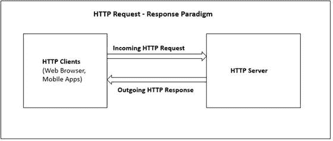
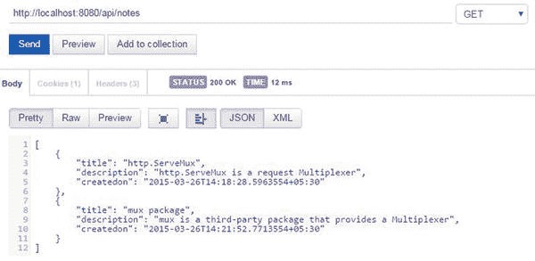
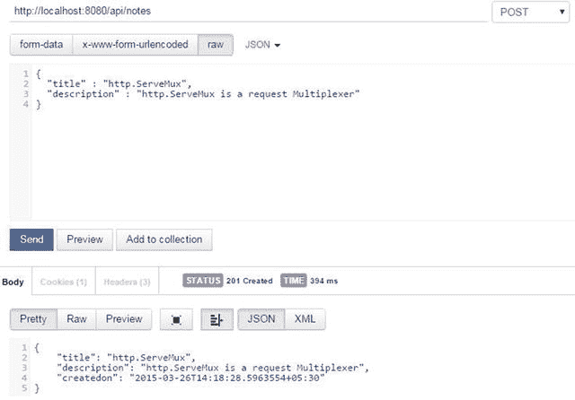

# 4. Web 开发入门

前三章讨论了 Go 编程语言和 Go 生态系统的基础知识。由于本书的主要重点是探索 Go 中的 Web 开发，因此其余章节将从实践角度探讨 Go 中的 Web 开发。

Go 是一个出色的技术栈，可用于为移动和 Web 应用构建可扩展的、基于 Web 的后端系统，但它可能不是构建传统 Web 应用的最佳选择，因为传统 Web 应用的所有处理和视图模板渲染都在服务器端执行。这并不意味着 Go 不适用于开发传统 Web 应用，但对于构建 SPA 和移动应用的后端系统而言，它是一个理想的选择，因为你可以使用 Go 在服务器端构建 API。在移动 API 时代，RESTful API 正成为现代应用的支柱，而服务器端 Web 开发也在向 REST API 演进。Go 是构建此类 API 以为 Web 和移动应用提供后端支持的绝佳环境选择。过去，我使用 C# 和 Node.js 来构建移动应用的后端 API，但现在我强烈推荐使用 Go 来开发 Web API。

本章将探讨在 Go 中构建 Web 应用的基础知识。对于 Web 开发者来说，Go 标准库提供了开发 Web 系统所需的一切。只需利用标准库，你就可以在 Go 中构建高度可扩展的 Web 应用和 Web API。

## net/http 包

当你考虑在 Go 中构建 Web 应用和 Web API，或者仅仅是构建 HTTP 服务器时，最重要的包是 `net/http`，它来自 Go 标准库，并提供了开发完整 Web 应用所需的所有基本功能。Go 的设计理念是通过组合小型的组件模块来开发更大的程序。`net/http` 包提供了高度的组合性和可扩展性，因此你可以轻松地用自己的包或第三方包替换或扩展标准库的功能。在 Ruby 等其他编程环境中，你会使用像 Rails 这样的完整 Web 应用框架来开发 Web 应用。在 Go 中，你可以找到许多完整的 Web 应用框架，例如 Beego、Revel 和 Martini。但是，在 Go 中开发 Web 应用的惯用方式是使用标准库包作为编程块的基本组成部分，并结合其他与 `http` 包兼容的库（而非框架）。对于 Web 开发，`net/http` 和 `html/template` 是标准库提供的主要包。仅使用这两个包，你就可以构建功能完整的 Web 应用，而无需借助任何第三方包。

**注意：** 你应该先从标准库包开始 Web 开发，然后再涉足第三方包和框架，以便理解 Go 的 Web 开发生态系统。如果你直接从第三方包和框架开始 Web 开发，你将错过许多核心基础知识，因为这些框架提供了大量“填鸭式”的功能和语法糖。

`http` 包提供了 HTTP 客户端和服务器的实现，包括用于客户端和服务器实现的各种结构体和函数。本章将探讨 `http` 包的各种功能。


### 处理 HTTP 请求

Web 基于请求-响应范式。在该模型（见图 4-1）中，HTTP 客户端向 Web 服务器发送数据请求，经服务器处理后，再将响应返回给 HTTP 客户端。



图 4-1. HTTP 请求-响应范式

这种通信模型最关键的一点在于，HTTP 是一个无状态层，这意味着每次向 HTTP 服务器发出的请求都被视为独立的事务，它不会记住任何之前的请求，也无法在请求之间持久保存数据。因此，通信由独立的请求和响应对组成。如果你正在构建 Web API，Web 服务器会处理 HTTP 请求，并以 XML 或 JSON 格式发送响应。如果你正在构建 Web 应用程序，Web 服务器会处理 HTTP 请求，并以 HTML 网页的形式发送响应，这些网页将在 Web 浏览器中渲染。

`net/http` 库有两个用于处理 HTTP 请求的主要组件（将在以下章节中讨论）：

*   `ServeMux`
*   `Handler`

### ServeMux

`ServeMux` 是一个多路复用器（或者简称为 HTTP 请求路由器），它将传入的 HTTP 请求与预定义的 URI 资源列表进行匹配，然后为 HTTP 客户端请求的资源调用相应的处理器。

### Handler

`ServeMux` 提供一个多路复用器，并为 HTTP 请求调用相应的处理器。处理器负责写入响应头和响应体。在 Go 中，任何对象都可以成为处理器，这归功于 Go 类型系统提供的出色接口实现。如果任何对象满足 `http.Handler` 接口的实现，它就可以成为处理 HTTP 请求的处理器。

代码清单 4-1 展示了 `http.Handler` 接口的定义。

代码清单 4-1. `http.Handler` 接口

```
type Handler interface {
   ServeHTTP(ResponseWriter, *Request)
}
```

`ServeHTTP` 方法有两个参数：一个 `http.ResponseWriter` 接口和一个指向 `http.Request` 结构体的指针。`ResponseWriter` 接口用于将响应头和响应体写入 HTTP 响应中。你可以使用 `Request` 从传入的 HTTP 请求中提取信息。例如，如果你想读取查询字符串的值，请使用 `Request` 对象。

`http` 包提供了多个实现了 `http.Handler` 接口的函数，它们被用作通用处理器：

*   `FileServer`
*   `NotFoundHandler`
*   `RedirectHandler`
*   `StripPrefix`
*   `TimeoutHandler`

### 构建静态 Web 服务器

让我们使用通用处理器函数 `FileServer` 在 Go 中构建一个静态 Web 服务器，该函数返回一个可用于构建静态 Web 服务器的处理器对象。

图 4-2 展示了一个静态网站的文件夹结构。


图 4-2. 静态网站的文件夹结构

一个静态网站应用程序在 `GOPATH` 位置创建，其文件夹结构如图 4-2 所示。静态 Web 服务器的实现在 `main.go` 源文件中编写，静态内容放置在 `public` 文件夹中，该文件夹为静态网站提供内容。

代码清单 4-2 展示了 `main.go` 中的实现，它通过提供 `public` 文件夹的内容来构建一个静态 Web 服务器。

代码清单 4-2. 使用 `FileServer` 函数构建的静态 Web 服务器

```
package main

import (
    "net/http"
)

func main() {
    mux := http.NewServeMux()
    fs := http.FileServer(http.Dir("public"))
    mux.Handle("/", fs)
    http.ListenAndServe(":8080", mux)
}
```

在 `main` 函数中，调用了 `http.NewServeMux` 函数来创建一个空的 `ServeMux` 对象。然后调用了 `http.FileServer` 函数来创建一个新的处理器，用于提供网站 `public` 文件夹中的静态内容。接着调用了 `ServeMux.Handle` 函数，将 URL 路径 `"/"` 注册到通过 `http.FileServer` 函数创建的处理器上。最后，调用了 `http.ListenAndServe` 函数来创建一个 HTTP 服务器，该服务器开始监听 `:8080` 端口上的传入请求。地址和 `ServeMux` 对象被传递给了 `ListenAndServe` 函数。

代码清单 4-3 展示了 `ListenAndServe` 函数的签名。

代码清单 4-3. `ListenAndServe` 签名

```
func ListenAndServe(addr string, handler Handler) error
```

`ListenAndServe` 函数在 TCP 网络地址上监听，然后调用带有 `http.Handler` 的 `Serve` 函数来处理传入连接上的请求。`ListenAndServe` 函数的第二个参数是一个 `http.Handler`，但此处传入的是一个 `ServeMux` 对象。`ServeMux` 类型也具有 `ServeHTTP` 方法，这意味着它满足了 `http.Handler` 接口，因此可以将 `ServeMux` 对象作为 `ListenAndServe` 函数的第二个参数传入。请记住，`ServeMux` 的实例是 `http.Handler` 接口的一个实现。如果你将 `nil` 作为 `ListenAndServe` 的第二个参数传入，则将使用 `DefaultServeMux` 作为 `http.Handler`。`DefaultServeMux` 是 `ServeMux` 的一个实例，因此它也是一个处理器。

当你运行该程序时，可以通过导航到 `http://localhost:8080/about.html`（见图 4-3）来访问静态网页 `about.html`。`about.html` 页面被放置在 `public` 文件夹中，以作为静态内容提供。


图 4-3. 访问静态网站


### 创建自定义处理器

在 Go 语言中，只要任何对象能提供签名形式为 `ServeHTTP(http.ResponseWriter, *http.Request)` 的方法，它就可以成为 `http.Handler` 的实现。

清单 4-4 通过实现 `http.Handler` 接口创建了一个自定义处理器。

清单 4-4. 创建自定义处理器

```
type messageHandler struct {
    message string
}

func (m *messageHandler) ServeHTTP(w http.ResponseWriter, r *http.Request) {
    fmt.Fprintf(w, m.message)
}
```

创建了一个名为 `messageHandler` 的结构体。为了让该类型实现 `Handler` 接口，实现了一个签名形式为 `ServeHTTP(http.ResponseWriter, *http.Request)` 的方法。如第 3 章所述，你无需指定关键字来让某个类型实现接口；只需根据接口定义的方法签名提供相应的方法，就可以将接口类型实现到具体类型中。将 `receiver` 方法作为 `messageHandler` 类型添加到 `ServeHTTP` 函数中，使其成为 `messageHandler` 结构体的方法。在 `ServeHTTP` 方法中，从结构体字段 `message` 获取数据，并返回一条字符串消息作为 HTTP 响应。

让我们编写一个程序来使用这个自定义处理器（见清单 4-5）。

清单 4-5. 使用自定义处理器类型

```
package main

import (
    "fmt"
    "log"
    "net/http"
)

type messageHandler struct {
    message string
}

func (m *messageHandler) ServeHTTP(w http.ResponseWriter, r *http.Request) {
    fmt.Fprintf(w, m.message)
}

func main() {
    mux := http.NewServeMux()
    mh1 := &messageHandler{"Welcome to Go Web Development"}
    mux.Handle("/welcome", mh1)
    mh2 := &messageHandler{"net/http is awesome"}
    mux.Handle("/message", mh2)
    log.Println("Listening...")
    http.ListenAndServe(":8080", mux)
}
```

在 `main` 函数中，创建了 `messageHandler` 结构体的实例（使用 `&` 符号获取指针），然后调用 `ServeMux.Handle` 来将处理器注册到 `messageHandler` 结构体的实例上。如果存在对 URL 路径 `"/welcome"` 和 `"/message"` 的请求，`messageHandler` 的 `ServeHTTP` 方法将在服务器端完成所有处理。你还可以重复使用自定义处理器。在该示例中，`messageHandler` 被用作两个 URL 路径的处理器。

### 使用函数作为处理器

清单 4-5 创建了一个结构体类型，并通过实现签名正确的 `ServeHTTP` 方法使其成为一个处理器。这个自定义处理器甚至可以被多个 URL 路径重复使用。尽管这种方式在某些场景下可行，但这样创建处理器的代码略显冗长，因为你必须定义结构体，然后再为 `ServeHTTP` 方法提供实现。而且在许多情况下，你可能希望使用普通函数作为处理器。

#### `http.HandlerFunc` 类型

除了通过实现 `http.Handler` 接口来创建自定义处理器类型，你还可以使用 `http.HandlerFunc` 类型来充当 HTTP 处理器。只要某个函数的签名是 `func(http.ResponseWriter, *http.Request)`，你就可以将该函数转换为 `HandlerFunc` 类型。`HandlerFunc` 类型就像一个适配器，允许你将普通函数用作 HTTP 处理器。`HandlerFunc` 类型内置了 `ServeHTTP(http.ResponseWriter, *http.Request)` 方法，因此它也满足了 `http.Handler` 接口，可以充当 HTTP 处理器。

清单 4-6 是一个使用 `HandlerFunc` 类型创建 HTTP 处理器的示例程序。

清单 4-6. 使用 `HandlerFunc` 类型将普通函数作为处理器

```
package main

import (
    "fmt"
    "log"
    "net/http"
)

func messageHandler(w http.ResponseWriter, r *http.Request) {
    fmt.Fprintf(w, "Welcome to Go Web Development")
}

func main() {
    mux := http.NewServeMux()
    // 将 messageHandler 函数转换为 HandlerFunc 类型
    mh := http.HandlerFunc(messageHandler)
    mux.Handle("/welcome", mh)
    log.Println("Listening...")
    http.ListenAndServe(":8080", mux)
}
```

运行程序后，导航到 `http://localhost:8080/welcome` 查看输出。

在 `main` 函数中，通过转换 `messageHandler` 函数创建了一个 `HandlerFunc` 实例，然后将其添加到 `ServeMux.Handle` 中，以处理对 `"/welcome"` URL 路径的请求。使用 `HandlerFunc` 类型，你可以轻松地将普通函数用作 HTTP 处理器。

在清单 4-5 中，自定义处理器可以被多个 URL 路径重复使用，因为它提供了一个可重用的 `"message"` 字段，为处理器提供了字符串值。清单 4-6 无法为 `"message"` 提供值，因此消息字符串的值必须是硬编码的。在许多场景下，你需要为处理器函数提供一些值。

假设你想将一个数据库连接对象传递给处理器函数，以便在函数内部重复使用它。你可以编写一个带有参数（用于接收某些值）的函数，然后在该函数内部定义并返回另一个作为 `http.Handler` 的函数。在 Go 中，你可以在函数内部创建函数，并且它也支持**闭包**。处理器逻辑可以在闭包中实现。

清单 4-7 是一个使用闭包编写处理器逻辑的示例程序。

清单 4-7. 将处理器逻辑写入闭包

```
package main

import (
    "fmt"
    "log"
    "net/http"
)

// 将处理器逻辑写入闭包
func messageHandler(message string) http.Handler {
    return http.HandlerFunc(func(w http.ResponseWriter, r *http.Request) {
        fmt.Fprintf(w, message)
    })
}

func main() {
    mux := http.NewServeMux()
    mux.Handle("/welcome", messageHandler("Welcome to Go Web Development"))
    mux.Handle("/message", messageHandler("net/http is awesome"))
    log.Println("Listening...")
    http.ListenAndServe(":8080", mux)
}
```

该程序的工作方式与清单 4-5 相同。`messageHandler` 函数返回一个 `http.Handler`。在 `messageHandler` 函数内部，通过调用一个签名形式为 `func(http.ResponseWriter, *http.Request)` 的匿名函数返回了 `http.HandlerFunc`，这使得它满足了 `http.Handler` 接口，因此 `messageHandler` 函数可以返回 `http.Handler`。如前文所述，`http.HandlerFunc` 类型是 `http.Handler` 的一个实现。此处，利用变量 `"message"` 形成了一个闭包，并且这个函数被放置在 `messageHandler` 函数内部。当你在处理实际应用程序时，这种方法非常有用；你可以使用此方法将应用上下文级别的类型值传递给处理器函数。


#### ServeMux.HandleFunc 函数

在上一节中，一个普通函数被转换为 `HandlerFunc` 类型，并通过注册到 `ServeMux.Handle` 来用作 HTTP 处理器。由于普通函数经常以这种方式用作 HTTP 处理器，`http` 包提供了一个快捷方法：`ServeMux.HandleFunc`。`HandleFunc` 会为给定的模式注册处理函数。（这只是一个为了方便您使用的快捷方法。）它在内部（在 `http` 包内部）会将其转换为 `HandlerFunc` 类型，并将该处理程序注册到 `ServeMux` 中。

清单 4-8 是一个使用 `ServeMux.HandleFunc` 的示例程序。

**清单 4-8.** 使用 `ServeMux.HandleFunc`

```go
package main

import (
    "fmt"
    "log"
    "net/http"
)

func messageHandler(w http.ResponseWriter, r *http.Request) {
    fmt.Fprintf(w, "Welcome to Go Web Development")
}

func main() {
    mux := http.NewServeMux()
    // 使用快捷方法 ServeMux.HandleFunc
    mux.HandleFunc("/welcome", messageHandler)
    log.Println("监听中...")
    http.ListenAndServe(":8080", mux)
}
```

运行该程序，导航至 `http://localhost:8080/welcome` 即可查看输出。

#### DefaultServeMux

在本章的示例程序中，通过调用 `http.NewServeMux` 函数创建了 `ServeMux` 对象。`DefaultServeMux` 与此前程序中的 `ServeMux` 对象相同。`DefaultServeMux` 是 `Serve` 方法使用的默认 `ServeMux`，并且当使用 `http` 包时，该 `ServeMux` 对象会被实例化。

以下是来自 Go 源码的代码声明：

```go
var DefaultServeMux = newServeMux()
```

清单 4-9 展示了来自 Go 源码的 `NewServeMux` 函数。

**清单 4-9.** 来自 Go 源码的 `NewServeMux` 函数

```go
// NewServeMux 分配并返回一个新的 ServeMux。
func NewServeMux() *ServeMux { return &ServeMux{m: make(map[string]muxEntry)} }
```

`http` 包提供了几个用于操作 `DefaultServeMux` 的快捷方法：`http.Handle` 和 `http.HandleFunc`。`http.Handle` 函数为 `DefaultServeMux` 中的给定模式注册处理程序，而 `http.HandleFunc` 则为 `DefaultServeMux` 中的给定模式注册处理函数。因此，这些函数只是用于在 `DefaultServeMux` 中使用 `ServeMux.Handle` 和 `ServeMux.HandleFunc` 的快捷方式。如果第二个参数设置为 `nil` 而非提供 `http.Handler` 对象，`ListenAndServe` 函数将使用 `DefaultServeMux`。

让我们重写清单 4-8 中的程序，以便与 `DefaultServeMux` 一起使用（参见清单 4-10）。

**清单 4-10.** 使用 `DefaultServeMux`

```go
package main

import (
    "fmt"
    "log"
    "net/http"
)

func messageHandler(w http.ResponseWriter, r *http.Request) {
    fmt.Fprintf(w, "Welcome to Go Web Development")
}

func main() {
    http.HandleFunc("/welcome", messageHandler)
    log.Println("监听中...")
    http.ListenAndServe(":8080", nil)
}
```

运行该程序，导航至 `http://localhost:8080/welcome` 即可查看输出。当您使用 `http.Handle` 和 `http.HandleFunc` 函数时，可以将 `nil` 值作为第二个参数传递给 `ListenAndServe`，因为处理程序和处理函数会通过 `http.Handle` 和 `http.HandleFunc` 函数注册到 `DefaultServeMux` 中。

### http.Server 结构体

在之前的示例中，通过调用 `http.ListenAndServe` 来运行 HTTP 服务器，这种方法不允许您自定义 HTTP 服务器配置。`http` 包提供了一个名为 `Server` 的结构体，它使您能够指定 HTTP 服务器配置。

清单 4-11 展示了 `Server` 结构体。

**清单 4-11.** `http.Server` 结构体

```go
type Server struct {
    Addr           string
    Handler        Handler
    ReadTimeout    time.Duration
    WriteTimeout   time.Duration
    MaxHeaderBytes int
    TLSConfig      *tls.Config
    TLSNextProto   map[string]func(*Server, *tls.Conn, Handler)
    ConnState      func(net.Conn, ConnState)
    ErrorLog       *log.Logger
}
```

该结构体允许您配置许多值，包括服务器的错误日志记录器、读取请求超时的最大持续时间、写入响应超时的最大持续时间以及请求头的最大大小。

清单 4-12 是一个使用 `Server` 结构体自定义服务器行为的示例程序。

**清单 4-12.** 使用 `http.Server` 结构体

```go
package main

import (
    "fmt"
    "log"
    "net/http"
    "time"
)

func messageHandler(w http.ResponseWriter, r *http.Request) {
    fmt.Fprintf(w, "Welcome to Go Web Development")
}

func main() {
    http.HandleFunc("/welcome", messageHandler)
    server := &http.Server{
        Addr:           ":8080",
        ReadTimeout:    10 * time.Second,
        WriteTimeout:   10 * time.Second,
        MaxHeaderBytes: 1 << 20,
    }
    log.Println("监听中...")
    server.ListenAndServe()
}
```

通过创建一个 `Server` 类型对象并调用 `Server.ListenAndServe` 方法来自定义服务器行为。在之前的示例中，使用 `http.ListenAndServe` 函数来启动 HTTP 服务器。当调用 `http.ListenAndServe` 函数时，它会在内部创建一个 `Server` 类型实例并调用 `ListenAndServe` 方法。

清单 4-13 是来自 Go 源码的 `http.ListenAndServe` 实现。

**清单 4-13.** `http.ListenAndServe` 的实现

```go
func ListenAndServe(addr string, handler Handler) error {
        server := &Server{Addr: addr, Handler: handler}
        return server.ListenAndServe()
}
```


### Gorilla Mux

`http.ServeMux`是一个 HTTP 请求多路复用器，在大多数常见场景下都能很好地工作。在前面的示例程序中，它被用作请求多路复用器。如果你需要为请求多路复用器提供更强大的功能，可以考虑使用与标准`http.ServeMux`兼容的第三方路由包。例如，当你想要使用适当的 HTTP 端点和 HTTP 方法来指定 RESTful 资源时，使用标准`http.ServeMux`会比较困难。

来自 Gorilla Web 工具包（`github.com/gorilla/mux`）的`mux`包是一个强大的请求路由器，允许你以自定义的方式配置多路复用器。这个包在构建 RESTful 服务时非常有用，它实现了`http.Handler`接口，因此与标准`http.ServeMux`兼容。使用`mux`包，可以根据 URL 主机、路径、路径前缀、协议、标头和查询值以及 HTTP 方法来匹配请求。你还可以使用自定义匹配器，并将路由作为子路由器与`this`包一起使用。

要安装`mux`包，在终端中运行以下命令：

`go get github.com/gorilla/mux`

让我们使用`mux`包来配置路由（参见清单 4-14）。

**清单 4-14. 使用`mux`包进行路由**

```
func main() {
    r := mux.NewRouter().StrictSlash(false)
    r.HandleFunc("/api/notes", GetNoteHandler).Methods("GET")
    r.HandleFunc("/api/notes", PostNoteHandler).Methods("POST")
    r.HandleFunc("/api/notes/{id}", PutNoteHandler).Methods("PUT")
    r.HandleFunc("/api/notes/{id}", DeleteNoteHandler).Methods("DELETE")
    server := &http.Server{
        Addr:    ":8080",
        Handler: r,
    }
    server.ListenAndServe()
}
```

这里通过调用`NewRouter`函数创建了一个`mux.Router`对象，然后为资源指定路由。在指定 URI 模式时，可以匹配 HTTP 方法，这在构建 RESTful 应用程序时非常有用。由于`mux`包实现了`http.Handler`接口，你可以轻松地使用标准`http`包。它提供了大量的可扩展性，使你能够用自己的包和第三方包轻松替换或扩展其许多功能。

与其他 Web 编程生态系统不同，Go 中 Web 开发的惯用方式是使用标准库包，并在需要时使用第三方包来扩展现有功能的能力。在选择第三方包时，选择那些与标准库包兼容的非常重要。`mux`包是这种方法的一个很好的例子，它与`http`包兼容，因为它提供了`http.Handler`接口。

#### 构建 RESTful API

本章讨论了 Go 中 Web 开发的基础知识，包括用于处理和提供 HTTP 请求的`http.ServeMux`和`http.Handler`。你还学习了第三方包`mux`，它可以作为`http.ServeMux`的替代品，并且与`http`包兼容。现在，让我们使用`mux`包作为请求多路复用器来构建一个简单的基于 JSON 的 REST API，这将帮助你理解在 Go 中构建 Web 系统的许多实际做法（参见清单 4-15）。

> **注意**
> 表述性状态转移（REST）：如果你想了解更多关于 REST 的知识，我推荐你阅读 Martin Fowler 的文章《Richardson 成熟度模型：迈向 REST 荣耀的步骤》。访问地址：[`http://martinfowler.com/articles/richardsonMaturityModel.html`](http://martinfowler.com/articles/richardsonMaturityModel.html)

**清单 4-15. 基于 JSON 的 RESTful API**

```
package main

import (
    "encoding/json"
    "log"
    "net/http"
    "strconv"
    "time"
    "github.com/gorilla/mux"
)

type Note struct {
     Title       string    `json:"title"`
     Description string    `json:"description"`
     CreatedOn   time.Time `json:"createdon"`
}

//Store for the Notes collection
var noteStore = make(map[string]Note)

//Variable to generate key for the collection
var id int = 0

//HTTP Post - /api/notes
func PostNoteHandler(w http.ResponseWriter, r *http.Request) {
    var note Note
    // Decode the incoming Note json
    err := json.NewDecoder(r.Body).Decode(&note)
    if err != nil {
        panic(err)
    }
    note.CreatedOn = time.Now()
    id++
    k := strconv.Itoa(id)
    noteStore[k] = note
    j, err := json.Marshal(note)
    if err != nil {
        panic(err)
    }
    w.Header().Set("Content-Type", "application/json")
    w.WriteHeader(http.StatusCreated)
    w.Write(j)
}

//HTTP Get - /api/notes
func GetNoteHandler(w http.ResponseWriter, r *http.Request) {
    var notes []Note
    for _, v := range noteStore {
        notes = append(notes, v)
    }
    w.Header().Set("Content-Type", "application/json")
    j, err := json.Marshal(notes)
    if err != nil {
        panic(err)
    }
    w.WriteHeader(http.StatusOK)
    w.Write(j)
}

//HTTP Put - /api/notes/{id}
func PutNoteHandler(w http.ResponseWriter, r *http.Request) {
    var err error
    vars := mux.Vars(r)
    k := vars["id"]
    var noteToUpd Note
    // Decode the incoming Note json
    err = json.NewDecoder(r.Body).Decode(&noteToUpd)
    if err != nil {
        panic(err)
    }
    if note, ok := noteStore[k]; ok {
        noteToUpd.CreatedOn = note.CreatedOn
        //delete existing item and add the updated item
        delete(noteStore, k)
        noteStore[k] = noteToUpd
    } else {
        log.Printf("Could not find key of Note %s to delete", k)
    }
    w.WriteHeader(http.StatusNoContent)
}

//HTTP Delete - /api/notes/{id}
func DeleteNoteHandler(w http.ResponseWriter, r *http.Request) {
    vars := mux.Vars(r)
    k := vars["id"]
    // Remove from Store
    if _, ok := noteStore[k]; ok {
        //delete existing item
        delete(noteStore, k)
    } else {
        log.Printf("Could not find key of Note %s to delete", k)
    }
    w.WriteHeader(http.StatusNoContent)
}

//Entry point of the program
func main() {
    r := mux.NewRouter().StrictSlash(false)
    r.HandleFunc("/api/notes", GetNoteHandler).Methods("GET")
    r.HandleFunc("/api/notes", PostNoteHandler).Methods("POST")
    r.HandleFunc("/api/notes/{id}", PutNoteHandler).Methods("PUT")
    r.HandleFunc("/api/notes/{id}", DeleteNoteHandler).Methods("DELETE")
    server := &http.Server{
        Addr:    ":8080",
        Handler: r,
    }
    log.Println("Listening...")
    server.ListenAndServe()
}
```

#### 数据模型与数据存储

清单 4-15 构建了一个简单的 REST API，针对数据模型`Note`结构体实现了基本的 CRUD 操作：

```
type Note struct {
     Title       string    `json:"title"`
     Description string    `json:"description"`
     CreatedOn   time.Time `json:"createdon"`
}
```

对于基于 JSON 的 API，结构体字段会被编码为 JSON，作为对 HTTP 客户端的响应。你可以通过使用标准库包`encoding/json`轻松地将结构体编码为 JSON，以及将 JSON 解码为结构体。如果你需要 JSON 元素与结构体字段不同的表示方式，可以将结构体字段映射为你想要的 JSON 编码元素：

```
 Title       string    `json:"title"`
 Description string    `json:"description"`
CreatedOn   time.Time `json:"createdon"`
```

这里结构体字段使用大写字母表示；在 JSON 表示中将这些字段编码为小写字母。

本示例没有使用任何数据库存储，因此为了演示目的，使用了一个映射作为持久化存储。使用整数变量`id`为映射生成键：

```
//Store for the Notes collection
var noteStore = make(map[string]Note)

//Variable to generate key for the map
var id int = 0
```


#### 配置复用器

您可以使用 `mux` 包作为复用器，并为其配置相应的处理函数。使用 `"/api/notes"` 作为表示 `Notes` 资源的基础端点。由于 `mux` 支持与 HTTP 方法进行映射，您可以轻松地以 RESTful 方式表示资源：

```go
//Entry point of the program

func main() {

    r := mux.NewRouter().StrictSlash(false)

    r.HandleFunc("/api/notes", GetNoteHandler).Methods("GET")

    r.HandleFunc("/api/notes", PostNoteHandler).Methods("POST")

    r.HandleFunc("/api/notes/{id}", PutNoteHandler).Methods("PUT")

    r.HandleFunc("/api/notes/{id}", DeleteNoteHandler).Methods("DELETE")

    server := &http.Server{

        Addr:    ":8080",

        Handler: r,

    }

    log.Println("Listening...")

    server.ListenAndServe()

}
```

表 4-1 展示了与复用器一起使用的配置。如果 URI 和 HTTP 方法与预定义的配置列表匹配，复用器将调用相应的处理函数。

**表 4-1.** 复用器配置

| URI | HTTP 方法 | 处理函数 |
| --- | --- | --- |
| `/api/notes` | `Get` | `GetNoteHandler` |
| `/api/notes` | `Post` | `PostNoteHandler` |
| `/api/notes/{id}` | `Put` | `PutNoteHandler` |
| `/api/notes/{id}` | `Delete` | `DeleteNoteHandler` |

#### 用于 CRUD 操作的处理函数

让我们看看用于 `HTTP Get` 获取 `Note` 资源值的处理函数：

```go
//HTTP Get - /api/notes

func GetNoteHandler(w http.ResponseWriter, r *http.Request) {

    var notes []Note

    for _, v := range noteStore {

        notes = append(notes, v)

    }

    w.Header().Set("Content-Type", "application/json")

    j, err := json.Marshal(notes)

    if err != nil {

        panic(err)

    }

    w.WriteHeader(http.StatusOK)

    w.Write(j)

}
```

这里遍历了 `noteStore` 映射，并将这些值追加到一个 `Note` 切片中。通过使用 `json` 包的 `Marshal` 函数，`Note` 切片被编码为 JSON。

`ResponseWriter` 用于写入响应头和响应体。此处使用 `ResponseWriter` 的 `WriteHeader` 方法写入响应头，并使用 `ResponseWriter` 的 `Write` 方法写入响应体。当您使用 `HTTP Get` 方法调用 API 端点 `"/api/notes"` 时，将看到如图 4-4 所示格式的输出。



**图 4-4.** Notes 资源的 HTTP Get

在图 4-4 中，您将获取到 JSON 格式的 `Note` 集合。这里使用了 Postman REST API 客户端工具来测试 REST API 示例。Postman 是一个 Chrome 应用，允许您测试 API。（不过，由于它是 Chrome 应用，因此只能在 Chrome 浏览器上运行）。使用 Postman，您可以快速向 API 服务器构建 HTTP 请求，将它们保存以供将来使用，并分析 API 服务器发送的响应。Postman 是一个非常实用的工具，无需构建客户端应用程序即可用于测试 REST API。要获取更多详细信息，请访问 Postman 网站 [`www.getpostman.com`](http://www.getpostman.com/)。

让我们看看用于 `HTTP Post` 创建新 `Note` 资源的处理函数：

```go
//HTTP Post - /api/notes

func PostNoteHandler(w http.ResponseWriter, r *http.Request) {

    var note Note

    // Decode the incoming Note json

    err := json.NewDecoder(r.Body).Decode(&note)

    if err != nil {

        panic(err)

    }

    note.CreatedOn = time.Now()

    id++

    k := strconv.Itoa(id)

    noteStore[k] = note

    j, err := json.Marshal(note)

    if err != nil {

        panic(err)

    }

    w.Header().Set("Content-Type", "application/json")

    w.WriteHeader(http.StatusCreated)

    w.Write(j)

}
```

指向 `http.Request` 对象的指针用于获取关于 `HTTP 请求` 的信息。此处从 `Request.Body` 访问传入的 JSON 数据，并使用 `json` 包将其解码为 `Note` 资源。`NewDecoder` 函数创建了一个 `Decoder` 对象，其 `Decode` 方法将 JSON 字符串解码为给定的类型（在此例中为 `Note` 类型）。`id` 变量递增，以为 `noteStore` 映射生成键值。`string` 类型被用作 `noteStore` 映射的键，因此使用 `strconv.Itoa` 函数将 `int` 类型转换为 `string` 类型。新的 `Note` 资源被添加到 `noteStore` 映射中，其键由 `id` 变量创建。最后，将响应作为新创建的 `Note` 资源的 JSON 数据，并附上适当的响应头发送回 HTTP 客户端。使用 `json.Marshal` 将 `Note` 对象转换为 JSON 数据。

图 4-5 展示了针对资源 `"/api/nodes"` 的 `HTTP Post` 测试。您将在响应体中看到新创建的资源，并带有 HTTP 状态码 `201`，该状态码表示 HTTP 状态 `"Created"`。



**图 4-5.** Notes 资源的 HTTP Post

端点 `"/api/notes/{id}"` 用于 `Note` 资源的 `HTTP Put` 和 `HTTP Delete` 操作。在此示例中，`id` 的值被用作 `noteStore` 映射的键。为了从请求对象中检索此值，调用了 `mux.Vars()`：

```go
vars := mux.Vars(r)

k := vars["id"]
```

`mux` 包的 `Vars` 函数返回当前请求的路由变量。使用路由值 `id`，从 `noteStore` 映射中检索 `Note` 对象，并将 `CreatedOn` 的值复制到 `Note` 对象中。

此处，为了更新功能的实现，现有 `Note` 对象被移除并重新添加到 `noteStore` 映射中。其余所有实现方式与 `HTTP Post` 操作相同：

```go
//HTTP Put - /api/notes/{id}

func PutNoteHandler(w http.ResponseWriter, r *http.Request) {

    var err error

    vars := mux.Vars(r)

    k := vars["id"]

    var noteToUpd Note

    // Decode the incoming Note json

    err = json.NewDecoder(r.Body).Decode(&noteToUpd)

    if err != nil {

        panic(err)

    }

    if note, ok := noteStore[k]; ok {

        noteToUpd.CreatedOn = note.CreatedOn

        //delete existing item and add the updated item

        delete(noteStore, k)

        noteStore[k] = noteToUpd

    } else {

        log.Printf("Could not find key of Note %s to delete", k)

    }

    w.WriteHeader(http.StatusNoContent)

}
```

与 `Note` 资源的 `HTTP Put` 操作类似，获取路由值 `id`，并通过使用来自路由变量 `id` 的键值，从 `noteStore` 映射中移除 `Note` 对象：

```go
//HTTP Delete - /api/notes/{id}

func DeleteNoteHandler(w http.ResponseWriter, r *http.Request) {

    vars := mux.Vars(r)

    k := vars["id"]

    // Remove from Store

    if _, ok := noteStore[k]; ok {

        //delete existing item

        delete(noteStore, k)

    } else {

        log.Printf("Could not find key of Note %s to delete", k)

    }

    w.WriteHeader(http.StatusNoContent)

}
```

此示例应用程序演示了通过使用 Go 的标准库包 `net/http` 和第三方包 `mux` 构建 RESTful API 的基本概念。


### 摘要

Go 是构建基于 Web 的后端系统的优秀技术栈，尤其擅长构建 RESTful API。标准库中的 `net/http` 包为在 Go 中构建 Web 应用提供了基础模块。Go 的哲学不鼓励使用大型框架来构建 Web 应用，而是提倡以 `net/http` 包为基础模块，结合第三方包和自定义包来扩展 `net/http` 包提供的功能。

`http` 包包含两个处理 HTTP 请求的主要组件：`http.ServeMux` 和 `http.Handler`。`http.ServeMux` 是一个请求多路复用器，它将传入的 HTTP 请求与预定义的 URI 资源列表进行匹配，并调用与 HTTP 客户端请求的资源相关联的处理程序。处理程序负责编写响应头和响应体。通过使用诸如 `mux` 之类的第三方包，可以扩展 `http.ServeMux` 的能力。

本章最后一节通过展示如何开发一个基于 JSON 的 RESTful API，探讨了 Go Web 开发的基础知识。

