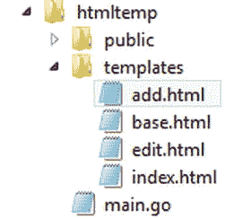
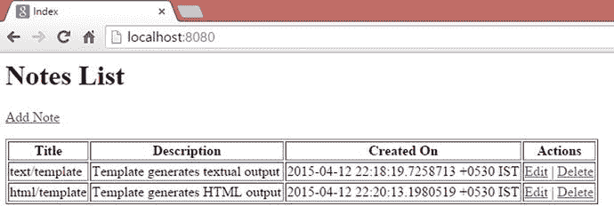
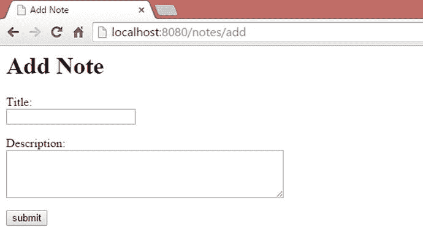
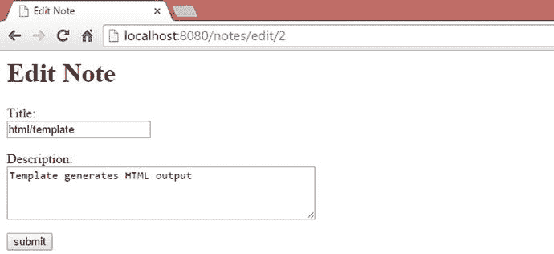

# 5. 使用 Go 模板

第 4 章讨论了使用标准库包 `net/http` 在 Go 中进行 Web 开发的基础知识。通过使用标准库包 `net/http` 作为主要 Web 编程模块，以及第三方包 Gorilla `mux` 作为 HTTP 请求多路复用器，创建了一个基于 JSON 的 Web API。本章将向您展示如何在 Go 中开发 Web 应用程序；标准库包 `html/template` 用于渲染网页。

本章从 Go 模板的基础知识开始，并介绍如何通过利用 `html/template` 包来开发功能完备的 Web 应用程序。

#### `text/template` 包

使用模板是构建动态内容的好方法；您在运行时提供数据，以预定义的格式生成动态内容。Go 标准库包 `html/template` 允许您通过将静态内容与动态内容相结合来构建动态 HTML 页面，它会在运行时解析模板以及所提供的数据结构。

在深入研究 `html/template` 包之前，您将先了解标准库包 `text/template`。`html/template` 包提供了与 `text/template` 包相同的接口；两者之间的唯一区别在于，`html/template` 包解析模板并以 HTML 格式生成输出，而 `text/template` 包则以文本格式生成输出。您可以从 `text/template` 包开始，以了解 Go 模板的语法，然后可以轻松地使用 `html/template`，而无需处理任何语法差异。`text/template` 包允许您构建数据驱动的模板，以生成文本输出。

#### 使用 `text/template`

模板会针对运行时提供的数据结构进行解析。模板中的命令引用数据结构的元素。例如，结构体字段可以与模板命令进行映射。模板中的命令由 `{{` 和 `}}` 分隔。

要使用 `text/template`，请将其添加到导入列表中：

```go
import (
    "text/template"
)
```

清单 5-1 是一个示例程序，它使用结构体对象字段生成文本输出。

**清单 5-1. 将结构体字段应用于模板**

```go
package main

import (
    "log"
    "os"
    "text/template"
)

type Note struct {
    Title       string
    Description string
}

const tmpl = `Note - Title: {{.Title}}, Description: {{.Description}}`

func main() {
    // Create an instance of Note struct
    note := Note{"text/templates", "Template generates textual output"}
    // create a new template with a name
    t := template.New("note")
    // parse some content and generate a template
    t, err := t.Parse(tmpl)
    if err != nil {
        log.Fatal("Parse: ", err)
        return
    }
    // Applies a parsed template to the data of Note object
    if err := t.Execute(os.Stdout, note); err != nil {
        log.Fatal("Execute: ", err)
        return
    }
}
```

您应该会看到以下输出：

```
Note - Title: text/templates, Description: Template generates textual output
```

在上一个清单中，声明了一个名为 `Note` 的结构体，并将一个模板声明为字符串常量：

```go
const tmpl = `Note - Title: {{.Title}}, Description: {{.Description}}`
```

在模板中，`Note` 结构体的 `Title` 和 `Description` 字段已被映射，因此当模板执行时，可以渲染包含 `Note` 对象值的文本输出。模板块 `{{ . }}` 是一个上下文感知块，将根据执行上下文执行。这里在模板执行时提供了 `Note` 对象，因此点号 (`.`) 后面的名称映射了 `Note` 对象的字段名。

创建了一个名为 `"note"` 的新模板。`New` 函数返回类型 `*Template`：

```go
t := template.New("note")
```

`Parse` 方法将一个字符串解析为模板：

```go
t, err := t.Parse(tmpl)
```

这里模板是从一个用常量变量声明的字符串解析的。要从模板文件解析模板，请使用 `*Template` 的 `ParseFiles` 方法：

```go
func (t *Template) ParseFiles(filenames ...string) (*Template, error)
```

`ParseGlob` 方法解析由模式标识的文件中的模板定义。以下是一个示例，用于解析文件夹中所有扩展名为 `.tmpl` 的模板定义文件：

```go
t, err := template.ParseGlob("templates/*.tmpl")
```

上述代码块解析了 `templates` 文件夹中所有文件扩展名为 `.tmpl` 的模板定义。

`Execute` 方法将解析后的模板应用于指定的数据对象（此处为 `Note` 对象），并将输出写入输出写入器。如果在模板执行期间或写入其输出时发生错误，则执行停止，但部分结果可能已经写入输出写入器：

```go
err1 := t.Execute(os.Stdout, note)
```

以下是使用 `text/template` 生成文本输出的步骤总结：

1. 声明一个模板，用于与数据对象映射。
2. 通过调用 `template.New` 函数创建一个模板（`*Template`）。
3. 通过调用 `Parse` 方法将字符串解析为模板。
4. 使用指定的数据对象执行解析后的模板，以使用数据对象的值渲染文本内容。

在前面的程序中，将一个简单的结构体对象应用于模板以生成输出。让我们看看如何将对象集合应用于模板以生成文本输出。

清单 5-2 是一个示例程序，它使用集合对象渲染文本模板。

**清单 5-2. 将对象切片应用于模板**

```go
package main

import (
    "log"
    "os"
    "text/template"
)

type Note struct {
```


`Title` `string`

`Description` `string`

`}`

```go
const tmpl = `Notes are:
{{range .}}
Title: {{.Title}}, Description: {{.Description}}
{{end}}
`
```

```go
func main() {
    //创建 Note 对象的切片
    notes := []Note{
        {"text/template", "模板生成文本输出"},
        {"html/template", "模板生成 HTML 输出"},
    }
    //创建一个带名称的新模板
    t := template.New("note")
    //解析一些内容并生成一个模板
    t, err := t.Parse(tmpl)
    if err != nil {
        log.Fatal("Parse: ", err)
        return
    }
    //将解析后的模板应用于 Note 对象的切片
    if err := t.Execute(os.Stdout, notes); err!=nil {
        log.Fatal("Execute: ", err)
        return
    }
}
```

您应该会得到如下输出：

```
Notes are:
Title: text/templates, Description: Template generates textual output
Title: html/templates, Description: Template generates HTML output
```

模板定义被声明为一个字符串常量：

```go
const tmpl = `Notes are:
{{range .}}
Title: {{.Title}}, Description: {{.Description}}
{{end}}
`
```

在此列表中，提供了 `Note` 结构体的切片作为数据对象。这里的模板定义块 `{{.}}` 代表集合对象，我们可以通过 `{{range .}}` 动作遍历该集合。所有控制结构（`if`、`with` 或 `range`）的定义必须以 `{{end}}` 结束。

#### 定义命名模板

模板定义可以通过 `define` 和 `end` 动作来定义。`define` 动作通过提供一个字符串常量来命名正在创建的模板，这在处理嵌套模板定义时会非常有用。（后续在构建 Web 应用时，将使用嵌套模板。）示例 5-3 是一个示例程序。

**示例 5-3.** 定义一个模板定义

```go
package main

import (
    "log"
    "os"
    "text/template"
)

func main() {
    t, err := template.New("test").Parse(`{{define "T"}}你好, {{.}}!{{end}}`)
    err = t.ExecuteTemplate(os.Stdout, "T", "世界")
    if err != nil {
        log.Fatal("Execute: ", err)
    }
}
```

您应该会得到如下输出：

```
你好 世界!
```

在前面的程序中，模板定义被定义了一个名为 `"T"` 的名称。`ExecuteTemplate` 方法用于执行名为 `"T"` 的模板，它应用字符串数据 `"World"`（即“世界”），该数据会映射到模板定义块 `{{.}}` 中。请记住，`define` 动作必须以 `end` 动作闭合，您可以在 `define` 和 `end` 动作之间提供模板定义。

#### 声明变量

可以在模板定义中声明变量，这些变量可以在模板定义中被引用以供后续使用。要声明变量，请在 `{{ }}` 块中使用 `$variable`。示例 5-4 是一个示例。

**示例 5-4.** 声明一个变量并随后引用它

```go
{{ $note := "样本备忘"}}
{{ $note }}
```

这里声明了一个 `$note` 变量，并通过简单地指定变量名来随后引用它。`{{ $note }}` 命令打印 `$note` 变量的值。

当您使用 `range` 动作声明变量时，变量值将是每次迭代中的连续元素。`range` 动作可以为键和值元素声明两个变量，用逗号分隔（参见 示例 5-5）。

**示例 5-5.** 使用 `range` 动作声明变量

```go
{{range $key,$value := . }}
```

如果您将 `range` 动作与映射一起使用，则 `$key` 变量是映射的存储键，而 `$value` 变量是每次迭代中的存储值元素。

#### 使用管道

当您使用 Go 模板时，您可以通过管道一个接一个地执行动作：每个管道的输出成为下一个管道的输入。示例 5-6 展示了一个示例。

**示例 5-6.** 在模板中使用管道

```go
{{ eq $a $b | if }} a 和 b 相等{{ end }}
```

这里，如果变量 `$a` 和 `$b` 的值相等，则打印一个输出值。

### 使用 `html/template` 构建 HTML 视图

当您构建 Web 应用时，您必须使用应用数据来渲染视图（UI）模板。标准库包 `html/template` 让您可以在 Go 中构建动态 Web 应用的用户界面。当您构建 Web 应用时，您可以通过将 Go 模板语法与 HTML、CSS 和 JavaScript 结合来定义视图模板，这些模板可以在运行时通过使用各种数据结构提供应用数据来渲染为网页。

`html/template` 包提供与 `text/template` 相同的接口，但模板定义的输出是 HTML。`html/template` 不仅生成 HTML，而且在渲染 HTML 页面时还能防止某些代码注入。当您为 Web 应用渲染 HTML 视图时，必须使用 `html/template` 而不是 `text/template`。

使用 `html/template` 的最大优势在于它能通过适当的安全模型安全地进行 HTML 编码。示例 5-7 展示了一个防范脚本注入的程序。

**示例 5-7.** `html/template` 防范脚本注入

```go
package main

import (
    "html/template"
    "log"
    "os"
)

func main() {
    t, err := template.New("test").Parse(`{{define "T"}}你好, {{.}}!{{end}}`)
    err = t.ExecuteTemplate(os.Stdout, "T", "<script>alert('XSS 注入')</script>")
    if err != nil {
        log.Fatal("Execute: ", err)
    }
}
```

您应该会得到如下输出：

```
你好, &lt;script&gt;alert(&#39;XSS 注入&#39;)&lt;/script&gt;!
```

该模板安全地对输出进行了编码，将脚本块替换为相应的文本。

#### 构建一个 Web 应用

在本节中，您将通过构建一个简单的 Web 应用来学习如何使用 `html/template` 构建 HTML 视图。

图 5-1 展示了您将在下一节中构建的 Web 应用的文件夹结构。您将在 `GOPATH` 位置编写应用。所有模板定义文件都放入 `templates` 文件夹，静态文件（如 CSS 和 JS 文件）则放入 `public` 文件夹。



**图 5-1.** 示例 Web 应用的文件夹结构

`html/template` 必须首先添加到导入列表中（参见 示例 5-8）。

**示例 5-8.** `main.go` 中的导入列表

```go
import (
        "html/template"
        "log"
        "net/http"
        "strconv"
        "time"
        "github.com/gorilla/mux"
)
```

#### 数据结构与数据存储

在 示例 5-9 所示的示例 Web 应用中，使用结构体类型作为数据结构，并针对该结构体类型执行 CRUD 操作。使用映射类型作为存储，以持久化带有键的映射类型对象。该键将通过递增变量 `id` 来生成。

**示例 5-9.** `main.go` 中的数据结构与数据存储

```go
type Note struct {
    Title       string
    Description string
    CreatedOn   time.Time
}

//Notes 集合的存储
var noteStore = make(map[string]Note)

//用于生成集合键的变量
var id int = 0
```


#### main 函数

清单 5-10 展示了程序的入口点，其中配置了 HTTP 请求多路复用器并启动了 HTTP 服务器。

清单 5-10. `main.go` 中的程序入口点

```
//程序入口点
func main() {
    r := mux.NewRouter().StrictSlash(false)
    fs := http.FileServer(http.Dir("public"))
    r.Handle("/public/", fs)
    r.HandleFunc("/", getNotes)
    r.HandleFunc("/notes/add", addNote)
    r.HandleFunc("/notes/save", saveNote)
    r.HandleFunc("/notes/edit/{id}", editNote)
    r.HandleFunc("/notes/update/{id}", updateNote)
    r.HandleFunc("/notes/delete/{id}", deleteNote)
    server := &http.Server{
        Addr:    ":8080",
        Handler: r,
    }
    log.Println("Listening...")
    server.ListenAndServe()
}
```

#### 视图与模板定义文件

该 Web 应用提供以下 HTML 页面：

-   `Index` 页面显示 `Note` 对象的列表。
-   `Add` 页面用于创建新的 `Note`。
-   `Edit` 页面用于编辑已有的 `Note` 对象。

创建了四个模板定义文件来渲染 HTML 视图：

-   `index.html`：用于生成 `Index` 页面内容的模板定义文件。
-   `add.html`：用于生成 `Add` 页面内容的模板定义文件。
-   `edit.html`：用于生成 `Edit` 页面内容的模板定义文件。
-   `base.html`：一个嵌套的模板定义文件，用于生成 Web 应用的所有页面。你需要提供合适的内容页面来渲染每个网页。

清单 5-11 是 `base.html` 的模板定义文件。

清单 5-11. `base.html` 中的模板定义

```
{{define "base"}}
<html>
  <head>{{template "head" .}}</head>
  <body>{{template "body" .}}</body>
</html>
{{end}}
```

这里定义了一个名为 `base` 的模板，其中嵌入了两个模板。为了渲染网页，每次都会调用 `base` 模板，同时从内容页面提供名为 `head` 和 `body` 的模板。例如，当渲染 `Index` 页面时，会解析来自 `base.html` 和 `index.html` 的模板定义文件，然后执行在 `base.html` 中定义的嵌套模板 `base`，并从 `index.html` 中获取 `head` 和 `body` 的内容。

#### 初始化视图模板

模板定义文件必须在模板执行之前进行解析。解析模板定义文件是一次性操作，不需要每次执行模板时都解析这些文件。这里解析了这些文件，并将它们放入一个映射中，其中每个元素代表渲染特定页面的模板文件。需要生成三个 HTML 页面，因此映射中放入了三个元素。模板定义文件在 `init` 函数中解析，并使用 `Must` 辅助函数进行解析。`Must` 是一个辅助函数，它包装了对返回 `(*Template, error)` 的函数的调用，并在返回非 `nil` 错误时触发 `panic`。

清单 5-12 使用 `Must` 辅助函数解析模板文件并将其放入映射中。

清单 5-12. 在 `main.go` 的 `init` 函数中编译视图模板文件

```
var templates map[string]*template.Template

//编译视图模板
func init() {
    if templates == nil {
        templates = make(map[string]*template.Template)
    }
    templates["index"] = template.Must(template.ParseFiles("templates/index.html", "templates/base.html"))
    templates["add"] = template.Must(template.ParseFiles("templates/add.html", "templates/base.html"))
    templates["edit"] = template.Must(template.ParseFiles("templates/edit.html", "templates/base.html"))
}
```

对于每个内容页面，相应的内容文件会与 `base.html` 一起被解析。

清单 5-13 是一个渲染单个网页的辅助函数。

清单 5-13. 在 `main.go` 中渲染模板的辅助函数

```
//根据给定的名称、模板定义和数据对象渲染模板
func renderTemplate(w http.ResponseWriter, name string, template string, viewModel interface{}) {
    // 确保模板在映射中存在。
    tmpl, ok := templates[name]
    if !ok {
        http.Error(w, "The template does not exist.", http.StatusInternalServerError)
    }
    err := tmpl.ExecuteTemplate(w, template, viewModel)
    if err != nil {
        http.Error(w, err.Error(), http.StatusInternalServerError)
    }
}
```

这里参数 `name` 用作从映射中检索模板文件的键，而参数 `template` 则用于在执行模板时提供模板名称。`renderTemplate` 函数使用 `interface{}` 类型作为数据对象的类型，因此你可以传递任何类型的数据对象以应用到模板中。`interface{}` 类型被称为“空接口”，它可以容纳任何类型的值。当你运行时不知道传递给函数参数的类型，或者希望提供任意类型的值时，这种类型非常有用。


#### 渲染索引页面

让我们渲染 `Index` 页面，以显示 `Note` 对象的列表。清单 5-14 是 `index.html` 中的模板定义。

**清单 5-14.** `index.html` 中的模板定义

```html
{{define "head"}}<title>Index</title>{{end}}

{{define "body"}}
<h1>Notes List</h1>
<p>
<a href="/notes/add" >Add Note</a>
</p>
<div>
<table border="1">
    <tr>
        <th>Title</th>
        <th>Description</th>
        <th>Created On</th>
        <th>Actions</th>
    </tr>
    {{range $key,$value := . }}
    <tr>
        <td> {{$value.Title}}</td>
        <td>{{$value.Description}}</td>
        <td>{{$value.CreatedOn}}</td>
        <td>
            <a href="/notes/edit/{{$key}}" >Edit</a> |
            <a href="/notes/delete/{{$key}}" >Delete</a>
        </td>
    </tr>
{{end}}
</table>
</div>
{{end}}
```

定义了两个模板的命名定义：`head` 和 `body`。两者都将被 `base.html` 中定义的 `base` 模板使用。当执行 `Index` 页面时，会传递一个映射对象，该对象每个元素都包含 `Note` 结构体的对象。`range` 动作用于遍历该映射对象。在 `range` 动作中，声明了两个变量，分别用于键和值元素，这些元素在 `range` 动作内部被引用。`range` 动作必须以 `end` 动作结束。

当用户请求路由 `"/"` 时，`Index` 页面通过调用 `main.go` 中的 `getNotes` 请求处理器来渲染。清单 5-15 展示了 `getNotes` 函数。

**清单 5-15.** `main.go` 中路由 `"/"` 的处理器函数

```go
func getNotes(w http.ResponseWriter, r *http.Request) {
    renderTemplate(w, "index", "base", noteStore)
}
```

在 `getNotes` 处理器函数中，调用了 `renderTemplate` 辅助函数来渲染 `Index` 页面。调用 `renderTemplate` 时，提供了 `http.ResponseWriter` 对象作为 `io.Writer`，提供了 `index` 以获取解析后的模板来执行 `Index` 页面，提供了 `base` 以指定要执行的模板定义，并提供了映射对象作为应用于模板定义的数据对象。

当调用 `templates["index"]` 时，您会得到通过使用模板定义文件 `index.html` 和 `base.html` 解析后编译好的模板。最终，从解析后的模板中执行 `base` 模板定义，该模板是一个嵌套模板，它从 `index.html` 文件中定义的 `head` 和 `page` 模板定义中获取内容。

图 5-2 显示了带有 `Note` 对象列表的 `Index` 页面。



**图 5-2.** 索引页面

请注意，图 5-2 显示了在为示例 Web 应用程序实现所有处理器函数后的最终结果。出于演示目的，已向 `noteStore` 对象中添加了几个值。

#### 渲染添加页面

添加页面用于添加新的 `Note` 对象。`add.html` 用于提供 `head` 和 `body` 部分的内容（参见清单 5-16）。

**清单 5-16.** `add.html` 中的模板定义

```html
{{define "head"}}<title>Add Note</title>{{end}}

{{define "body"}}
<h1>Add Note</h1>
<form action="/notes/save" method="post">
    <p>Title:<br> <input type="text" name="title"></p>
    <p>Description:<br> <textarea rows="4" cols="50" name="description"></textarea> </p>
    <p><input type="submit" value="submit"/> </p>
</form>
{{end}}
```

当 HTTP 服务器收到对 `"/notes/add"` 路由的请求时，它会调用 `addNote` 处理器函数（参见清单 5-17）。

**清单 5-17.** `main.go` 中 `"/notes/add"` 的处理器函数

```go
func addNote(w http.ResponseWriter, r *http.Request) {
    renderTemplate(w, "add", "base", nil)
}
```

当您不需要向模板定义提供任何数据对象时，`Add` 页面用于添加新的 `Note` 对象。因此，传递 `nil` 作为数据对象。提供字符串 `"add"` 作为映射对象的键，以获取已解析的模板（该模板通过使用模板定义文件 `add.html` 和 `base.html` 解析得到），用于渲染添加页面。

图 5-3 显示了添加页面，它提供了用于创建新 `Note` 的用户界面。



**图 5-3.** 添加页面

当用户提交 HTML 表单时，会向服务器发送一个 HTTP `POST` 请求，请求的 URL 为 `"/notes/save"`，该请求将由清单 5-18 中所示的处理器函数处理。

**清单 5-18.** 在 `main.go` 中保存新 Note 对象的处理器函数

```go
//Handler for "/notes/save" for save a new item into the data store
func saveNote(w http.ResponseWriter, r *http.Request) {
    r.ParseForm()
    title := r.PostFormValue("title")
    desc := r.PostFormValue("description")
    note := Note{title, desc, time.Now()}
    //increment the value of id for generating key for the map
    id++
    //convert id value to string
    k := strconv.Itoa(id)
    noteStore[k] = note
    http.Redirect(w, r, "/", 302)
}
```

`saveHandler` 函数通过调用 `ParseForm` 方法从 `*http.Request` 对象解析表单值；然后通过调用 `PostFormValue("element_name")` 读取表单字段值。在清单 5-18 中，从 HTML 表单元素 `title` 和 `description` 中读取值。`id` 的值递增，以便为 `noteStore` 映射对象生成一个键，最后将新添加的 `Note` 对象使用生成的键添加到 `noteStore` 映射对象中。请求被重定向到 `"/"` 以跳转到 `Index` 页面，在其中可以看到新添加的数据。


#### 渲染编辑页面

编辑页面用于修改已有的`Note`对象。`edit.html`被用来提供`head`和`body`部分的内容（参见代码清单 5-19）。

**代码清单 5-19.** `edit.html` 中的模板定义

```
{{define "head"}}<title>编辑笔记</title>{{end}}
{{define "body"}}
<h1>编辑笔记</h1>
<form action="/notes/update/{{.Id}}" method="post">
<p>标题：<br> <input type="text" value="{{.Note.Title}}" name="title"></p>
<p>描述：<br> <textarea rows="4" cols="50" name="description">{{.Note.Description}}</textarea> </p>
<p><input type="submit" value="提交"/></p>
</form>
{{end}}
```

在`edit.html`中，`Note`对象的数据元素与 HTML 表单字段值进行映射，以编辑已有的条目。该模板定义与`EditNote`结构体的数据对象相对应，该结构体包含一个待编辑条目的`id`，以及用于编辑`Note`对象字段的`Note`对象。当执行渲染编辑页面的模板时，会提供一个`EditNote`结构体的实例作为数据对象（参见代码清单 5-20）。

**代码清单 5-20.** 编辑条目的数据模型

```
//编辑的视图模型
type EditNote struct {
    Note
    Id string
}
```

当 HTTP 服务器收到对`"/notes/edit/{id}"`路由的请求时，会调用`editNote`处理函数（参见代码清单 5-21）。

**代码清单 5-21.** `main.go` 中 `"/notes/edit/{id}"` 的处理函数

```
//处理 "/notes/edit/{id}" 以编辑已有条目
func editNote(w http.ResponseWriter, r *http.Request) {
    var viewModel EditNote
    //从路由变量中读取值
    vars := mux.Vars(r)
    k := vars["id"]
    if note, ok := noteStore[k]; ok {
        viewModel = EditNote{note, k}
    } else {
        http.Error(w, "找不到要编辑的资源。", http.StatusBadRequest)
    }
    renderTemplate(w, "edit", "base", viewModel)
}
```

一个`EditNote`结构体实例作为数据对象提供给模板定义。字符串`"edit"`作为映射对象的键，用于获取已解析的模板（该模板通过模板定义文件`edit.html`和`base.html`解析得到），以渲染编辑页面。

图 5-4 展示了编辑页面的界面，它为用户提供了编辑已有`Note`的界面。



**图 5-4.** 编辑页面

当用户编辑完`Note`对象的值并提交 HTML 表单后，会向服务器发送一个针对 URL `"/notes/update/{id}"` 的 HTTP `POST` 请求，该请求将由代码清单 5-22 所示的处理函数处理。

**代码清单 5-22.** `main.go` 中 `"/notes/update/{id}"` 的处理函数（用于更新已有条目）

```
//处理 "/notes/update/{id}" 以更新数据存储中的条目
func updateNote(w http.ResponseWriter, r *http.Request) {
    //从路由变量中读取值
    vars := mux.Vars(r)
    k := vars["id"]
    var noteToUpd Note
    if note, ok := noteStore[k]; ok {
        r.ParseForm()
        noteToUpd.Title = r.PostFormValue("title")
        noteToUpd.Description = r.PostFormValue("description")
        noteToUpd.CreatedOn = note.CreatedOn
        //删除已有条目并添加更新后的条目
        delete(noteStore, k)
        noteStore[k] = noteToUpd
    } else {
        http.Error(w, "找不到要更新的资源。", http.StatusBadRequest)
    }
    http.Redirect(w, r, "/", 302)
}
```

与代码清单 5-18 中添加新`Note`对象类似，会解析来自`*http.Request`对象的表单字段值，并更新`Note`对象的值。随后请求被重定向到`"/"`，即跳转到首页，在首页中可以看到更新后的值。

`main.go`的完整源代码在代码清单 5-23 中给出。

**代码清单 5-23.** `main.go`

```
package main

import (
    "html/template"
    "log"
    "net/http"
    "strconv"
)
```


```go
"time"
"github.com/gorilla/mux"
```

```go
type Note struct {
    Title       string
    Description string
    CreatedOn   time.Time
}

// 用于编辑的视图模型
type EditNote struct {
    Note
    Id string
}

// 笔记集合的存储
var noteStore = make(map[string]Note)

// 用于生成集合键值的变量
var id int = 0
var templates map[string]*template.Template

// 编译视图模板
func init() {
    if templates == nil {
        templates = make(map[string]*template.Template)
    }
    templates["index"] = template.Must(template.ParseFiles("templates/index.html", "templates/base.html"))
    templates["add"] = template.Must(template.ParseFiles("templates/add.html", "templates/base.html"))
    templates["edit"] = template.Must(template.ParseFiles("templates/edit.html", "templates/base.html"))
}

// 根据给定的名称、模板定义和数据对象渲染模板
func renderTemplate(w http.ResponseWriter, name string, template string, viewModel interface{}) {
    // 确保模板存在于模板映射中
    tmpl, ok := templates[name]
    if !ok {
        http.Error(w, "模板不存在。", http.StatusInternalServerError)
    }
    err := tmpl.ExecuteTemplate(w, template, viewModel)
    if err != nil {
        http.Error(w, err.Error(), http.StatusInternalServerError)
    }
}

// 处理 "/notes/save" 路由，将新条目保存到数据存储中
func saveNote(w http.ResponseWriter, r *http.Request) {
    r.ParseForm()
    title := r.PostFormValue("title")
    desc := r.PostFormValue("description")
    note := Note{title, desc, time.Now()}
    // 增加 id 值，为映射生成键值
    id++
    // 将 id 值转换为字符串
    k := strconv.Itoa(id)
    noteStore[k] = note
    http.Redirect(w, r, "/", 302)
}

// 处理 "/notes/add" 路由，添加新条目
func addNote(w http.ResponseWriter, r *http.Request) {
    renderTemplate(w, "add", "base", nil)
}

// 处理 "/notes/edit/{id}" 路由，编辑现有条目
func editNote(w http.ResponseWriter, r *http.Request) {
    var viewModel EditNote
    // 从路由变量中读取值
    vars := mux.Vars(r)
    k := vars["id"]
    if note, ok := noteStore[k]; ok {
        viewModel = EditNote{note, k}
    } else {
        http.Error(w, "找不到要编辑的资源。", http.StatusBadRequest)
    }
    renderTemplate(w, "edit", "base", viewModel)
}

// 处理 "/notes/update/{id}" 路由，更新数据存储中的条目
func updateNote(w http.ResponseWriter, r *http.Request) {
    // 从路由变量中读取值
    vars := mux.Vars(r)
    k := vars["id"]
    var noteToUpd Note
    if note, ok := noteStore[k]; ok {
        r.ParseForm()
        noteToUpd.Title = r.PostFormValue("title")
        noteToUpd.Description = r.PostFormValue("description")
        noteToUpd.CreatedOn = note.CreatedOn
        // 删除现有条目并添加更新后的条目
        delete(noteStore, k)
        noteStore[k] = noteToUpd
    } else {
        http.Error(w, "找不到要更新的资源。", http.StatusBadRequest)
    }
    http.Redirect(w, r, "/", 302)
}

// 处理 "/notes/delete/{id}" 路由，从存储中删除条目
func deleteNote(w http.ResponseWriter, r *http.Request) {
    // 从路由变量中读取值
    vars := mux.Vars(r)
    k := vars["id"]
    // 从存储中移除
    if _, ok := noteStore[k]; ok {
        // 删除现有条目
        delete(noteStore, k)
    } else {
        http.Error(w, "找不到要删除的资源。", http.StatusBadRequest)
    }
    http.Redirect(w, r, "/", 302)
}

// 处理 "/" 路由，渲染主页
func getNotes(w http.ResponseWriter, r *http.Request) {
    renderTemplate(w, "index", "base", noteStore)
}

// 程序入口点
func main() {
    r := mux.NewRouter().StrictSlash(false)
    fs := http.FileServer(http.Dir("public"))
    r.Handle("/public/", fs)
    r.HandleFunc("/", getNotes)
    r.HandleFunc("/notes/add", addNote)
    r.HandleFunc("/notes/save", saveNote)
    r.HandleFunc("/notes/edit/{id}", editNote)
    r.HandleFunc("/notes/update/{id}", updateNote)
    r.HandleFunc("/notes/delete/{id}", deleteNote)
    server := &http.Server{
        Addr:    ":8080",
        Handler: r,
    }
    log.Println("正在监听...")
    server.ListenAndServe()
}
```

在这个例子中，通过利用标准库包 `html/template` 来渲染包含动态数据的用户界面，在 Go 中完成了一个完整的 Web 应用程序。模板定义文件被解析并放入一个映射对象中，这样你就可以在需要执行模板时轻松获取解析后的模板文件。这种方法避免了每次执行模板时都重新解析模板文件，从而提高了 Web 应用程序的性能。通过利用示例应用程序中展示的各种技术，你可以构建真实的 Web 应用程序。

### 总结

本章通过开发一个 Web 应用程序，展示了如何使用 Go 模板。在处理数据驱动的 Web 应用程序时，你必须利用模板来渲染 HTML 页面，在这些页面中，你可以通过将数据对象应用于模板，将静态内容与动态内容结合起来。

`html/template` 包用于渲染 HTML 页面。它在渲染 HTML 输出时还提供了针对各种代码注入的安全机制。`html/template` 和 `text/template` 为模板作者提供了相同的接口，其中 `html/template` 生成 HTML 输出，而 `text/template` 生成文本输出。通过利用标准库包 `net/http` 和 `html/template`，你可以在 Go 中构建功能完备的 Web 应用程序。

