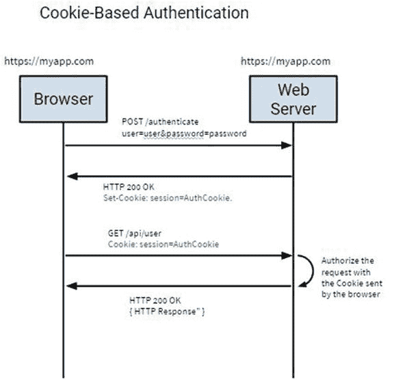
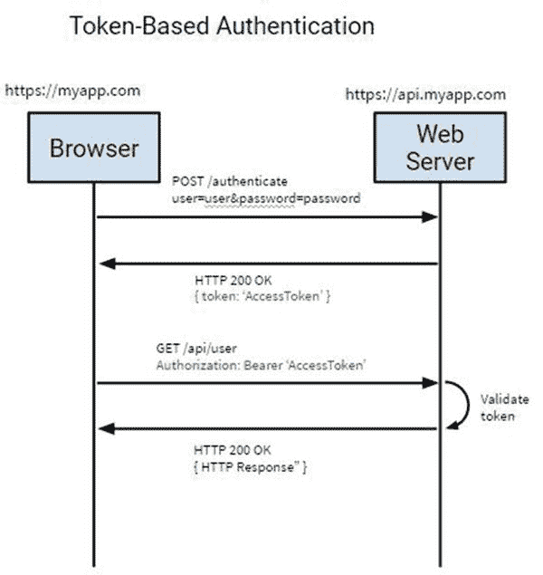
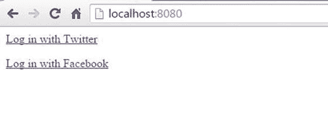
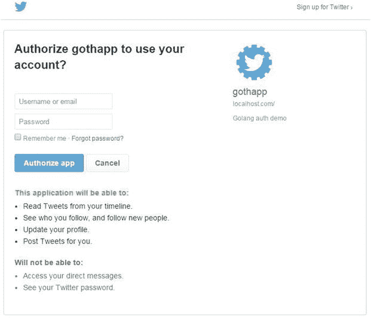
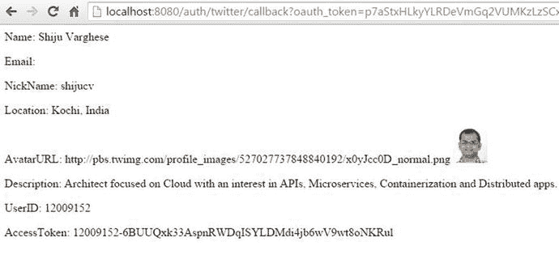
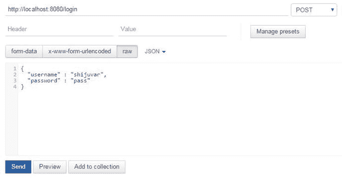
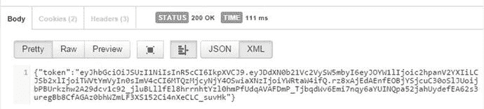
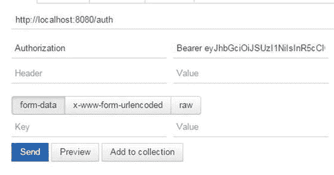
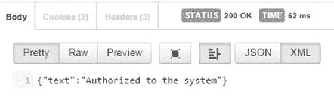

# 7. 为 Web 应用添加身份验证

安全性是构建成功的 Web 应用或 Web API 时需要考虑的最重要因素之一。如果你无法保护应用程序免受未授权访问，那么无论其功能如何，整个应用都将毫无意义。你可能为应用程序开发了出色的用户体验，但如果你无法确保应用安全，那么所有实现都将功亏一篑。身份验证和授权使得应用程序能够保护其受保护的资源免受未授权访问。

本章将向你展示如何使用各种身份验证方法来保护基于 Web 的系统。它将重点介绍用于保护应用程序的现代身份验证方法，当你使用 Web API 作为服务器端实现来构建 Web 应用和移动应用时，这些方法非常有用。

### 身份验证与授权

身份验证是识别能够访问受保护资源的应用程序和服务的客户端的过程。这些客户端可以是最终用户，也可以是其他应用程序和服务。通常，数据库存储用户凭据，例如用户名和密码，最终用户通过输入有效的用户名和密码来获得对应用程序的访问权限。

授权是授予执行特定操作或访问资源权限的过程，该权限仅授予经过身份验证的客户端。授权与身份验证过程协同工作，你可以将授权角色附加到用户凭据上。当你在数据库中存储用户凭据时，你可以将授权角色和权限与用户信息关联起来。当你构建应用程序时，可以通过定义多个授权角色来区分访问权限。例如，如果你想为特定的已认证用户提供管理员功能，你可以为管理员用户定义一个授权角色及其访问权限，从而区分他们与其他已认证用户的访问权限。某些应用程序可能没有任何授权角色，因为所有已认证用户对应用程序拥有相同的权限。

当你设计 Web 应用程序时，适当的身份验证和授权策略是最重要的因素。如果你设计的应用程序具有适当的身份验证和授权机制，就能避免许多安全挑战，而这些挑战对于一个成功的应用程序来说至关重要。


### 身份验证方法

在应用程序中实现身份验证有多种可用方法。通常，用户凭证会存储在应用程序的数据库中。Web 服务器通过 HTML 表单获取用户名和密码，然后将这些凭证与数据库中存储的凭证进行验证。但在现代应用程序中，人们也使用诸如 Facebook、Twitter、LinkedIn 和 Google 等社交身份提供商作为社交身份进行身份验证，这有助于应用程序避免为每个单独的应用维护独立的用户身份系统。最终用户无需记住每个应用的用户 ID 和密码，他们可以使用现有的社交身份来验证登录应用程序。

在这个移动化时代，现代 Web 开发正朝着基于 API 的方向发展，这些 API 同时被移动客户端和 Web 客户端所使用。必须为现代 Web 应用程序提供更可靠的安全系统。API 是基于无状态设计开发的，在设计 API 的身份验证系统时应考虑到这一点。因此，您不能将对传统 Web 应用程序使用的方法直接应用于 API。

一旦用户登录系统，他们就必须能够在后续的 HTTP 请求中访问 Web 服务器资源，而无需为每个 HTTP 请求提供用户凭证。有两种方法可以将用户保持为后续 HTTP 请求的"已登录"状态。传统方法是使用 HTTP 会话和 Cookie，而现代方法是使用 Web 服务器生成的访问令牌。基于令牌的方法对于 Web API 来说是一种便捷的解决方案；HTTP 会话和 Cookie 则适用于传统 Web 应用程序。

#### 基于 Cookie 的身份验证

基于 Cookie 的方法是实现 Web 应用程序身份验证最广泛使用的方式。在这种方法中，用户使用凭证登录系统后，每个 HTTP 请求都通过 HTTP Cookie 进行身份验证。

图 7-1 展示了基于 Cookie 的身份验证工作流程。



图 7-1. 基于 Cookie 的身份验证工作流程

在基于 Cookie 的身份验证中，Web 服务器首先验证通过 HTML 表单发送的用户名和密码。一旦用户凭证与数据库中存储的凭证验证通过，HTTP 服务器就会设置一个会话 Cookie，通常包含用户信息。对于每个后续 HTTP 请求，Web 服务器可以根据 Cookie 中包含的值来验证 HTTP 请求。一些服务器端技术为实施此类身份验证提供了非常丰富的基础设施，您只需调用其 API 方法即可轻松实现基于 Cookie 的身份验证。在其他服务器端技术和框架中，您可以手动编写一些代码来写入 Cookie 并将值存储到会话存储中，以实现身份验证。

结合会话的基于 Cookie 的方法非常适合传统 Web 应用程序，在这些应用程序中，所有内容（包括 UI 渲染逻辑）都在服务器端实现。Web 应用程序通过常规桌面浏览器访问。

在 Go 语言中，您可以使用诸如 `sessions` ([www.gorillatoolkit.org/pkg/sessions](http://www.gorillatoolkit.org/pkg/sessions)) 之类的包（由 Gorilla Web 工具包提供），通过基于 Cookie 的会话来实施身份验证。

由于多种原因，使用基于 Cookie 的方法为 Web API 实施身份验证并非良策。当您构建 API 时，无状态设计是理想的设计选择。如果使用基于 Cookie 的方法，您需要为 API 维护一个会话存储，这违反了无状态 API 的设计原则。此外，当从不同域访问 Web 服务器资源时，由于跨域资源共享（CORS）的限制，基于 Cookie 的方法也无法很好地工作。

#### 基于令牌的身份验证

过去几年中，开发 Web 应用程序的方法已经发生变化。移动应用开发的时代也改变了基于 Web 的系统的开发方式。现代 Web 开发正朝着 API 驱动的方式发展，即在服务器端提供 Web API（通常是 RESTful API），而 Web 应用程序和移动应用程序则通过使用该 Web API 来构建。

基于令牌的方法是为 Web 应用程序和 Web API 实施身份验证的现代方法。在基于令牌的方法中（见图 7-2），每个 HTTP 请求都使用访问令牌 ID 进行身份验证。在这种方法中，您也可以使用用户名和密码登录系统。如果用户获得系统访问权限，身份验证系统会生成一个访问令牌，用于后续的 HTTP 请求，以便在 Web 服务器上进行身份验证。这些访问令牌是经过安全签名的字符串，可用于每个 HTTP 请求访问 HTTP 资源。通常，访问令牌作为 Bearer 令牌通过 HTTP `Authorization` 头发送，可以在 Web 服务器端进行验证。



图 7-2. 基于令牌的身份验证工作流程

有时，您可以使用第三方身份提供商或第三方 API 进行身份验证。在这种情况下，使用客户端 ID 和密钥（而非用户名和密码）来登录身份验证系统。

以下是基于令牌的身份验证过程：

- 通过提供用户名和密码，或提供客户端 ID 和密钥来验证登录系统。
- 如果身份验证请求成功，身份验证系统会生成一个经过安全签名的字符串作为访问令牌，用于后续的 HTTP 请求。
- 客户端应用程序从 Web 服务器接收令牌，并使用它来访问 Web 服务器资源。
- 客户端应用程序在每个发往 Web 服务器的 HTTP 请求中提供访问令牌。使用 HTTP 标头将访问令牌传输到 Web 服务器。
- Web 服务器验证客户端应用程序提供的访问令牌，如果访问令牌有效，则提供 Web 服务器资源。

当您构建无需在客户端利用 Cookie 的移动应用时，基于令牌的方法非常方便。当您使用 API 作为服务器端实现时，无需维护会话存储，这使您能够在服务器端构建无状态 API，并且这些 API 可以被各种客户端应用轻松使用而毫无障碍。使用基于令牌的方法的另一个好处是，您可以轻松地向任何 Web 服务器发起 AJAX 调用，无论其域如何，因为您使用 HTTP 标头发起 HTTP 请求。

基于令牌的方法是为 RESTful API 提供安全性的理想解决方案。在 Web 技术领域，Go 主要用于构建后端 API（通常是 RESTful API），因此本章的重点主要放在基于令牌的方法上。

### 使用 OAuth 2 进行身份验证

基于令牌的方法实际上源于 OAuth 规范，该规范旨在解决身份验证问题，使应用程序能够通过开放的身份验证模型访问彼此的数据。在深入探讨使用 OAuth 2 服务提供商的示例身份验证程序之前，让我们先简要了解一下 OAuth。


#### 理解 OAuth 2

`OAuth 2` 是一个开放的身份验证规范。`OAuth 2.0` 授权框架使第三方应用程序能够获得对 Facebook、Twitter、GitHub 和 Google 等 HTTP 服务的有限访问权限。最重要的是，`OAuth 2` 是一种用于身份验证流程的规范。

`OAuth 2` 为 Web 应用程序、桌面应用程序和移动应用程序提供了授权流程。在构建应用程序时，您可以将用户身份验证委托给 Facebook、Twitter、GitHub 和 Google 等社交身份提供商。您可以在身份提供商处注册您的应用程序，以授权该应用程序访问用户账户。当您在身份提供商处注册应用程序时，通常会获得一个 `client ID` 和一个 `client secret key`，以便访问身份提供商的用户账户。一旦您使用 `client ID` 和 `client secret key` 登录，身份验证服务器便会为您提供一个 `access token`，该令牌可用于访问 Web 服务器的受保护资源。

第 7.2.2 节讨论了基于令牌的身份验证工作流程。使用 Bearer Token 是在 `OAuth 2` 授权框架中定义的一种规范，它定义了如何在 HTTP 请求中使用 Bearer Token 来访问 `OAuth 2` 中的受保护资源。

有多个 `OAuth 2` 服务提供商可用于身份验证。由于 `OAuth 2` 是一个开放的授权标准，您可以将这些标准实现到您的 Web API 中，作为各种客户端应用程序（包括移动应用程序和 Web 应用程序）的身份验证机制。

注意

`OAuth 2.0` 是 OAuth 协议的下一代演进版本，该协议最初于 2006 年创建。`OAuth 2.0` 专注于客户端开发者的简便性，同时为 Web 应用程序、桌面应用程序和移动应用程序提供特定的授权流程。`OAuth 2` 规范的最终版本可在 [`http://tools.ietf.org/html/rfc6749`](http://tools.ietf.org/html/rfc6749) 找到。

#### 使用 Goth 包通过 OAuth 2 进行身份验证

Go 生态系统中提供了多种用于处理 `OAuth 2` 身份验证协议的包。`Goth` 第三方包及其子包 `Gothic` 允许您与 `OAuth 2` 提供商进行交互。`Goth` 支持 LinkedIn、Facebook、Twitter、Google 和 GitHub 等 `OAuth 2` 服务提供商。`Goth` 包提供了多种用于与每个服务提供商交互的 provider。例如，它提供了 `github.com/markbates/goth/providers/twitter` 包用于与 Twitter 身份提供商交互。

要安装 `Goth` 包，请在终端中运行以下命令：

`go get github.com/markbates/goth`

要使用 `Goth` 包，您必须将 `github.com/markbates/goth` 添加到导入列表中：

`import "github.com/markbates/goth"`

清单 7-1 是一个示例程序，它使用 Twitter 和 Facebook 作为身份提供商。在该程序中，Twitter 和 Facebook 登录凭据用于认证进入一个示例应用程序。

清单 7-1. 使用 `OAuth 2` 服务提供商进行身份验证

```
package main

import (
	"encoding/json"
	"fmt"
	"html/template"
	"log"
	"net/http"
	"os"

	"github.com/gorilla/pat"
	"github.com/markbates/goth"
	"github.com/markbates/goth/gothic"
	"github.com/markbates/goth/providers/facebook"
	"github.com/markbates/goth/providers/twitter"
)

//解析 JSON 配置的结构体
type Configuration struct {
	TwitterKey     string
	TwitterSecret  string
	FacebookKey    string
	FacebookSecret string
}

var config Configuration

//从 config.json 读取配置值
func init() {
	file, _ := os.Open("config.json")
	decoder := json.NewDecoder(file)
	config = Configuration{}
	err := decoder.Decode(&config)
	if err != nil {
		log.Fatal(err)
	}
}

func callbackAuthHandler(res http.ResponseWriter, req *http.Request) {
	user, err := gothic.CompleteUserAuth(res, req)
	if err != nil {
		fmt.Fprintln(res, err)
		return
	}
	t, _ := template.New("userinfo").Parse(userTemplate)
	t.Execute(res, user)
}

func indexHandler(res http.ResponseWriter, req *http.Request) {
	t, _ := template.New("index").Parse(indexTemplate)
	t.Execute(res, nil)
}

func main() {
	//向 Goth 注册提供商
	goth.UseProviders(
		twitter.New(config.TwitterKey, config.TwitterSecret, "http://localhost:8080/auth/twitter/callback"),
		facebook.New(config.FacebookKey, config.FacebookSecret, "http://localhost:8080/auth/facebook/callback"),
	)

	//使用 Pat 包进行路由
	r := pat.New()
	r.Get("/auth/{provider}/callback", callbackAuthHandler)
	r.Get("/auth/{provider}", gothic.BeginAuthHandler)
	r.Get("/", indexHandler)

	server := &http.Server{
		Addr:    ":8080",
		Handler: r,
	}

	log.Println("正在监听...")
	server.ListenAndServe()
}

//视图模板
var indexTemplate = `
<p><a href="/auth/twitter">使用 Twitter 登录</a></p>
<p><a href="/auth/facebook">使用 Facebook 登录</a></p>
`

var userTemplate = `
<p>姓名: {{.Name}}</p>
<p>邮箱: {{.Email}}</p>
<p>昵称: {{.NickName}}</p>
<p>位置: {{.Location}}</p>
<p>头像 URL: {{.AvatarURL}} </p>
<p>描述: {{.Description}}</p>
<p>用户 ID: {{.UserID}}</p>
<p>访问令牌: {{.AccessToken}}</p>
`
```

Twitter 和 Facebook 被用于登录示例应用程序。为此，您需要在相应的身份提供商处注册该应用程序。当您在身份提供商处注册应用程序时，您会获得一个 `client ID` 和 `secret key`。通过提供 `client ID`、`client secret key` 和 `callback URL`，即可在 `Goth` 包中注册 Twitter 和 Facebook 提供商。

成功通过 `OAuth2` 服务提供商登录后，服务器会重定向到回调 URL：

```
//向 Goth 注册 OAuth2 提供商
goth.UseProviders(
	twitter.New(config.TwitterKey, config.TwitterSecret, "http://localhost:8080/auth/twitter/callback"),
```


```go
facebook.New(config.FacebookKey, config.FacebookSecret, "http://localhost:8080/auth/facebook/callback"),
```

客户端 ID 和客户端密钥在`init`函数中从配置文件读取。

运行程序并导航到`http://localhost:8080/`。图 7-3 显示了应用程序的主页，该页面提供了 Twitter 和 Facebook 的身份验证功能。



**图 7-3.** 示例程序的首页

让我们选择 Twitter 来获取身份提供者的访问权限。系统会要求使用 Twitter 账户凭证授权该应用程序，如图 7-4 所示。



**图 7-4.** 使用 Twitter 凭证登录

成功通过社交身份提供者登录后，应用程序被授权访问认证服务器，并将用户信息（包括访问令牌）提供给应用程序，同时重定向到注册社交身份提供者时提供的回调 URL（使用`Goth`包）。

以下是回调 URL 的应用程序处理函数：

```go
func callbackAuthHandler(res http.ResponseWriter, req *http.Request) {

    user, err := gothic.CompleteUserAuth(res, req)

    if err != nil {
        fmt.Fprintln(res, err)
        return
    }

    t, _ := template.New("userinfo").Parse(userTemplate)
    t.Execute(res, user)
}
```

当调用`Goth`包的`CompleteUserAuth`函数时，它会返回`Goth`包的一个`User`结构体。该`User`结构体包含大多数 OAuth 和 OAuth2 提供者通用的信息。来自提供者的所有“原始”数据都可以在`RawData`字段中找到。

以下是`Goth`包源码中`User`结构体的定义：

```go
type User struct {
    RawData           map[string]interface{}
    Email             string
    Name              string
    NickName          string
    Description       string
    UserID            string
    AvatarURL         string
    Location          string
    AccessToken       string
    AccessTokenSecret string
}
```

最后，通过提供`User`结构体来渲染视图模板。以下是用于渲染显示用户信息的 UI 的视图模板：

```html
var userTemplate = `
<p>Name: {{.Name}}</p>
<p>Email: {{.Email}}</p>
<p>NickName: {{.NickName}}</p>
<p>Location: {{.Location}}</p>
<p>AvatarURL: {{.AvatarURL}} </p>
<p>Description: {{.Description}}</p>
<p>UserID: {{.UserID}}</p>
<p>AccessToken: {{.AccessToken}}</p>
`
```

图 7-5 显示了从 Twitter 获取的用户信息。



**图 7-5.** 从 Twitter 获取的用户信息页面

### 使用 JSON Web Token 进行身份验证

第 7.2.2 节讨论了一种基于令牌的认证方法，其中使用不记名令牌来访问 Web 服务器的受保护资源。JSON Web Token（JWT）是一种用于生成和使用不记名令牌进行两方认证的开放标准。JWT 是一种紧凑、URL 安全的方式，用于表示要在两方之间传输的声明。JWT 中的声明被编码为 JSON 对象，并使用 JSON Web 签名（JWS）进行数字签名。与 OAuth 2 一样，JWT 是基于令牌认证的开放标准。（JWT 的发音与英文单词“jot”相同。）

JWT 是一个签名的 JSON 对象，可以在 OAuth 2 中用作不记名令牌进行身份验证。JWT 令牌由三部分组成，用`.`（句点）分隔。第一部分称为`Header`，它是一个经过 base64url 编码的 JSON 对象。第二部分称为`Claims`，也是一个 JSON 对象，包含 JWT 所承载的声明。最后一部分称为`Signature`，使用`Header`提供的信息进行验证。

**注意**

JWT 规范的草案可在此处获取：[`http://self-issued.info/docs/draft-ietf-oauth-json-web-token.html`](http://self-issued.info/docs/draft-ietf-oauth-json-web-token.html)


### 使用 `jwt-go` 包处理 JWT

第三方 Go 语言包 `jwt-go` 提供了多种用于处理 JWT 的实用函数。它提供以下实用功能：

- 生成和签署 JWT 令牌
- 解析和验证 JWT 令牌

`jwt-go` 库支持 RSA256 和 HMAC SHA256 签名算法。

要安装 `jwt-go` 包，请在终端中输入以下命令：

```
go get github.com/dgrijalva/jwt-go
```

要使用 `jwt-go` 包，必须将 `github.com/dgrijalva/jwt-go` 添加到导入列表中：

```
import "github.com/dgrijalva/jwt-go"
```

让我们编写一个示例 API，使用 `jwt-go` 包处理 JWT 令牌。示例程序中认证流程的步骤如下：

API 服务器验证客户端应用程序提供的用户凭据（用户名和密码）。如果登录凭据有效，API 服务器会生成一个 JWT 令牌，并将其作为访问令牌发送给客户端应用程序。客户端应用程序可以将 JWT 令牌存储在客户端存储中。HTML 5 本地存储通常用于存储 JWT 令牌。为了访问 API 服务器的受保护资源，客户端应用程序在每个 HTTP 请求中，都会将访问令牌作为 Bearer 令牌放入 HTTP 头 `Authorization (Authorization: Bearer "Access_Token")` 中。

在开始示例程序之前，让我们为应用程序生成用于签署令牌的 RSA 密钥。可以使用 `openssl` 命令行工具生成 RSA 密钥。

运行以下命令：

```
openssl genrsa -out app.rsa 1024
```

```
openssl rsa -in app.rsa -pubout > app.rsa.pub
```

这些命令会生成一个私钥和一个公钥。`1024` 是所生成密钥的大小。

清单 7-2 展示了示例程序。

## 清单 7-2. 使用 `jwt-go` 包进行基于 JWT 令牌的认证

```
package main

import (
	"encoding/json"
	"fmt"
	"io/ioutil"
	"log"
	"net/http"
	"time"

	jwt "github.com/dgrijalva/jwt-go"
	"github.com/gorilla/mux"
)

// 使用非对称加密/RSA 密钥
// 用于签名和验证的密钥文件位置
const (
	privKeyPath = "keys/app.rsa"     // openssl genrsa -out app.rsa 1024
	pubKeyPath  = "keys/app.rsa.pub" // openssl rsa -in app.rsa -pubout > app.rsa.pub
)

// 验证密钥和签名密钥
var (
	verifyKey, signKey []byte
)

// 用于解析登录凭据的 User 结构体
type User struct {
	UserName string `json:"username"`
	Password string `json:"password"`
}

// 在启动 HTTP 处理程序之前读取密钥文件
func init() {
	var err error
	signKey, err = ioutil.ReadFile(privKeyPath)
	if err != nil {
		log.Fatal("读取私钥时出错")
		return
	}
	verifyKey, err = ioutil.ReadFile(pubKeyPath)
	if err != nil {
		log.Fatal("读取私钥时出错")
		return
	}
}

// 读取登录凭据，检查凭据并创建 JWT 令牌
func loginHandler(w http.ResponseWriter, r *http.Request) {
	var user User
	// 解码到 User 结构体
	err := json.NewDecoder(r.Body).Decode(&user)
	if err != nil {
		w.WriteHeader(http.StatusInternalServerError)
		fmt.Fprintln(w, "请求体中有错误")
		return
	}
	// 验证用户凭据
	if user.UserName != "shijuvar" && user.Password != "pass" {
		w.WriteHeader(http.StatusForbidden)
		fmt.Fprintln(w, "信息错误")
		return
	}
	// 为 rsa 256 创建签名器
	t := jwt.New(jwt.GetSigningMethod("RS256"))
	// 设置我们的声明
	t.Claims["iss"] = "admin"
	t.Claims["CustomUserInfo"] = struct {
		Name string
		Role string
	}{user.UserName, "Member"}
	// 设置过期时间
	t.Claims["exp"] = time.Now().Add(time.Minute * 20).Unix()
	tokenString, err := t.SignedString(signKey)
	if err != nil {
		w.WriteHeader(http.StatusInternalServerError)
		fmt.Fprintln(w, "抱歉，签名令牌时出错！")
		log.Printf("令牌签名错误: %v\n", err)
		return
	}
	response := Token{tokenString}
	jsonResponse(response, w)
}

// 只有拥有有效令牌才能访问
func authHandler(w http.ResponseWriter, r *http.Request) {
	// 验证令牌
	token, err := jwt.ParseFromRequest(r, func(token *jwt.Token) (interface{}, error) {
		// 由于我们只使用一个私钥来签署令牌，
		// 所以我们也只使用其对应的公钥进行验证
		return verifyKey, nil
	})
	if err != nil {
		switch err.(type) {
		case *jwt.ValidationError: // 验证过程中出现问题
			vErr := err.(*jwt.ValidationError)
			switch vErr.Errors {
			case jwt.ValidationErrorExpired:
				w.WriteHeader(http.StatusUnauthorized)
				fmt.Fprintln(w, "令牌已过期，请获取一个新令牌。")
				return
			default:
				w.WriteHeader(http.StatusInternalServerError)
				fmt.Fprintln(w, "解析令牌时出错！")
				log.Printf("ValidationError 错误: %+v\n", vErr.Errors)
				return
			}
		default: // 发生其他错误
			w.WriteHeader(http.StatusInternalServerError)
			fmt.Fprintln(w, "解析令牌时出错！")
			log.Printf("令牌解析错误: %v\n", err)
			return
		}
	}
	if token.Valid {
		response := Response{"已授权访问系统"}
		jsonResponse(response, w)
	} else {
		response := Response{"无效令牌"}
		jsonResponse(response, w)
	}
}

type Response struct {
	Text string `json:"text"`
}

type Token struct {
	Token string `json:"token"`
}

func jsonResponse(response interface{}, w http.ResponseWriter) {
	json, err := json.Marshal(response)
	if err != nil {
		http.Error(w, err.Error(), http.StatusInternalServerError)
		return
	}
	w.WriteHeader(http.StatusOK)
	w.Header().Set("Content-Type", "application/json")
	w.Write(json)
}

// 程序的入口点
func main() {
	r := mux.NewRouter()
	r.HandleFunc("/login", loginHandler).Methods("POST")
	r.HandleFunc("/auth", authHandler).Methods("POST")
	server := &http.Server{
		Addr:    ":8080",
		Handler: r,
	}
	log.Println("监听中...")
	server.ListenAndServe()
}
```

#### 生成 JWT 令牌

如果登录成功，API 服务器会使用 `jwt-go` 库生成 JWT 令牌：

```
// 为 rsa 256 创建签名器
t := jwt.New(jwt.GetSigningMethod("RS256"))
// 设置我们的声明
t.Claims["iss"] = "admin"
t.Claims["CustomUserInfo"] = struct {
	Name string
	Role string
}{user.UserName, "Member"}
// 设置过期时间
t.Claims["exp"] = time.Now().Add(time.Minute * 20).Unix()
tokenString, err := t.SignedString(signKey)
```

在代码块中，创建了一个使用 `"RS256"` 的签名器。设置了声明，包括 JWT 令牌的过期时间（使用预定义声明 `"exp"`）。最后，使用最开始步骤生成的 RSA 密钥（私钥）创建了一个 JWT 令牌。`tokenString` 变量包含了发送给客户端应用程序的 JWT 令牌。


#### 验证 JWT 令牌

由于只有一个私钥 (`"app.rsa"`) 用于签署令牌，因此只使用其对应的公钥 (`"app.rsa.pub"`) 来验证访问令牌。

以下是验证访问令牌的身份验证处理程序。它会自动检查 HTTP 请求对象中的 HTTP `Authorization` 首部中的 `Bearer` 令牌。

```
func authHandler(w http.ResponseWriter, r *http.Request) {

    // 验证令牌
    token, err := jwt.ParseFromRequest(r, func(token *jwt.Token) (interface{}, error) {
        // 因为我们只用一个私钥来签署令牌，
        // 所以也只使用其对应的公钥进行验证
        return verifyKey, nil
    })

    if err != nil {
        switch err.(type) {
        case *jwt.ValidationError: // 验证过程中出现问题
            vErr := err.(*jwt.ValidationError)
            switch vErr.Errors {
            case jwt.ValidationErrorExpired:
                w.WriteHeader(http.StatusUnauthorized)
                fmt.Fprintln(w, "令牌已过期，请获取新令牌。")
                return
            default:
                w.WriteHeader(http.StatusInternalServerError)
                fmt.Fprintln(w, "解析令牌时出错！")
                log.Printf("ValidationError 错误: %+v\n", vErr.Errors)
                return
            }
        default: // 其他问题
            w.WriteHeader(http.StatusInternalServerError)
            fmt.Fprintln(w, "解析令牌时出错！")
            log.Printf("令牌解析错误: %v\n", err)
            return
        }
    }

    if token.Valid {
        response := Response{"已授权访问系统"}
        jsonResponse(response, w)
    } else {
        response := Response{"令牌无效"}
        jsonResponse(response, w)
    }
}
```

`ParseFromRequest` 函数会自动检查 HTTP 首部中的访问令牌，并使用相应的验证密钥验证该字符串。通过检查错误，您可以查看令牌是否已过期。`jwt-go` 包在处理 JWT 令牌时非常有用。

#### 运行与测试 API 服务器

让我们运行程序并使用 REST 客户端工具调用 API 端点。要登录到 API 服务器，请通过提供用户名和密码向 `"/login"` 发送 HTTP `Post` 请求，如图 7-6 所示。



图 7-6.
向 “/login” 发送 HTTP Post 请求

图 7-7 显示了向 “/login” 发送 HTTP Post 请求的响应。



图 7-7.
API 服务器发送 JWT 访问令牌作为响应

如果登录有效，API 服务器会向客户端发送一个 JWT 令牌，作为后续 HTTP 请求的访问令牌。

让我们使用从 HTTP `Post` 到 `"/login"` 接收到的访问令牌授权进入 API 服务器。

让我们向 `"/auth"` 发送请求，在 HTTP `Authorization` 首部中提供访问令牌，格式如下（参见图 7-8）：

`Authorization: Bearer "JWT 访问令牌"`



图 7-8.
使用 JWT 访问令牌向 API 服务器进行身份验证

图 7-9 显示成功向系统进行身份验证的响应。



图 7-9.
成功向 API 服务器进行身份验证

当您为移动应用和 Web 应用构建后端 Web API 时，如果您提供自己的身份验证和授权基础架构，基于令牌的方法是首选解决方案。这种方法适用于移动客户端和单页应用消费 API 资源。使用用户名和密码登录系统后，客户端应用程序可以获取访问令牌，以便在后续的 HTTP 请求中访问受保护的资源。一旦客户端应用程序从 API 服务器获取了访问令牌（JWT 令牌），该令牌可以持久化存储在客户端应用程序的本地存储中。每当发送 HTTP 请求以访问 API 服务器的受保护资源时，就可以从本地存储中获取这些令牌。

#### 使用 HTTP 中间件验证 JWT 令牌

当您使用 JWT 令牌作为访问服务器受保护资源的身份验证模型时，必须对每个 HTTP 请求验证令牌。在每个 HTTP 请求中实现验证逻辑将是一项繁琐的工作，因此 HTTP 中间件是一种在 Web 应用中实现身份验证和授权逻辑的好方法，您可以将身份验证中间件装饰到需要身份验证的路由中。您在一个地方编写身份验证逻辑，然后可以将其应用于您想要实现授权以访问其受保护资源的多个路由。

清单 7-3 是一个身份验证中间件，可以用于装饰多个应用程序处理器以执行授权。

**清单 7-3.** 用于验证 JWT 令牌的身份验证中间件

```
func authMiddleware(w http.ResponseWriter, r *http.Request, next http.HandlerFunc) {
    // 验证令牌
    token, err := jwt.ParseFromRequest(r, func(token *jwt.Token) (interface{}, error) {
        return verifyKey, nil
    })

    if(err==nil && token.Valid) {
        next(w,r)
    } else {
        w.WriteHeader(http.StatusUnauthorized)
        fmt.Fprint(w, "身份验证失败")
    }
}
```

如果令牌有效，则会调用中间件栈中的下一个处理器。

以下是将身份验证中间件装饰到受保护资源的应用处理器的代码块：

```
r.HandleFunc("/login", loginHandler).Methods("POST")
r.Handle("/admin", negroni.New(
                negroni.HandlerFunc(authMiddleware),
                negroni.Wrap(http.HandlerFunc(adminHandler)),
        ))
```

这里使用了用于中间件栈的 `Negroni` 包。对于受保护的资源 `"/admin"`，`authMiddleware` 中间件处理器被装饰到了 `adminHandler` 应用程序处理器上。


### 摘要

在构建 Web 应用和 RESTful API 时，安全性是决定应用成功与否的最关键因素之一。如果你无法保护应用免遭未授权访问，那么即便提供了出色的用户体验，整个应用也毫无意义。

通常使用两种身份验证模型来授权 HTTP 请求访问服务器的受保护资源：基于 Cookie 的身份验证和基于令牌的身份验证。基于 Cookie 的身份验证是一种传统方法，适用于传统的、独立的 Web 应用，这些应用的后端实现提供了包括 UI 渲染在内的一切功能。

基于令牌的方法非常适合为 RESTful API 添加身份验证功能，这些 API 可以轻松地被各种客户端应用（包括移动应用和 Web 应用）访问。对于移动应用来说，基于令牌的方法是一种非常便捷的模型，因为令牌可以通过 HTTP 头部作为持有者令牌（Bearer Token）发送。使用基于令牌的方法时，Ajax 请求可以发送到任何 API 服务器，不受域限制，从而避免了跨域资源共享（CORS）问题。

`OAuth 2` 是一种开放的身份验证标准，它允许应用将身份验证委托给各种 `OAuth 2` 服务提供商，例如 LinkedIn、GitHub、Twitter、Facebook 和 Google。许多 `OAuth 2` 服务提供商都可以作为身份提供者使用。Go 的第三方包 `Goth` 允许你通过多种 `OAuth 2` 服务提供商实现身份验证。在 `OAuth 2` 身份验证流程中，访问令牌用于获取对受保护资源的访问权限。

JSON Web 令牌（`JWT`）是一种开放标准，用于生成和使用持有者令牌，以供双方进行身份验证。`JWT` 是一种紧凑且 URL 安全的方式，用来表示要在双方之间传输的声明。Go 的第三方包 `jwt-go` 提供了多种用于处理 `JWT` 令牌的实用函数。它允许你轻松生成 `JWT` 令牌并验证令牌以进行身份验证。当你使用基于令牌的身份验证时，可能需要在多个应用处理器中应用身份验证逻辑。在这种情况下，你可以使用 HTTP 中间件来实现身份验证逻辑，该逻辑可以装饰到多个应用处理器中。

