# 10. 测试 Go 应用

自动化测试是软件工程中一项确保应用质量的重要实践。如果你关心应用质量，就应该编写自动化测试来验证应用组件的行为。在 Go 应用中，自动化测试可以确保 Go 包按照设计的方式工作。Go 通过其标准库包和工具支持提供了基础的测试能力。在本章中，你将学习如何使用标准库包和第三方包编写单元测试。

#### 单元测试

开发可靠的软件系统并长期维护并非易事。在开发应用时，你必须确保它们每次都能按预期工作。一个好的软件系统应该是可维护的，以便你能随时修改应用的功能而不会破坏应用的任何部分。当你修改应用的某些部分时，不应破坏其他部分的功能。因此，你需要采用良好的软件工程实践来确保应用质量。单元测试是一种重要的软件开发实践，可用于确保这种质量。

单元测试是一种自动化测试过程，其中将应用中可测试的最小软件单元（称为单元）单独且独立地进行测试，以确定它们是否完全按照设计运行。编写单元测试时，将单元（最小的可测试部分）与代码的其他部分隔离开来，以独立地测试应用代码非常重要。编写单元测试时，你应该确定要测试的单元。

在面向对象编程中，最小的单元可能是一个属于类的方法。在过程式编程中，最小的单元可能是一个单一函数。在 Go 程序中，函数或方法可被视为一个单元。但这并不一定意味着一个函数就必然是一个单元，因为具体情况中，应用功能的上下文和软件设计将决定哪部分可以被视为一个单元。

### 测试驱动开发（TDD）

测试驱动开发（TDD）是一种遵循“测试优先”开发原则的软件开发过程，即在生产代码之前编写单元测试。TDD 是一种设计方法，鼓励开发者在编写代码前思考他们的实现，这与开发用户界面原型类似。原型设计可以让你了解将为应用开发什么样的用户界面。


在 TDD 中，你首先编写一个单元测试，该测试在生产代码之前定义了一个新识别的需求或期望的改进，这让你对将要开发的内容有所了解。你针对新识别的功能需求编写一个单元测试，开发过程从新添加的单元测试开始。开发人员必须清楚地理解功能需求才能编写新的单元测试。在纯粹的 TDD 方法中，你在编写实现之前运行所有单元测试以及新添加的测试，并看到新测试失败。编写单元测试后，你编写足够的代码来通过测试。一旦测试成功，你可以毫无畏惧地重构应用程序代码，因为它已经被单元测试覆盖。

TDD 方法受到那些在软件交付中使用敏捷开发方法的人的高度推荐。敏捷方法论强调基于演进式方法开发软件，而不是遵循预先设计。当你基于演进式设计方法开发软件时，TDD 会带来很多价值，因为你不断地为新识别的需求或期望的改进重构应用程序代码。由于你的应用程序代码被单元测试覆盖，你可以随时运行整套单元测试，以确保你的应用程序按设计工作。单元测试定义了你的应用程序设计。

以下是 TDD 中涉及的步骤：

-   添加一个单元测试来定义一个新的功能需求。
-   运行所有测试，看看新的单元测试是否失败。
-   编写一些代码来通过测试。
-   运行测试。
-   重构代码。

这些步骤将在软件开发生命周期的整个演进过程中持续进行。

本章的示例不采用测试优先的方法或 TDD 作为设计方法。它更侧重于编写自动化单元测试。TDD 是使用自动化单元测试的高级技术，因此如果你知道如何编写自动化单元测试，就可以轻松实践 TDD。

### 使用 Go 进行单元测试

Go 通过其 `testing` 标准库包提供了编写自动化单元测试的核心功能。`testing` 包提供了编写自动化单元测试所需的所有基本功能，旨在与 `go test` 命令一起使用。因此，你可以使用 `testing` 包编写单元测试，然后通过 `go test` 命令运行这些单元测试。就像提供 Web 编程基础模块并具有可扩展性的 `net/http` 包一样，`testing` 包在单元测试方面也发挥着同样的作用。

`testing` 包缺少一些编写单元测试所需的高级功能，但有许多基于该包构建的第三方包提供了编写高级场景自动化单元测试所需的额外功能。除了 `testing` 包，Go 标准库还提供了另外两个包：`httptest`（`net/http/httptest`）提供 HTTP 测试的实用工具，以及 `quick`（`testing/quick`）提供帮助进行黑盒测试的实用函数。

`testing` 包旨在与 `go test` 命令一起使用。为了执行它，用于编写与此命令一起使用的测试函数有一些命名约定和模式。

`go test` 命令查找以下约定来识别测试函数：

`func TestXxx(*testing.T)`

这里，`Xxx` 可以是任何以大写字母开头的字母数字字符串。

以下约定用于编写新的测试套件：

-   创建一个以 `_test.go` 结尾的源文件。
-   在测试套件内（源文件以 `_test.go` 结尾），编写签名为 `func TestXxx(*testing.T)` 的函数。

你可以将测试套件文件放在与被测试的包相同的包中。当你构建包时，这些测试文件会被排除，但在运行 `go test` 命令时会被包含在内，该命令会重新编译每个包以及所有名称与文件模式 `"*_test.go"` 匹配的文件。

要获取 `go test` 的帮助，请运行以下命令：

`go help test`

要获取 `go test` 命令使用的各种标志的帮助，请运行以下命令：

`go help testflag`

#### 编写单元测试

让我们使用 `testing` 包编写一些单元测试（本章不关注测试优先的开发过程）。首先，让我们编写几个字符串实用函数来演示单元测试。

列表 [10-1] 提供了几个字符串实用函数，用于转换字符串参数的大小写并反转字符串参数。

**列表 10-1.**  `utils.go` 中的字符串实用函数

```
package stringutils

import (
    "bytes"
    "unicode"
)

// SwapCase 转换字符串参数的大小写
func SwapCase(str string) string {
    buf := &bytes.Buffer{}
    for _, r := range str {
        if unicode.IsUpper(r) {
            buf.WriteRune(unicode.ToLower(r))
        } else {
            buf.WriteRune(unicode.ToUpper(r))
        }
    }
    return buf.String()
}

// Reverse 反转字符串参数
func Reverse(s string) string {
    r := []rune(s)
    for i, j := 0, len(r)-1; i < len(r)/2; i, j = i+1, j-1 {
        r[i], r[j] = r[j], r[i]
    }
    return string(r)
}
```

这里有两个函数需要测试：`SwapCase` 和 `Reverse`。`SwapCase` 函数转换字符串参数的大小写；`Reverse` 函数反转字符串参数。

让我们编写测试 `SwapCase` 和 `Reverse` 函数的测试用例。

列表 [10-2] 在源文件 `utils_test.go` 中提供了测试。

**列表 10-2.**  `utils_test.go` 中 `stringutils` 包的单元测试

```
package stringutils

import (
    "testing"
)

// TestSwapCase 函数 SwapCase 的测试用例
func TestSwapCase(t *testing.T) {
    input, expected := "Hello, World", "hELLO, wORLD"
    result := SwapCase(input)
    if result != expected {
        t.Errorf("SwapCase(%q) == %q, expected %q", input, result, expected)
    }
}

// TestReverse 函数 Reverse 的测试用例
func TestReverse(t *testing.T) {
    input, expected := "Hello, World", "dlroW ,olleH"
    result := Reverse(input)
    if result != expected {
        t.Errorf("Reverse(%q) == %q, expected %q", input, result, expected)
    }
}
```

测试套件文件 `utils_test.go` 创建在 `stringutils` 包目录中。在 `utils_test.go` 文件中，编写了两个模式为 `func TestXxx(*testing.T)` 的测试函数。`TestSwapCase` 函数用于验证 `SwapCase` 函数的行为，`TestReverse` 用于验证 `Reverse` 函数。

如果测试结果与预期结果不匹配，可以调用 `Error`、`Fail` 或相关函数来指示测试用例失败。`Error` 和 `Fail` 函数指示测试用例失败，但会继续执行其余的测试用例。如果你想在任何测试用例失败时停止执行，可以调用 `FailNow` 或 `Fatal` 函数。`FailNow` 函数调用 `Fail` 函数并停止执行。`Fatal` 相当于 `Log` 后跟 `FailNow`。在这些测试用例中，调用 `Errorf` 函数来指示失败：

```
if result != expected {
    t.Errorf("SwapCase(%q) == %q, expected %q", input, result, expected)
}
```

让我们运行测试用例。导航到 `stringutils` 包目录，然后在命令行窗口运行以下命令：

`go test`

`go test` 命令将执行 `stringutils` 包目录中的所有 `_test.go` 文件，你应该会看到类似如下的输出：

```
PASS
ok      github.com/shijuvar/go-web/chapter-10/stringutils       0.524s
```


上一个测试结果的输出信息不够详细。`verbose` (`-v`) 标志用于获取测试用例的详细描述信息。让我们通过提供 `verbose` 标志来运行 `go test` 命令：

`go test –v`

当你使用 `verbose` 标志运行 `go test` 时，你应该会看到类似如下的输出：

`=== RUN   TestSwapCase`

`--- PASS: TestSwapCase (0.00s)`

`=== RUN   TestReverse`

`--- PASS: TestReverse (0.00s)`

`PASS`

`ok      github.com/shijuvar/go-web/chapter-10/stringutils       0.466s`

这个输出了每个测试用例的描述性信息。

#### 获取测试覆盖率

`coverage` (`-cover`) 标志有助于获取测试用例对代码的覆盖率。让我们来看一下 `stringutil` 包的测试覆盖率。

让我们将 coverage 标志与 verbose 标志一起提供：

`go test –v –cover`

你应该会看到类似如下的输出：

`=== RUN   TestSwapCase`

`--- PASS: TestSwapCase (0.00s)`

`=== RUN   TestReverse`

`--- PASS: TestReverse (0.00s)`

`PASS`

`coverage: 100.0% of statements`

这个输出显示，对 `stringutils` 包中编写的代码实现了 100% 的测试覆盖率。在 `stringutils` 包中，编写了两个在 `utils_test.go` 测试套件文件中涵盖的实用函数。

为了演示，让我们注释掉测试函数 `TestSwapCase`，并使用 `coverage` 标志运行 `go test` 命令。你应该会看到类似如下的输出：

`=== RUN   TestReverse`

`--- PASS: TestReverse (0.00s)`

`PASS`

`coverage: 40.0% of statements`

`ok      github.com/shijuvar/go-web/chapter-10/stringutils       0.371s`

这个输出显示测试覆盖率是 40%，因为 `SwapCase` 函数没有被测试套件文件覆盖（`TestSwapCase` 函数被注释掉了）。

##### 基准单元测试

清单 [10-2] 展示了几个使用 `testing` 包验证代码行为的测试用例。这些测试侧重于验证代码行为和应用程序设计。除了编写这类测试，`testing` 包还提供了对代码进行基准测试的能力，这使你可以分析一个工作单元的性能。

以下是编写基准测试的约定：

`func BenchmarkXxx(*testing.B)`

你在 `_test.go` 文件中编写基准函数。当提供 `benchmark` (`-bench`) 标志时，基准测试由 `go test` 命令执行。

让我们在 `utils_test.go` 测试套件文件中编写基准测试，以便对 `utils.go` 中编写的函数进行基准测试。

清单 [10-3] 提供了用于分析 `utils.go` 中编写的 `SwapCase` 和 `Reverse` 函数的基准测试。

清单 10-3.  utils_test.go 中的基准测试用例

```
// Benchmark for SwapCase function
func BenchmarkSwapCase(b *testing.B) {
    for i := 0; i < b.N; i++ {
        SwapCase("Hello, World")
    }
}

// Benchmark for Reverse function
func BenchmarkReverse(b *testing.B) {
    for i := 0; i < b.N; i++ {
        Reverse("Hello, World")
    }
}
```

编写了两个基准测试用例来确定 `SwapCase` 和 `Reverse` 函数的性能。为了可靠地对测试函数进行基准测试，必须对目标代码运行 `b.N` 次。`b.N` 的值将在基准函数执行期间进行调整。基准测试可以为你提供每次循环的可靠响应时间。

当提供 `benchmark` (`-bench`) 标志时，你必须提供一个正则表达式来指示要测试的基准。要运行所有基准测试，请使用 `"-bench ."` 或 `"-bench=."`。

让我们通过提供 `"-bench ."` 来运行测试：

`go test -v -cover -bench .`

你应该会看到类似如下的输出：

`=== RUN   TestSwapCase`

`--- PASS: TestSwapCase (0.00s)`

`=== RUN   TestReverse`

`--- PASS: TestReverse (0.00s)`

`PASS`

`BenchmarkSwapCase-4      3000000               562 ns/op`

`BenchmarkReverse-4       3000000               404 ns/op`

`coverage: 100.0% of statements`

`ok      github.com/shijuvar/go-web/chapter-10/stringutils       4.471s`

这个输出显示 `BenchmarkSwapCase` 基准函数内的循环以每次循环 562 纳秒的速度运行了 3,000,000 次。`BenchmarkReverse` 函数内的循环以每次循环 404 纳秒的速度运行了 3,000,000 次。在输出中，`BenchmarkReverse` 函数的性能略好于 `BenchmarkSwapCase` 函数。

##### 验证示例代码

除了提供编写测试来验证行为和编写基准测试的支持外，`testing` 包还提供了运行和验证示例代码的支持。可以利用此功能为包、函数、类型和方法提供示例代码。

以下是用于为包、函数 F、类型 T 以及类型 T 上的方法 M 声明示例的命名约定：

`func Example()    // 包的示例测试`

`func ExampleF()   // 函数 F 的示例测试`

`func ExampleT()   // 类型 T 的示例测试`

`func ExampleT_M() // 类型 T 上方法 M 的示例测试`

在示例测试函数内部，有一个以 `"Output:"` 开头的结束行注释，在运行测试时，该注释会与函数的标准输出进行比较。

清单 [10-4] 提供了 `Reverse` 和 `SwapCase` 函数的示例代码。

清单 10-4.  Reverse 和 SwapCase 函数的示例代码

```
// Example code for Reverse function
func ExampleReverse() {
    fmt.Println(Reverse("Hello, World"))
    // Output: dlroW ,olleH
}

// Example code for SwapCase function
func ExampleSwapCase() {
    fmt.Println(SwapCase("Hello, World"))
    // Output: hELLO, wORLD
}
```

示例测试函数写在 `utils_test.go` 文件中。在示例代码中，包含了一个以 `"Output:"` 开头的结束行注释。

让我们使用 `go test` 命令运行测试：

`go test –v -cover`

你应该会看到类似如下的输出：

`=== RUN   TestSwapCase`

`--- PASS: TestSwapCase (0.00s)`

`=== RUN   TestReverse`

`--- PASS: TestReverse (0.00s)`

`=== RUN   ExampleReverse`

`--- PASS: ExampleReverse (0.00s)`

`=== RUN   ExampleSwapCase`

`--- PASS: ExampleSwapCase (0.00s)`

`PASS`

`coverage: 100.0% of statements`

`ok      github.com/shijuvar/go-web/chapter-10/stringutils       0.359s`

这个输出显示示例测试已成功通过。除了验证示例代码，示例测试还可作为包文档的示例。当使用 `godoc` 工具生成文档时，示例测试函数中的示例代码会在文档中作为示例提供。

图 [10-1] 展示了 `Reverse` 函数的文档，显示了该示例取自 `ExampleReverse` 函数。

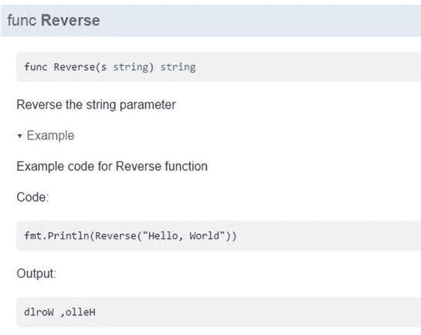

图 10-1.

由 godoc 工具生成的 Reverse 函数文档

图 [10-2] 展示了 `SwapCase` 函数的文档，显示了该示例取自 `ExampleSwapCase` 函数。

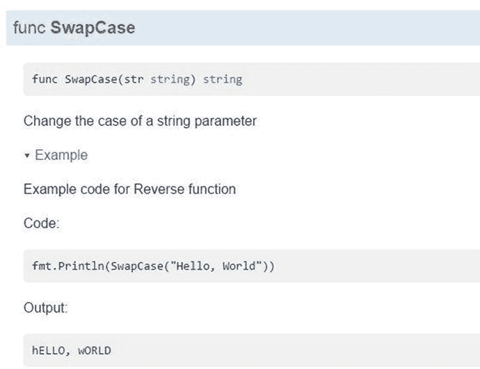

图 10-2.

由 godoc 工具生成的 SwapCase 函数文档

#### 跳过测试用例

当你运行测试时，可以通过利用 `testing` 包提供的 `Skip` 函数并为 `go test` 命令提供 `short` (`-short`) 标志来跳过某些测试用例。这在某些特定场景下很有用。如果你想在运行测试时跳过一些耗时的测试用例，可以利用跳过测试用例的功能。


好的，作为高级文档工程师和翻译员，我已根据您的格式要求和注意事项，将给定的英文文本翻译成中文。


在另一种情况下，某些测试用例可能需要依赖资源（如配置文件或环境变量）才能运行。如果这些资源在执行测试时不可用，可以直接跳过这些测试，而不是让它们失败。`testing`包提供了`testing.T`类型的`Skip`方法，允许跳过测试用例。

10-5 清单在`utils_test.go`中展示了一个跳过测试用例的示例。

**清单 10-5. 跳过测试用例**

```go
func TestLongRun(t *testing.T) {
	// Checks whether the short flag is provided
	if testing.Short() {
		t.Skip("Skipping test in short mode")
	}
	// Long running implementation goes here
	time.Sleep(5 * time.Second)
}
```

在`TestLongRun`函数中，通过调用`testing.Short()`检查是否提供了`short`标志。如果提供了`short`标志，则调用`Skip`方法跳过测试用例；否则，测试用例正常执行。当测试函数`TestLongRun`正常执行时，演示会延迟 5 秒。

运行测试时不提供`short`标志：

```bash
go test –v –cover
```

输出应如下所示：

```
=== RUN   TestSwapCase
--- PASS: TestSwapCase (0.00s)
=== RUN   TestReverse
--- PASS: TestReverse (0.00s)
=== RUN   TestLongRun
--- PASS: TestLongRun (5.00s)
=== RUN   ExampleReverse
--- PASS: ExampleReverse (0.00s)
=== RUN   ExampleSwapCase
--- PASS: ExampleSwapCase (0.00s)
PASS
coverage: 100.0% of statements
ok      github.com/shijuvar/go-web/chapter-10/stringutils       5.457s
```

在此，测试在没有`short`标志的情况下正常运行，因此测试函数`TestLongRun`正常执行并耗时 5 秒。现在，通过提供`short`标志运行测试：

```bash
go test –v –cover -short
```

输出应如下所示：

```
=== RUN   TestSwapCase
--- PASS: TestSwapCase (0.00s)
=== RUN   TestReverse
--- PASS: TestReverse (0.00s)
=== RUN   TestLongRun
--- SKIP: TestLongRun (0.00s)
utils_test.go:61: Skipping test in short mode
=== RUN   ExampleReverse
--- PASS: ExampleReverse (0.00s)
=== RUN   ExampleSwapCase
--- PASS: ExampleSwapCase (0.00s)
PASS
coverage: 100.0% of statements
ok      github.com/shijuvar/go-web/chapter-10/stringutils       0.449s
```

此输出显示测试用例`TestLongRun`在执行过程中被跳过：

```
--- SKIP: TestLongRun (0.00s)
utils_test.go:61: Skipping test in short mode
```

#### 并行运行测试用例

虽然测试用例默认按顺序执行，但如果希望加快测试执行速度，可以并行运行测试用例。当运行大量顺序测试用例时，可以利用并行运行测试的能力来加速执行。要并行运行测试用例，请在测试用例的第一条语句中调用`testing.T`类型的`Parallel`方法。

10-6 清单在`utils_test.go`文件中提供了几个并行运行的测试用例。

**清单 10-6. 并行运行的测试用例**

```go
// Test case for the SwapCase function to execute in parallel
func TestSwapCaseInParallel(t *testing.T) {
	t.Parallel()
	// Delaying 1 second for the sake of demonstration
	time.Sleep(1 * time.Second)
	input, expected := "Hello, World", "hELLO, wORLD"
	result := SwapCase(input)
	if result != expected {
		t.Errorf("SwapCase(%q) == %q, expected %q", input, result, expected)
	}
}

// Test case for the Reverse function to execute in parallel
func TestReverseInParallel(t *testing.T) {
	t.Parallel()
	// Delaying 2 seconds for the sake of demonstration
	time.Sleep(2 * time.Second)
	input, expected := "Hello, World", "dlroW ,olleH"
	result := Reverse(input)
	if result != expected {
		t.Errorf("Reverse(%q) == %q, expected %q", input, result, expected)
	}
}
```


这里有几个测试用例，其中调用了`t.Parallel()`以实现并行执行测试用例。`SwapCase`和`Reverse`函数被运行和测试，以确保存在并行执行。

让我们通过提供`parallel`（`-parallel`）标志来运行测试：

`go test –v –cover –short –parallel 2`

使用`parallel`标志，您可以指定一次并行运行两个测试用例。如果您不指定`parallel`标志，它默认使用`runtime.GOMAXPROCS(0)`，其值为`1`，因此并行测试将一次运行一个。

运行测试时，您应该看到类似以下的输出：

```
=== RUN   TestSwapCaseInParallel
=== RUN   TestReverseInParallel
=== RUN   TestSwapCase
--- PASS: TestSwapCase (0.00s)
=== RUN   TestReverse
--- PASS: TestReverse (0.00s)
=== RUN   TestLongRun
--- SKIP: TestLongRun (0.00s)
utils_test.go:91: Skipping test in short mode
--- PASS: TestSwapCaseInParallel (1.00s)
--- PASS: TestReverseInParallel (2.00s)
=== RUN   ExampleReverse
--- PASS: ExampleReverse (0.00s)
=== RUN   ExampleSwapCase
--- PASS: ExampleSwapCase (0.00s)
PASS
coverage: 100.0% of statements
ok      github.com/shijuvar/go-web/chapter-10/stringutils       2.345s
```

这个输出显示测试用例`TestSwapCaseInParallel`和`TestReverseInParallel`是并行运行的：

```
=== RUN   TestSwapCaseInParallel
=== RUN   TestReverseInParallel
```

在这些函数中，为了演示目的，执行时间通过使用`time.Sleep`函数延迟。两个测试以不同的顺序完成，`TestSwapCaseInParallel`耗时 1 秒，`TestReverseInParallel`耗时 2 秒：

```
--- PASS: TestSwapCaseInParallel (1.00s)
--- PASS: TestReverseInParallel (2.00s)
```

如果您查看`go test`生成的日志，您会看到其他测试用例依次顺序执行，每个测试用例完成后才进行下一个：

```
=== RUN   TestSwapCase
--- PASS: TestSwapCase (0.00s)
=== RUN   TestReverse
--- PASS: TestReverse (0.00s)
=== RUN   TestLongRun
--- SKIP: TestLongRun (0.00s)
utils_test.go:91: Skipping test in short mode
=== RUN   ExampleReverse
--- PASS: ExampleReverse (0.00s)
=== RUN   ExampleSwapCase
--- PASS: ExampleSwapCase (0.00s)
```

#### 将测试放入单独的包

单元测试通常与被测试的代码放在同一个包中。`_test.go`文件在常规包构建中被排除在外，但在运行`go test`命令时会被包含。在我看来，最好将测试文件移动到一个单独的包中，这样可以将单元测试与应用程序代码分离，从而改善关注点分离。（在前面的示例中，应用程序代码和测试文件被写在同一个包`stringutils`中。）

让我们将`utils_test.go`文件移动到一个名为`stringutils_test`的新包目录中，并导入`stringutils`包，以便可以访问要测试的函数。

图 10-3 展示了应用程序的目录结构。

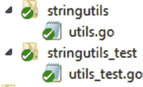

**图 10-3.** `stringutils`和`stringutils_test`包的目录结构

`utils.go`文件被放入`stringutils`包目录，而测试套件文件`utils_test.go`被放入`stringutils_test`包目录。

清单 10-7 提供了前面示例中使用的`utils_test.go`文件的合并源代码版本。

**清单 10-7.** 测试套件文件`utils_test.go`的源代码

```
package stringutils_test

import (
"fmt"
"testing"
"time"

. "github.com/shijuvar/go-web/chapter-10/stringutils"
)

// Test case for the SwapCase function to execute in parallel
func TestSwapCaseInParallel(t *testing.T) {
t.Parallel()
// Delaying 1 second for the sake of demonstration
time.Sleep(1 * time.Second)

input, expected := "Hello, World", "hELLO, wORLD"
result := SwapCase(input)
if result != expected {
t.Errorf("SwapCase(%q) == %q, expected %q", input, result, expected)
}
}
```


```go
// Reverse 函数的并行测试用例
func TestReverseInParallel(t *testing.T) {
    t.Parallel()
    // 为演示目的延迟 2 秒
    time.Sleep(2 * time.Second)
    input, expected := "Hello, World", "dlroW ,olleH"
    result := Reverse(input)
    if result != expected {
        t.Errorf("Reverse(%q) == %q, expected %q", input, result, expected)
    }
}

// SwapCase 函数的测试用例
func TestSwapCase(t *testing.T) {
    input, expected := "Hello, World", "hELLO, wORLD"
    result := SwapCase(input)
    if result != expected {
        t.Errorf("SwapCase(%q) == %q, expected %q", input, result, expected)
    }
}

// Reverse 函数的测试用例
func TestReverse(t *testing.T) {
    input, expected := "Hello, World", "dlroW ,olleH"
    result := Reverse(input)
    if result != expected {
        t.Errorf("Reverse(%q) == %q, expected %q", input, result, expected)
    }
}

// SwapCase 函数的基准测试
func BenchmarkSwapCase(b *testing.B) {
    for i := 0; i < b.N; i++ {
        SwapCase("Hello, World")
    }
}

// Reverse 函数的基准测试
func BenchmarkReverse(b *testing.B) {
    for i := 0; i < b.N; i++ {
        Reverse("Hello, World")
    }
}

// Reverse 函数的示例代码
func ExampleReverse() {
    fmt.Println(Reverse("Hello, World"))
    // Output: dlroW ,olleH
}

// SwapCase 函数的示例代码
func ExampleSwapCase() {
    fmt.Println(SwapCase("Hello, World"))
    // Output: hELLO, wORLD
}

func TestLongRun(t *testing.T) {
    // 检查是否提供了短标志
    if testing.Short() {
        t.Skip("Skipping test in short mode")
    }
    // 长时间运行的实现部分位于此处
    time.Sleep(5 * time.Second)
}
```

在 imports 包中，导入了 `stringutils` 包：

```
. "github.com/shijuvar/go-web/chapter-10/stringutils"
```

导入 `stringutils` 包时，使用点（`.`）`import`，这允许你在不引用包名的情况下调用导出的标识符：

```
result := SwapCase(input)
```

让我们使用 `go test` 命令运行单元测试：

```
go test –v –cover –short –parallel 2
```

你应该会看到类似如下的输出：

```
=== RUN   TestSwapCaseInParallel
=== RUN   TestReverseInParallel
=== RUN   TestSwapCase
--- PASS: TestSwapCase (0.00s)
=== RUN   TestReverse
--- PASS: TestReverse (0.00s)
=== RUN   TestLongRun
--- SKIP: TestLongRun (0.00s)
    utils_test.go:93: Skipping test in short mode
--- PASS: TestSwapCaseInParallel (1.00s)
--- PASS: TestReverseInParallel (2.00s)
=== RUN   ExampleReverse
--- PASS: ExampleReverse (0.00s)
=== RUN   ExampleSwapCase
--- PASS: ExampleSwapCase (0.00s)
PASS
coverage: 0.0% of statements
ok      github.com/shijuvar/go-web/chapter-10/stringutils_test  2.573s
```

尽管单元测试是从与被测试包不同的包中运行的，但 `go test` 命令给出了正确的输出。这里，唯一的区别是测试覆盖率为 0%：

```
coverage: 0.0% of statements
```

如果你不关心从 `go test` 命令获得的测试覆盖率百分比，那么将单元测试放在单独的包中是一种推荐的做法。

### 测试 Web 应用程序

本书的主要焦点是 Go 语言的 Web 开发，本节将介绍如何测试 Web 应用程序。标准库包 `net/http/httptest` 提供了用于测试 HTTP 应用程序的实用工具。`httptest` 包提供了以下有助于测试 HTTP 应用程序的结构体类型：

*   `ResponseRecorder`
*   `Server`

`ResponseRecorder` 是 `http.ResponseWriter` 的一个实现，可用于记录返回的 HTTP 响应，以便在单元测试中检查响应。你可以通过调用 `httptest` 包的 `NewRecorder` 函数来创建 `ResponseRecorder` 实例。当执行 HTTP 请求处理器时，会传递 `ResponseRecorder` 对象；可以通过测试包含返回响应的 `ResponseRecorder` 对象来检查响应。


```markdown
`Server`是一个 HTTP 服务器，用于通过测试服务器测试 HTTP 应用程序。你可以通过调用`httptest`包的`NewServer`函数并传入`http.Handler`实例来创建测试 HTTP 服务器，该函数会通过调用`http.Server`的`Serve`方法启动一个 HTTP 服务器。通过使用`httptest.Server`，你可以使用测试服务器（HTTP 服务器）测试 HTTP 应用程序。因此，你可以通过从 HTTP 客户端向服务器发送 HTTP 请求来执行端到端 HTTP 测试。

### 使用`ResponseRecorder`进行测试

让我们看看如何利用`ResponseRecorder`类型编写单元测试来检查 HTTP 响应。首先，我们编写一个示例 HTTP API 服务器，其端点如表 10-1 所示。

表 10-1. HTTP API 服务器示例

| HTTP 动词 | 路径 | 功能 |
| --- | --- | --- |
| `GET` | `/users` | 以 JSON 格式列出所有用户 |
| `POST` | `/users` | 创建一个用户 |

清单 10-8 提供了一个示例 HTTP 服务器的实现。

清单 10-8. main.go 中的 HTTP API 服务器示例

```go
package main

import (
    "encoding/json"
    "errors"
    "net/http"
    "github.com/gorilla/mux"
)

type User struct {
    FirstName string `json:"firstname"`
    LastName  string `json:"lastname"`
    Email     string `json:"email"`
}

var userStore = []User{}

func getUsers(w http.ResponseWriter, r *http.Request) {
    users, err := json.Marshal(userStore)
    if err != nil {
        w.WriteHeader(http.StatusInternalServerError)
        return
    }
    w.Header().Set("Content-Type", "application/json")
    w.WriteHeader(http.StatusOK)
    w.Write(users)
}

func createUser(w http.ResponseWriter, r *http.Request) {
    var user User
    // 解码传入的 User json
    err := json.NewDecoder(r.Body).Decode(&user)
    if err != nil {
        w.WriteHeader(http.StatusInternalServerError)
        return
    }
    // 验证 User 实体
    err = validate(user)
    if err != nil {
        w.WriteHeader(http.StatusBadRequest)
        return
    }
    // 将 User 实体插入到 User 存储中
    userStore = append(userStore, user)
    w.WriteHeader(http.StatusCreated)
}

// 验证 User 实体
func validate(user User) error {
    for _, u := range userStore {
        if u.Email == user.Email {
            return errors.New("该电子邮件已存在")
        }
    }
    return nil
}

func SetUserRoutes() *mux.Router {
    r := mux.NewRouter()
    r.HandleFunc("/users", createUser).Methods("POST")
    r.HandleFunc("/users", getUsers).Methods("GET")
    return r
}

func main() {
    http.ListenAndServe(":8080", SetUserRoutes())
}
```

编写了两个 HTTP 端点：HTTP `Post`（路径为`"/users"`）和 HTTP `Get`（路径为`"/users"`）。使用了`Gorilla mux`来配置请求多路复用器。当创建新的`User`实体时，会验证`e-mail` ID 是否已存在。出于示例演示目的，`User`对象被持久化到名为`userStore`的切片中。

在 TDD 中，开发人员通过根据已识别的需求编写单元测试来开始开发周期。开发人员通常会编写用户故事来编写单元测试。尽管本书不遵循测试优先方法或最纯粹的 TDD 形式，但让我们编写用于编写单元测试的用户故事：

- 用户应该能够查看`User`实体列表。
- 用户应该能够创建新的`User`实体。
- `User`实体的电子邮件 ID 应该是唯一的。

清单 10-9 提供了 HTTP 服务器应用程序的单元测试（参见清单 10-8）。这些测试基于前面定义的用户故事。

清单 10-9. 使用 ResponseRecorder 为 HTTP API 服务器编写单元测试，文件为 main_test.go

```go
package main

import (
    "fmt"
    "net/http"
    "net/http/httptest"
    "strings"
    "testing"
    "github.com/gorilla/mux"
)

// 用户故事 - 用户应该能够查看 User 实体列表
func TestGetUsers(t *testing.T) {
    r := mux.NewRouter()
    r.HandleFunc("/users", getUsers).Methods("GET")
```

```go
req, err := http.NewRequest("GET", "/users", nil)

if err != nil {
    t.Error(err)
}

w := httptest.NewRecorder()
r.ServeHTTP(w, req)

if w.Code != 200 {
    t.Errorf("HTTP Status expected: 200, got: %d", w.Code)
}
```

```go
// 用户故事 - 用户应该能够创建一个 User 实体
func TestCreateUser(t *testing.T) {
    r := mux.NewRouter()
    r.HandleFunc("/users", createUser).Methods("POST")

    userJson := `{"firstname": "shiju", "lastname": "Varghese", "email": "shiju@xyz.com"}`

    req, err := http.NewRequest(
        "POST",
        "/users",
        strings.NewReader(userJson),
    )
    if err != nil {
        t.Error(err)
    }

    w := httptest.NewRecorder()
    r.ServeHTTP(w, req)

    if w.Code != 201 {
        t.Errorf("HTTP Status expected: 201, got: %d", w.Code)
    }
}
```

```go
//用户故事 - User 实体的 Email Id 必须是唯一的
func TestUniqueEmail(t *testing.T) {
    r := mux.NewRouter()
    r.HandleFunc("/users", createUser).Methods("POST")

    userJson := `{"firstname": "shiju", "lastname": "Varghese", "email": "shiju@xyz.com"}`

    req, err := http.NewRequest(
        "POST",
        "/users",
        strings.NewReader(userJson),
    )
    if err != nil {
        t.Error(err)
    }

    w := httptest.NewRecorder()
    r.ServeHTTP(w, req)

    if w.Code != 400 {
        t.Error("Bad Request expected, got: %d", w.Code)
    }
}
```

```go
func TestGetUsersClient(t *testing.T) {
    r := mux.NewRouter()
    r.HandleFunc("/users", getUsers).Methods("GET")
    server := httptest.NewServer(r)
    defer server.Close()

    usersUrl := fmt.Sprintf("%s/users", server.URL)
    request, err := http.NewRequest("GET", usersUrl, nil)

    res, err := http.DefaultClient.Do(request)
    if err != nil {
        t.Error(err)
    }

    if res.StatusCode != 200 {
        t.Errorf("HTTP Status expected: 200, got: %d", res.StatusCode)
    }
}
```

```go
func TestCreateUserClient(t *testing.T) {
    r := mux.NewRouter()
    r.HandleFunc("/users", createUser).Methods("POST")
    server := httptest.NewServer(r)
    defer server.Close()

    usersUrl := fmt.Sprintf("%s/users", server.URL)
    fmt.Println(usersUrl)

    userJson := `{"firstname": "Rosmi", "lastname": "Shiju", "email": "rose@xyz.com"}`

    request, err := http.NewRequest("POST", usersUrl, strings.NewReader(userJson))

    res, err := http.DefaultClient.Do(request)
    if err != nil {
        t.Error(err)
    }

    if res.StatusCode != 201 {
        t.Errorf("HTTP Status expected: 201, got: %d", res.StatusCode)
    }
}
```

针对这些用户故事编写了三个测试用例。请按照以下步骤编写每个测试用例：

-   使用 `Gorilla mux` 包创建一个路由器实例，并配置多路复用器。
-   使用 `http.NewRequest` 函数创建一个 HTTP 请求。
-   使用 `httptest.NewRecorder` 函数创建一个 `ResponseRecorder` 对象。
-   通过调用 `ServeHTTP` 方法，将 `ResponseRecorder` 对象和 `Request` 对象发送给多路复用器。
-   检查 `ResponseRecorder` 对象，以检查返回的 HTTP 响应。

让我们来探索测试函数 `TestGetUsers` 的代码：

配置多路复用器以对 `"/users"` 执行 HTTP `Get` 请求：

```go
r := mux.NewRouter()
r.HandleFunc("/users", getUsers).Methods("GET")
```

使用 `http.NewRequest` 创建 HTTP 请求对象，以便将此对象发送给多路复用器：

```go
req, err := http.NewRequest("GET", "/users", nil)
if err != nil {
    t.Error(err)
}
```

使用 `httptest.NewRecorder` 函数创建一个 `ResponseRecorder` 对象，用于记录返回的 HTTP 响应：

```go
w := httptest.NewRecorder()
```

通过提供 `ResponseRecorder` 和 `Request` 对象，调用多路复用器的 `ServeHTTP` 方法，以对 `"/users"` 发起 HTTP `Get` 请求，该请求将调用 `getUsers` 处理函数：

```go
r.ServeHTTP(w, req)
```

`ResponseRecorder` 对象记录返回的响应，以便验证 HTTP 响应的行为。此处验证返回的 HTTP 响应状态码是否为 `200`：

```go
if w.Code != 200 {
    t.Errorf("HTTP Status expected: 200, got: %d", w.Code)
}
```

在测试函数 `TestCreateUser` 中，提供了 JSON 数据用于创建一个 `User` 实体。此处验证返回的 HTTP 响应状态码是否为 `201`：

```go
if w.Code != 201 {
```


`t.Errorf("HTTP Status expected: 201, got: %d", w.Code)`

`}`

测试函数 `TestUniqueEmail` 用于验证用户实体的电子邮件 ID 具有唯一性。为了测试这一行为，提供了与 `TestCreateUser` 函数相同的 JSON 数据。由于测试用例按顺序执行，`TestUniqueEmail` 函数会在 `TestCreateUser` 函数执行之后运行。因为提供了重复的电子邮件，所以应返回状态码 `400`：

`if w.Code != 400 {`

`t.Error("Bad Request expected, got: %d", w.Code)`

`}`

### 使用服务器进行测试

在上一节中，我们编写了使用 `ResponseRecorder` 结构体类型的单元测试，该类型足以测试 HTTP 响应。`httptest` 包还提供了一个 `Server` 结构体类型，允许你创建 HTTP 服务器，用于执行端到端的 HTTP 测试，你可以通过 HTTP 客户端向该服务器发送 HTTP 请求。清单 10-9 测试了 HTTP 响应的行为，但并未创建 HTTP 服务器。相反，它将 HTTP `请求`和`ResponseRecorder` 对象发送给了多路复用器。使用 `httptest.Server`，可以创建一个 HTTP 服务器，然后通过从 HTTP 客户端发送请求来测试其行为。

让我们使用 `httptest.Server` 类型编写单元测试，以测试清单 10-8 中编写的示例 HTTP 应用程序。在这些示例单元测试中，我们编写了测试用例，以验证对 `"/users"` 的 HTTP `Get` 操作和对 `"/users"` 的 HTTP `Post` 操作的行为。这些单元测试编写在 `main_test.go` 测试套件文件中，该文件中已包含使用 `ResponseRecorder` 编写的单元测试。

清单 10-10 提供了使用 `httptest.Server` 的单元测试。

**清单 10-10.** 在 main_test.go 中使用 Server 对 HTTP API 服务器进行单元测试

```
func TestGetUsersClient(t *testing.T) {

	r := mux.NewRouter()

	r.HandleFunc("/users", getUsers).Methods("GET")

	server := httptest.NewServer(r)

	defer server.Close()

	usersUrl := fmt.Sprintf("%s/users", server.URL)

	request, err := http.NewRequest("GET", usersUrl, nil)

	res, err := http.DefaultClient.Do(request)

	if err != nil {

		t.Error(err)

	}

	if res.StatusCode != 200 {

		t.Errorf("HTTP Status expected: 200, got: %d", res.StatusCode)

	}

}

func TestCreateUserClient(t *testing.T) {

	r := mux.NewRouter()

	r.HandleFunc("/users", createUser).Methods("POST")

	server := httptest.NewServer(r)

	defer server.Close()

	usersUrl := fmt.Sprintf("%s/users", server.URL)

	userJson := `{"firstname": "Rosmi", "lastname": "Shiju", "email": "rose@xyz.com"}`

	request, err := http.NewRequest("POST", usersUrl, strings.NewReader(userJson))

	res, err := http.DefaultClient.Do(request)

	if err != nil {

		t.Error(err)

	}

	if res.StatusCode != 201 {

		t.Errorf("HTTP Status expected: 201, got: %d", res.StatusCode)

	}

}
```

使用 `httptest.Server`，我们编写了两个测试函数：`TestGetUsersClient` 和 `TestCreateUserClient`。在这些测试用例中，创建了一个 HTTP 服务器，并通过从 HTTP 客户端向其发送 HTTP 请求来测试其行为。

请按照以下步骤编写每个测试用例：

1.  使用 `Gorilla mux` 包创建一个路由器实例，并配置多路复用器。
2.  使用 `httptest.NewServer` 函数创建一个 HTTP 服务器。
3.  使用 `http.NewRequest` 函数创建一个 `Request` 对象。
4.  使用 `http.Client` 对象的 `Do` 方法向服务器发送 HTTP 请求。
5.  检查 `Response` 对象以查看返回的 HTTP 响应。

让我们来分析测试函数 `TestGetUsersClient`。首先，配置多路复用器以对 `"/users"` 执行 HTTP `Get` 请求：

```
r := mux.NewRouter()
r.HandleFunc("/users", getUsers).Methods("GET")
```

使用 `httptest.NewServer` 函数创建一个 HTTP 服务器。`NewServer` 函数会启动并返回一个新的 HTTP 服务器。`Server` 对象的 `Close` 方法被添加到延迟函数列表中。


`server := httptest.NewServer(r)`

`defer server.Close()`

通过 `http.NewRequest` 函数创建一个 HTTP 请求，并使用 `http.Client` 对象的 `Do` 方法发送 HTTP 请求。`http.Client` 对象通过 `http.DefaultClient` 创建。调用 `Do` 方法，该方法发送 HTTP 请求并返回 HTTP 响应：

`usersUrl := fmt.Sprintf("%s/users", server.URL)`

`request, err := http.NewRequest("GET", usersUrl, nil)`

`res, err := http.DefaultClient.Do(request)`

此处，向 `NewRequest` 函数提供了 `nil` 作为请求参数，因为这是一个 HTTP `Get` 请求。

最后，验证 HTTP 服务器返回的 HTTP 响应的行为：

```
if res.StatusCode != 200 {
    t.Errorf("HTTP Status expected: 200, got: %d", res.StatusCode)
}
```

`TestCreateUserClient` 用于测试 `"/users"` 上的 HTTP `Post` 请求。由于这是一个 HTTP `Post` 请求，必须向服务器发送数据以创建 `User` 实体。当调用 `http.NewRequest` 函数创建 HTTP 请求时，JSON 数据作为请求参数提供。

以下是用于在 `"/users"` 上向服务器提供 JSON 数据以执行 HTTP `Post` 请求的代码块：

`usersUrl := fmt.Sprintf("%s/users", server.URL)`

`userJson := `{"firstname": "Rosmi", "lastname": "Shiju", "email": "rose@xyz.com"}` `

`request, err := http.NewRequest("POST", usersUrl, strings.NewReader(userJson))`

如果对 `"/users"` 的请求成功，应返回 HTTP 状态码 `201`。验证过程如下：

```
if res.StatusCode != 201 {
    t.Errorf("HTTP Status expected: 201, got: %d", res.StatusCode)
}
```

### Go 语言中的 BDD 测试

Go 语言的 `testing` 和 `httptest` 标准库包为编写自动化单元测试提供了坚实基础。这些包的优势在于提供了许多扩展点，因此你可以轻松地将它们与其他自定义包结合使用。

本节讨论两个第三方包：`Ginkgo` 和 `Gomega`。`Ginkgo` 是一个基于行为驱动开发 (BDD) 的测试框架，它允许你用 Go 编写富有表达力的测试来指定应用程序的行为。如果你在软件开发过程中实践 BDD，`Ginkgo` 是一个绝佳的包选择。`Gomega` 是一个匹配器库，与 `Ginkgo` 包搭配使用效果最佳。虽然 `Gomega` 是 `Ginkgo` 的首选匹配库，但其设计是匹配器无关的。

#### 行为驱动开发 (BDD)

BDD 是一种源于 TDD 和其他敏捷实践的软件开发过程。BDD 旨在为敏捷软件交付打造一种有效的软件开发实践。它是从许多敏捷实践（主要来自 TDD）中演化而来的实践方法。TDD 中的“测试”一词在那些于软件开发过程中实践 TDD 的开发人员群体中曾引发过混淆。

尽管 TDD 是一种软件开发过程和设计理念，但许多开发者误以为它只关乎测试。然而，TDD 的理念是通过编写单元测试来设计代码。它本质上是关于应用行为的描述和验证。BDD 是 TDD 的延伸，其重点从“测试”转向了“行为”。在 BDD 中，你通过自动化测试来指定行为，并基于行为编写代码。

#### 使用 Ginkgo 进行行为驱动开发

如果你对自动化测试有基本了解，就能轻松采用 BDD 风格的测试。在 BDD 中，使用术语“行为”而非“测试”。让我们看看如何使用 `Ginkgo` 及其首选的匹配器库 `Gomega` 来编写 BDD 风格的测试。

##### 重构 HTTP API

让我们为清单 10-8 中编写的示例 HTTP 服务器编写 BDD 风格的测试。编写自动化单元测试时，你必须通过应用松耦合设计使代码具备可测试性，从而轻松编写测试。让我们重构清单 10-8 中的 HTTP 服务器。


图 10-4 展示了重构后应用程序的目录结构。

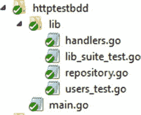

图 10-4. 列表 10-8 中重构后应用程序的目录结构

列表 10-8 将所有内容实现在一个源文件中：`main` 包中的 `main.go`。在重构后的应用程序中，代码被实现在两个包中：`lib` 和 `main`。`main` 包包含提供应用程序入口点的 `main.go` 文件，而所有应用程序逻辑都被移入了 `lib` 包。

`lib` 包包含以下源文件：

- `handlers.go` 包含 HTTP 处理程序，并提供了使用 `Gorilla mux` 设置路由的实现。
- `repository.go` 包含持久化逻辑和持久化存储。

`lib` 目录中的其他源文件提供了用于 BDD 自动化测试的实现，但它们被放在 `lib_test` 包中。（此主题将在本章后面讨论。）

列表 10-11 提供了 `lib` 包中的 `handlers.go` 代码。

列表 10-11. `lib` 包中的 `handlers.go`

```
package lib

import (
	"encoding/json"
	"net/http"
	"github.com/gorilla/mux"
)

func GetUsers(repo UserRepository) http.Handler {
	return http.HandlerFunc(func(w http.ResponseWriter, r *http.Request) {
		userStore := repo.GetAll()
		users, err := json.Marshal(userStore)
		if err != nil {
			w.WriteHeader(http.StatusInternalServerError)
			return
		}
		w.Header().Set("Content-Type", "application/json")
		w.WriteHeader(http.StatusOK)
		w.Write(users)
	})
}

func CreateUser(repo UserRepository) http.Handler {
	return http.HandlerFunc(func(w http.ResponseWriter, r *http.Request) {
		var user User
		err := json.NewDecoder(r.Body).Decode(&user)
		if err != nil {
			w.WriteHeader(http.StatusInternalServerError)
			return
		}
		err = repo.Create(user)
		if err != nil {
			w.WriteHeader(http.StatusBadRequest)
			return
		}
		w.WriteHeader(http.StatusCreated)
	})
}

func SetUserRoutes() *mux.Router {
	userRepository := NewInMemoryUserRepo()
	r := mux.NewRouter()
	r.Handle("/users", CreateUser(userRepository)).Methods("POST")
	r.Handle("/users", GetUsers(userRepository)).Methods("GET")
	return r
}
```

HTTP 处理程序函数被重构，以获取一个实现持久化逻辑的参数值。处理程序函数通过调用 `http.HandlerFunc` 返回一个 `http.Handler`。这些处理程序函数有一个 `UserRepository` 类型的参数，该类型是在 `repository.go` 文件中定义的接口。由于它是一个接口，你可以为此类型提供任何具体的实现。例如，你可以分别为应用程序代码和自动化测试提供 `UserRepository` 类型的实现，这能提供更好的代码可测试性。对于应用程序代码，你可以提供一个 `UserRepository` 接口的实现，以在真实数据库上实现持久化逻辑。但在从自动化测试调用处理程序函数时，你可以提供一个 `UserRepository` 接口的伪造实现，以在无需访问真实数据库时模拟其功能。当你编写测试时，可能需要在许多地方像这样模拟接口。

列表 10-12 提供了 `lib` 包中 `repository.go` 的源代码。

列表 10-12. `lib` 包中的 `repository.go`

```
package lib

import (
	"errors"
)

type User struct {
	FirstName string `json:"firstname"`
	LastName  string `json:"lastname"`
	Email     string `json:"email"`
}

type UserRepository interface {
	GetAll() []User
	Create(User) error
	Validate(User) error
}

type InMemoryUserRepository struct {
	DataStore []User
}

func (repo *InMemoryUserRepository) GetAll() []User {
	return repo.DataStore
}
```


```go
func (repo *InMemoryUserRepository) Create(user User) error {
    err := repo.Validate(user)
    if err != nil {
        return err
    }
    repo.DataStore = append(repo.DataStore, user)
    return nil
}

func (repo *InMemoryUserRepository) Validate(user User) error {
    for _, u := range repo.DataStore {
        if u.Email == user.Email {
            return errors.New("The Email is already exists")
        }
    }
    return nil
}

func NewInMemoryUserRepo() *InMemoryUserRepository {
    return &InMemoryUserRepository{DataStore: []User{}}
}
```

在源文件`repository.go`中，定义了一个名为`UserRepository`的接口，该接口为模型实体`User`提供了持久化逻辑。`Validate`函数用于验证`User`实体是否具有重复的电子邮件 ID，并在给定电子邮件 ID 已存在时返回错误：

```go
type UserRepository interface {
    GetAll() []User
    Create(User) error
    Validate(User) error
}
```

提供了`UserRepository`的一个实现，即`InMemoryUserRepository`，它将`User`对象持久化到切片中。（在此示例中使用切片作为数据存储；在实际实现中，它可能是诸如 MongoDB 之类的数据库。）

在文件`main.go`中启动了一个 HTTP 服务器。列表 10-13 提供了`main`包中的`main.go`的源代码。

**列表 10-13. `main`包中的`main.go`**

```go
package main

import (
    "net/http"
    "github.com/shijuvar/go-web/chapter-10/httptestbdd/lib"
)

func main() {
    routers := lib.SetUserRoutes()
    http.ListenAndServe(":8080", routers)
}
```

`main`包中的`main`函数会启动 HTTP 服务器。

##### 编写 BDD 风格的测试

HTTP API 应用程序已经重构，使其更易于测试，这样您就可以轻松编写自动化测试。现在，让我们专注于根据 BDD 方法论编写测试。与 TDD 类似，在编写代码之前，先定义用户故事并将其转化为测试用例。BDD 的主要目标是在编写生产代码之前，以更具表现力的方式定义行为，以便您可以轻松地基于定义明确的行为来开发应用程序。由于本书并非主要关注敏捷实践和 BDD，因此并未遵循 BDD 的确切开发过程，而是侧重于如何使用 Go 第三方库编写 BDD 风格的测试。

`Ginkgo`包与其首选的匹配器库`Gomega`配合使用，用于在测试用例中指定行为。

###### 安装 Ginkgo 和 Gomega

要安装`Ginkgo`和`Gomega`，请在命令行窗口中运行以下命令：

```shell
go get github.com/onsi/ginkgo/ginkgo
go get github.com/onsi/gomega
```

`Ginkgo`包还提供了一个名为`ginkgo`的可执行程序，可用于引导测试套件文件和运行测试。当安装`ginkgo`包时，它还会在`$GOPATH/bin`下安装`ginkgo`可执行文件。

要使用`Ginkgo`和`Gomega`，您必须将这些包添加到导入列表中：

```go
import (
    "github.com/onsi/ginkgo"
    "github.com/onsi/gomega"
)
```

###### 引导测试套件

要为某个包编写使用`Ginkgo`的测试，您必须首先通过在命令行窗口中运行以下命令来创建一个测试套件文件：

```shell
ginkgo bootstrap
```

让我们导航到`lib`目录，然后运行`ginkgo bootstrap`命令。它会生成一个名为`lib_suite_test.go`的文件，其中包含如列表 10-14 所示的代码。

**列表 10-14. `lib_test`包中的测试套件文件`lib_suite_test.go`**

```go
package lib_test

import (
    . "github.com/onsi/ginkgo"
    . "github.com/onsi/gomega"
    "testing"
)

func TestLib(t *testing.T) {
    RegisterFailHandler(Fail)
    RunSpecs(t, "Lib Suite")
}
```

生成的源文件将被放置到名为`lib_test`的包中，该包将测试与位于`lib`包中的应用程序代码隔离开来。Go 允许您直接将`lib_test`包放在`lib`包目录内。对于测试套件文件和测试，您也可以将包名更改为`lib`。


# 排版结果

`lib_suite_test.go`的源代码显示，**Ginkgo** 利用了 Go 现有的测试基础设施。你可以通过在命令行窗口中运行`"go test"`或`"ginkgo"`命令来运行测试套件。

让我们来探索这个套件文件：

*   `ginkgo`和`gomega`包使用了点导入（`.`），这允许你在调用`ginkgo`和`gomega`包的导出标识符时无需使用限定符。
*   `RegisterFailHandler(Fail)`语句连接了**Ginkgo**和**Gomega**。**Gomega**被用作**Ginkgo**的匹配器库。
*   `RunSpecs(t, "Lib Suite")`语句告诉**Ginkgo**启动测试套件。如果任何一个规格测试失败，**Ginkgo**会自动使`testing.T`测试失败。

###### 向套件中添加规格测试

虽然创建了一个名为`lib_suite_test.go`的测试套件文件，但要运行测试套件，需要添加测试文件来向套件中添加规格。让我们在命令行窗口中使用`ginkgo generate`命令生成一个测试文件：

`ginkgo generate users`

此命令将生成一个名为`users_test.go`的测试文件，其内容如代码清单 10-15 所示。如前所述，测试被编写在`lib`目录下的`lib_test`包中，Go 允许这样做。如果你希望使用`lib`包进行测试，也可以这么做。

**代码清单 10-15.** `ginkgo`生成的测试文件`users_test.go`

```
package lib_test

import (
    . "lib"
    . "github.com/onsi/ginkgo"
    . "github.com/onsi/gomega"
)

var _ = Describe("Users", func() {
})
```

生成的测试文件包含了使用点导入（`.`）导入`ginkgo`和`gomega`包的代码。因为测试文件是编写在`lib_test`包中的，所以必须导入`lib`包。由于对包使用了点导入（`.`），所以可以直接调用这些包的导出标识符，无需使用限定符。

在 BDD 风格的测试中，通过编写规格来定义代码的行为。使用**Ginkgo**时，规格是在顶层的`Describe`容器内，通过`Ginkgo Describe`函数编写的。**Ginkgo**使用了`"var _ ="`的技巧来在顶层评估`Describe`函数，而无需`init`函数。

###### 使用容器组织规格测试

现在，已经创建了一个基本的测试文件来为应用程序代码编写规格。让我们使用`Ginkgo`包提供的函数来组织这些规格。

**代码清单 10-16** 提供了`Users`规格的高级结构。

**代码清单 10-16.** `Users`规格的高级结构

```
var _ = Describe("Users", func() {
    BeforeEach(func() {
    })

    Describe("获取用户", func() {
        Context("获取所有用户", func() {
            It("应获取用户列表", func() {
            })
        })
    })

    Describe("创建新用户", func() {
        Context("提供有效的用户数据", func() {
            It("应创建新用户并获得 HTTP 状态码: 201", func() {
            })
        })

        Context("提供包含重复邮箱 id 的用户数据", func() {
            It("应获得 HTTP 状态码: 400", func() {
            })
        })
    })
})
```

`Describe`块用于描述代码的各个独立行为。在`Describe`容器内部，可以编写`Context`块和`It`块。`Context`块用于指定某个独立行为下的不同上下文。你可以在一个`Describe`块内编写多个`Context`块。而在`Describe`或`Context`容器内的`It`块中编写具体的规格。

`BeforeEach`块在每个`It`块之前运行，可用于在运行每个规格之前编写逻辑。

###### 在测试文件中编写规格

在上一节中，我们指定了高级规格。在本节中，我们将通过在`It`块中编写具体实现来完成测试文件。在测试中，我们通过向多路复用器发送请求来调用 HTTP 处理函数。

让我们探讨一下在代码清单 10-11 中编写的一个 HTTP 处理函数：

```
func GetUsers(repo UserRepository) http.Handler {
```


```go
return http.HandlerFunc(func(w http.ResponseWriter, r *http.Request) {

	userStore := repo.GetAll()

	users, err := json.Marshal(userStore)

	if err != nil {

		w.WriteHeader(http.StatusInternalServerError)

		return

	}

	w.Header().Set("Content-Type", "application/json")

	w.WriteHeader(http.StatusOK)

	w.Write(users)

	})

}
```

`GetUsers`函数有一个类型为`UserRepository`的参数，该参数是一个接口：

```go
type UserRepository interface {

	GetAll() []User

	Create(User) error

	Validate(User) error

}
```

在应用程序代码中，为`UserRepository`接口提供了一个具体实现（`InMemoryUserRepository`），该实现将持久化操作应用于内存中的集合数据。当你开发实际应用时，可能会将应用数据持久化到数据库中。在编写测试时，你可能希望提供模拟实现来避免持久化到数据库。由于处理函数期望将`UserRepository`的具体实现作为参数值，你可以在测试中提供`UserRepository`的一个独立版本来调用处理函数。

清单 10-17 提供了用于测试的`UserRepository`接口的具体实现。

**清单 10-17. users_tests.go 中 UserRepository 的实现**

```go
type FakeUserRepository struct {

	DataStore []User

}

func (repo *FakeUserRepository) GetAll() []User {

	return repo.DataStore

}

func (repo *FakeUserRepository) Create(user User) error {

	err := repo.Validate(user)

	if err != nil {

		return err

	}

	repo.DataStore = append(repo.DataStore, user)

	return nil

}

func (repo *FakeUserRepository) Validate(user User) error {

	for _, u := range repo.DataStore {

		if u.Email == user.Email {

			return errors.New("The Email is already exists")

		}

	}

	return nil

}

func NewFakeUserRepo() *FakeUserRepository {

	return &FakeUserRepository{

		DataStore: []User{

			User{"Shiju", "Varghese", "shiju@xyz.com"},

			User{"Rosmi", "Shiju", "rose@xyz.com"},

			User{"Irene", "Rose", "irene@xyz.com"},

		},

	}

}
```

`FakeUserRepository`提供了为测试编写的`UserRepository`接口的实现。你可以通过调用`NewFakeUserRepo`函数来创建`FakeUserRepository`的实例，该函数还提供了三个`User`对象的模拟数据。`FakeUserRepository`类型是一种测试替身（test double），这是单元测试中用于描述任何为了测试目的而替换生产对象的通用术语。在这里，`InMemoryUserRepository`被替换为`FakeUserRepository`以进行测试。

清单 10-18 提供了`users_test.go`的完整版本，其中实现了所有规格。

**清单 10-18. lib_test 包中 users_tests.go 的完整版本**

```go
package lib_test

import (

	"encoding/json"

	"errors"

	"net/http"

	"net/http/httptest"

	"strings"

	"github.com/gorilla/mux"

	. "github.com/onsi/ginkgo"

	. "github.com/onsi/gomega"

	. "github.com/shijuvar/go-web/chapter-10/httptestbdd/lib"

)

var _ = Describe("Users", func() {

	userRepository := NewFakeUserRepo()

	var r *mux.Router

	var w *httptest.ResponseRecorder

	BeforeEach(func() {

		r = mux.NewRouter()

	})

	Describe("Get Users", func() {

		Context("Get all Users", func() {

			//providing mocked data of 3 users
			It("should get list of Users", func() {

				r.Handle("/users", GetUsers(userRepository)).Methods("GET")

				req, err := http.NewRequest("GET", "/users", nil)

				Expect(err).NotTo(HaveOccurred())

				w = httptest.NewRecorder()

				r.ServeHTTP(w, req)

				Expect(w.Code).To(Equal(200))

				var users []User

				json.Unmarshal(w.Body.Bytes(), &users)

				//Verifying mocked data of 3 users
				Expect(len(users)).To(Equal(3))

			})

		})

	})

	Describe("Post a new User", func() {

		Context("Provide a valid User data", func() {

			It("should create a new User and get HTTP Status: 201", func() {

				r.Handle("/users", CreateUser(userRepository)).Methods("POST")
```


```go
userJson := `{"firstname": "Alex", "lastname": "John", "email": "alex@xyz.com"}`

req, err := http.NewRequest(
    "POST",
    "/users",
    strings.NewReader(userJson),
)
Expect(err).NotTo(HaveOccurred())
w = httptest.NewRecorder()
r.ServeHTTP(w, req)
Expect(w.Code).To(Equal(201))

Context("提供包含重复电子邮箱的用户数据", func() {
    It("应返回 HTTP 状态码：400", func() {
        r.Handle("/users", CreateUser(userRepository)).Methods("POST")
        userJson := `{"firstname": "Alex", "lastname": "John", "email": "alex@xyz.com"}`
        req, err := http.NewRequest(
            "POST",
            "/users",
            strings.NewReader(userJson),
        )
        Expect(err).NotTo(HaveOccurred())
        w = httptest.NewRecorder()
        r.ServeHTTP(w, req)
        Expect(w.Code).To(Equal(400))
    })
})

type FakeUserRepository struct {
    DataStore []User
}

func (repo *FakeUserRepository) GetAll() []User {
    return repo.DataStore
}

func (repo *FakeUserRepository) Create(user User) error {
    err := repo.Validate(user)
    if err != nil {
        return err
    }
    repo.DataStore = append(repo.DataStore, user)
    return nil
}

func (repo *FakeUserRepository) Validate(user User) error {
    for _, u := range repo.DataStore {
        if u.Email == user.Email {
            return errors.New("该电子邮箱已存在")
        }
    }
    return nil
}

func NewFakeUserRepo() *FakeUserRepository {
    return &FakeUserRepository{
        DataStore: []User{
            User{"Shiju", "Varghese", "shiju@xyz.com"},
            User{"Rosmi", "Shiju", "rose@xyz.com"},
            User{"Irene", "Rose", "irene@xyz.com"},
        },
    }
}
```

现在，我们一起来探索 `users_test.go` 中的代码：

- 各个行为写在 `Describe` 块中。这里，针对 `"用户"` 定义了 `"获取用户列表"` 和 `"新增用户"` 的行为。
- 在 `Describe` 块内部，使用 `Context` 块来定义某个行为下的具体场景。
- 单独的规格说明（spec）写在 `Describe` 和 `Context` 容器内部的 `It` 块中。
- 在 `"获取用户列表"` 行为中，定义了一个 `"获取所有用户"` 的上下文，它映射了在 `"/users"` 端点上执行 HTTP `GET` 操作的功能。在该上下文中，定义了一个 `It` 块，描述为 `"应返回用户列表"`，用于检查返回的 HTTP 响应状态码是否为 `200`。通过创建 `FakeUserRepository` 实例定义了三个用户（`Users`）的模拟数据，以便返回的 HTTP 响应显示包含三个用户。
- 对于 `"新增用户"` 行为，定义了两种场景：`"提供有效的用户数据"` 和 `"提供包含重复电子邮箱的用户数据"`。这映射了在 `"/users"` 端点上执行 HTTP `POST` 操作的功能。如果提供有效的用户数据，应能创建新用户。如果提供了包含重复电子邮箱的用户数据，则会引发错误。这些规格说明在 `It` 块中有详细描述。
- `FakeUserRepository` 实例是 `UserRepository` 接口的一个实现，它作为参数值传递给 HTTP 处理函数。
- 使用 `Ginkgo` 首选的匹配器库 `Gomega` 进行断言。`Gomega` 提供了多种用于编写断言语句的函数。`Expect` 函数也用于断言。

###### 运行规格说明

你可以使用 `go test` 或 `ginkgo` 命令来运行测试套件。

让我们使用 `go test` 命令运行套件：

`go test -v`

`go test` 命令生成的输出如图 10-5 所示。

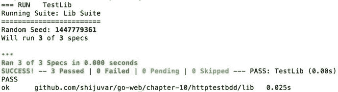

**图 10-5.** 使用 `go test` 命令运行规格说明的输出

让我们使用 `ginkgo` 命令运行套件：

`ginkgo -v`

`ginkgo` 命令生成的输出如图 10-6 所示。

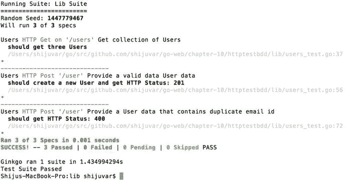

**图 10-6.** 使用 `ginkgo` 命令运行规格说明的输出

### 总结

自动化测试是软件工程中确保应用程序质量的一项重要实践。单元测试是一种自动化测试过程，其中应用程序中最小可测试的软件单元（称为单元）会被单独且独立地进行测试，以确定它们的行为是否完全符合设计预期。

测试驱动开发（TDD）是一种遵循测试优先开发方法的软件开发过程，即在编写生产代码之前先编写单元测试。TDD 是一种设计方法，它鼓励开发人员在编写代码之前先思考其实现方案。

Go 通过其 `testing` 标准库包提供了编写自动化单元测试的核心功能。`testing` 包提供了编写自动化测试所需的所有基本功能，并附带工具支持。它旨在与 `go test` 命令一起使用。除了 `testing` 包，Go 标准库还提供了另外两个包：`httptest` 提供了用于 HTTP 测试的实用程序，`quick` 提供了有助于进行黑盒测试的实用函数。

编写测试套件时使用以下命名约定和模式：
- 创建一个名称以 `_test.go` 结尾的源文件。
- 在测试套件（源文件以 `_test.go` 结尾）中，编写签名为 `func TestXxx(*testing.T)` 的函数。

当使用 `go test` 命令运行测试时，测试函数会顺序执行。除了支持代码测试行为外，`testing` 包还可用于基准测试和测试示例代码。

你可以使用 `httptest` 包测试 HTTP 应用程序。在测试 HTTP 应用程序时，可以使用 `httptest` 包提供的 `ResponseRecorder` 和 `Server` 结构体类型。`ResponseRecorder` 记录返回的 HTTP 响应，以便进行检查。`Server` 是一个用于测试的 HTTP 服务器，可以执行端到端的 HTTP 测试。

本章向你展示了用于测试的第三方包 `Ginkgo` 和 `Gomega`。`Ginkgo` 是一个行为驱动开发（BDD）风格的测试框架，它允许你在 Go 中编写富有表现力的测试来指定应用程序的行为。BDD 是 TDD 的扩展，它强调行为而非测试本身。在 BDD 中，你在自动化测试中以富有表现力的方式指定行为，然后根据这些行为编写代码。

# 11. 在谷歌云上构建 Go Web 应用程序

云计算正在改变可扩展应用程序的开发和运行方式。云计算允许你完全专注于应用程序工程，而无需管理 IT 基础设施。在云基础设施上开发 Go 应用程序是一个绝佳的选择，因为 Go 是为在现代计算机硬件和下一代 IT 基础设施平台上运行而设计的语言。Go 旨在解决大规模计算问题，并且正成为构建云基础设施技术（如 Docker 和 Kubernetes）的首选语言。本章将向你展示如何通过利用谷歌云平台，使用 Go 构建云原生应用程序。

### 云计算简介

云计算正逐渐成为部署应用程序的主要选择。云计算允许你将 IT 基础设施和应用程序迁移到基于订阅的计算模式，在该模式中，软件通过互联网访问，而无需管理和维护本地计算资源。这使得你可以专注于应用程序工程，而不是管理 IT 基础设施，因此开发人员可以构建具有更高敏捷性的高度可扩展应用程序。


云计算是一种“按需付费”的计算模型，其中 IT 基础设施和软件开发平台以基于服务的使用模式提供。云计算最大的优势在于开发应用程序时获得的操作敏捷性。云模型支持按需扩展，这意味着您可以在需要时增加计算资源，并根据需要使用任意时长，然后在不再需要时缩减计算资源。大多数云计算平台都为其云平台提供自动扩展功能，允许您根据配置自动扩展和缩减计算资源的数量。

在云计算中，有多种选项可用于托管和运行应用程序。这些选项提供了不同的灵活性模型来托管、运行和扩展您的应用程序，可用于适当的计算场景。

以下是云计算平台中可用于托管和运行应用程序的不同选项：

*   基础设施即服务（`IaaS`）
*   平台即服务（`PaaS`）
*   容器即服务（`CaaS`）

### 基础设施即服务（`IaaS`）

基础设施即服务（`IaaS`）模型通过互联网以服务形式提供虚拟化的计算资源。您可以从云平台获取虚拟机（`VM`）以实现按需扩展。在此模型中，您必须在自己的环境中设置好一切来托管和运行应用程序。例如，如果要在 Go 中运行一个 `HTTP` 服务器，您必须手动设置 Go 运行时环境，并打开 `HTTP` 端口以接收传入的网络请求。关于 `IaaS` 模型最重要的是，您可以完全控制在云上获取的虚拟机。

### 平台即服务（`PaaS`）

平台即服务（`PaaS`）模型提供一个由云平台供应商管理的平台，用于部署和运行应用程序。此模型提供了专门的语言环境、工具和软件开发工具包（`SDK`），以便在云上开发和运行应用程序。`PaaS` 模型比 `IaaS` 模型提供了更高的操作敏捷性，因为它是一种由云平台提供的托管服务，您可以使用平台提供的 `SDK` 和工具来开发、测试、部署和运行应用程序。

例如，如果您想利用 Google Cloud 提供的 `PaaS` 平台来开发 Go 应用程序，可以下载用于 Go 的 Google Cloud `PaaS` 平台 `SDK`，它允许您在 Google Cloud 上快速构建、测试和运行 Go 应用程序。使用此云计算模型，无需手动干预即可轻松实现自动扩展。您可能只需要配置关键绩效指标（`KPI`）的参数即可执行自动扩展。在此模型中，您无需像 `IaaS` 模型那样管理和维护虚拟机。此模型在开发过程中实现了卓越的操作敏捷性，因为开发者从许多 IT 基础设施管理操作中解放出来。

### 容器即服务（`CaaS`）

容器即服务（`CaaS`）是一种从 `IaaS` 和 `PaaS` 演变而来的计算模型。这是一个相对较新的模型，为您带来了 `IaaS` 和 `PaaS` 的最佳特性。此模型允许您通过使用诸如 `Docker` 和 `Kubernetes` 等流行的容器技术，在云平台上运行软件容器。由于其诸多优势，应用容器正逐渐成为部署和运行应用程序的标准。当您在云平台上运行应用容器时，此模型提供了许多能力。Google Container Engine 是 Google Cloud 提供的一个 `CaaS` 平台。

### Google Cloud 简介

Google Cloud 是 Google 提供的一个公有云平台，使开发者能够在 Google 高度可扩展且可靠的基础设施上构建、测试、部署和运行应用程序。Google Cloud 平台提供了一套模块化的基于云的服务，允许您构建从 Web 应用程序到大型大数据解决方案的各种应用程序，具有按需扩展能力和更高水平的操作敏捷性。

Google Cloud 提供了三种类型的计算服务：

*   Google App Engine（`GAE`）是一项 `PaaS` 服务。
*   Google Compute Engine（`GCE`）是一项 `IaaS` 服务。
*   Google Container Engine（`GKE`）是一项 `CaaS` 服务。

图 11-1 展示了 Google Cloud 平台提供的各种服务的信息图。

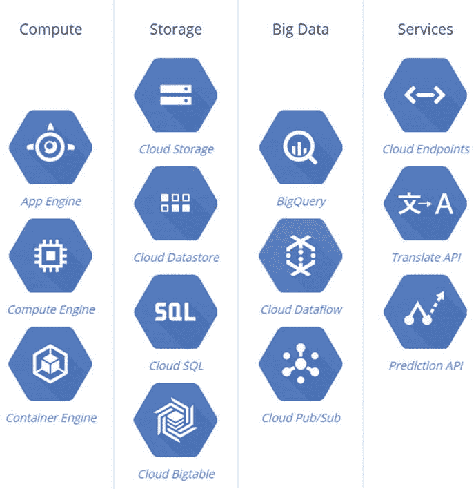

图 11-1. Google Cloud 平台服务信息图

本章主要关注 Google Cloud 平台中作为 `PaaS` 的 Google App Engine。

## Google App Engine（`GAE`）

Google App Engine 是 Google Cloud 平台提供的 `PaaS` 产品，允许您构建高度可扩展的 Web 应用程序和后端 `API`。App Engine 应用程序支持自动扩展，可以在流量激增时自动增加计算实例，并在不再需要时自动缩减计算实例。与 `IaaS` 不同，您无需通过运维（`Ops`）团队来配置和维护虚拟机。使用 App Engine，您只需使用 App Engine 提供的工具上传源代码，然后在云上运行应用程序，即可获得负载均衡和自动扩展能力。与 `IaaS` 模型相比，App Engine 为开发和管理应用程序提供了极大的操作敏捷性，因为您无需花费时间管理用于运行应用程序的虚拟机。

App Engine 支持以下语言环境：

*   `Python`
*   `Java`
*   `PHP`
*   `Go`

#### App Engine 的云服务

当您在 App Engine 上开发 Go 应用程序时，可以利用 Google Cloud 平台提供的各种云服务。Google Cloud 提供了用于从 App Engine 应用程序访问这些服务的 `API`。请记住，这些服务不仅限于 App Engine；您也可以将它们与 Google Compute Engine 和 Google Container Engine 一起使用。

以下部分描述了一些可用于 App Engine 应用程序的云服务。

##### 用户身份验证

您可以使用用户身份验证服务，让用户通过 Google 帐户或 `OpenID` 登录。

##### Cloud Datastore

`Cloud Datastore` 是一个无模式的 `NoSQL` 数据库，可用于持久化 App Engine 应用程序的数据。

##### Cloud Bigtable

`Cloud Bigtable` 是一个快速、完全托管、大规模可扩展的 `NoSQL` 数据库，非常适合用于处理大量数据的大规模 Web、移动、大数据和物联网应用程序的数据存储。如果 App Engine 应用程序需要一个高性能的大规模可扩展数据存储，`Cloud Bigtable` 比 `Cloud Datastore` 是更好的选择。

#### Google Cloud SQL

`Google Cloud SQL` 是 Google Cloud 平台中一个兼容 `MySQL` 的关系型数据库，作为托管服务提供。如果 App Engine 应用程序需要关系模型来进行数据持久化，您可以使用 `Google Cloud SQL`。

##### Memcache

在开发高性能应用程序时，缓存应用程序数据是提高应用程序性能的重要策略。`Memcache` 是一个分布式的内存数据缓存，可用于缓存应用程序数据，以提高 App Engine 应用程序的性能。

##### 搜索

搜索服务允许您对结构化数据（例如纯文本、`HTML`、`Atom` 摘要、数字、日期和地理位置）执行类似 Google 的搜索。

##### 流量分配

流量分配服务允许您将传入请求路由到不同的应用程序版本，运行 `A/B` 测试，并进行增量特性发布。


#### 日志记录

日志记录服务允许 App Engine 应用程序收集和存储日志。

#### 任务队列

任务队列服务通过使用稍后执行的小型离散任务，使 App Engine 应用程序能够在用户请求之外执行工作。

#### 安全扫描

安全扫描服务用于扫描应用程序的安全漏洞，例如 XSS 攻击。

### 适用于 Go 语言的 Google App Engine

App Engine 提供了一个 Go 运行时环境，用于在云端运行原生编译的 Go 代码，使您能够在 Google Cloud 基础设施上构建高度可扩展的 Web 应用程序。使用 App Engine，Go 应用程序运行在一个受保护的“沙盒”环境中，该环境允许 App Engine 环境将 Web 请求分发到多个服务器，并根据需求扩展服务器以实现按需伸缩。当您在 App Engine 的沙盒环境中开发应用程序时，无需配置服务器或花时间管理基础设施。App Engine 提供了一个部署工具，允许您将 Go 应用程序上传到云端。

### Go 开发环境

您可以使用适用于 Go 的 App Engine SDK 在 App Engine 上开发、测试和部署 Go 应用程序，该 SDK 提供了在 Google Cloud 上开发、测试和运行应用程序所需的工具和 API。App Engine Go SDK 包含一个开发 Web 服务器，允许您在本地计算机上运行 App Engine 应用程序，以便在上传到云端之前测试 Go 应用程序。

该开发 Web 服务器在开发环境中模拟了许多云服务，以便您可以在本地计算机上测试 App Engine 应用程序。这非常有用，因为在开发周期中，您无需在每次想要测试 App Engine 应用程序时都将其部署到云端。您可以在本地测试 App Engine 应用程序，而当您想要将应用程序部署到云平台的生产环境时，可以使用 App Engine 提供的工具来完成。此开发服务器应用程序模拟 App Engine 环境，包括 Google 账户数据存储的本地版本，并允许使用 App Engine API 直接从本地计算机获取 URL 和发送电子邮件。

Go SDK 使用了 Python SDK 开发工具的修改版本，并可在安装了 Python 2.7 的 Mac OS X、Linux 和 Windows 计算机上运行。因此，您可以从 Python 网站下载并安装适用于您平台的 Python 2.7。大多数 Mac OS X 用户已经安装了 Python 2.7。要在 App Engine 上开发 Go 应用程序，请下载并安装适用于您操作系统的 App Engine Go SDK。

`App Engine SDK for Go` 提供了一个名为 `goapp` 的命令行工具，该工具提供以下命令：

- `goapp serve`：`goapp serve` 命令在本地开发服务器上运行 Go 应用程序。
- `goapp deploy`：`goapp deploy` 命令用于将 Go 应用程序上传到 App Engine 生产环境。

您可以在 `App Engine SDK for Go` 的 zip 压缩包中的 `go_appengine` 目录下找到 `goapp` 工具。要从命令行调用 `goapp` 工具，请将 `go_appengine` 目录添加到 `PATH` 环境变量中。以下命令将 `go_appengine` 目录添加到 `PATH` 环境变量中：

```
export PATH=$HOME/go_appengine:$PATH
```

### 构建 App Engine 应用程序

一旦设置好 `App Engine SDK for Go`，您就可以开始在 App Engine 平台上开发 Web 应用程序了。尽管 App Engine 应用程序与独立的 Go Web 应用程序非常相似，但它们之间存在一些根本性的差异。主要区别在于 Go App Engine 运行时提供了一个特殊的 `main` 包，因此您不应将 `main` 包用于您的 App Engine 应用程序。相反，您可以将 HTTP 处理程序代码放在您选择的包中。Go 的 `http` 标准库包已针对 App Engine 运行时环境进行了轻微修改，以便在 `sandbox` 环境中运行 App Engine 应用程序。


#### 编写 HTTP 服务器

让我们编写一个示例 Web 应用服务器，以探索 Go 语言的 App Engine 平台。

清单 11-1 提供了在 App Engine 平台上的 HTTP 服务器。

**清单 11-1.** App Engine 的 Web 应用服务器

```go
package task

import (
    "fmt"
    "html/template"
    "net/http"
)

type Task struct {
    Name        string
    Description string
}

const taskForm = `
<html>
<body>
<form action="/task" method="post">
<p>Task Name: <input type="text" name="taskname" ></p>
<p> Description: <input type="text" name="description" ></p>
<p><input type="submit" value="Submit"></p>
</form>
</body>
</html>
`

const taskTemplateHTML = `
<html>
<body>
<p>New Task has been created:</p>
<div>Task: {{.Name}}</div>
<div>Description: {{.Description}}</div>
</body>
</html>
`

var taskTemplate = template.Must(template.New("task").Parse(taskTemplateHTML))

func init() {
    http.HandleFunc("/", index)
    http.HandleFunc("/task", task)
}

func index(w http.ResponseWriter, r *http.Request) {
    fmt.Fprint(w, taskForm)
}

func task(w http.ResponseWriter, r *http.Request) {
    task := Task{
        Name:        r.FormValue("taskname"),
        Description: r.FormValue("description"),
    }
    err := taskTemplate.Execute(w, task)
    if err != nil {
        http.Error(w, err.Error(), http.StatusInternalServerError)
    }
}
```

一个示例 Web 应用由多个 HTML 页面编写而成。HTTP 处理程序代码写在 `task` 包的 `init` 函数中，因为 App Engine 运行时提供了一个特殊的 `main` 包，你无法在应用代码中使用它。

#### 创建配置文件

要运行 App Engine 应用，你必须编写一个名为 `app.yaml` 的配置文件，该文件指定了运行应用所需的各种信息，包括应用标识符、运行时，以及应由 Go Web 应用处理的 URL。

让我们为 App Engine 应用编写一个配置文件（参见清单 11-2）。

**清单 11-2.** `app.yaml` 中的 App Engine 配置文件

```yaml
application: gae-demo
version: 1
runtime: go
api_version: go1
handlers:
- url: /.*
  script: _go_app
```

`app.yaml` 配置文件说明了关于 App Engine 应用的以下信息：

- 应用标识符是 `gae-demo`。当将应用部署到 App Engine 时，你必须指定一个唯一的标识符作为应用标识符。在开发服务器上运行应用时，你可以设置任意值作为应用标识符。这里，在开发服务器上运行期间，它被设置为 `gae-demo`。
- 应用代码的 `版本号` 是 1。如果在向 App Engine 上传新版本应用之前正确更新了版本，你可以使用管理控制台回滚到之前的版本。
- 此 Go 程序在 API 版本为 `go1` 的 Go `运行时` 环境中运行。
- 对路径匹配正则表达式 `/.*`（所有 URL）的 URL 的每个请求都应由 Go 程序处理。`_go_app` 值由开发 Web 服务器识别，并被生产环境 App Engine 服务器忽略。

#### 在开发服务器中测试应用

在前面的步骤中，已经创建了一个 App Engine 应用和一个配置文件。现在该应用已准备好，可以在 App Engine SDK 提供的开发 Web 服务器上运行。开发 Web 服务器允许你在开发环境中测试 App Engine 应用。

图 11-2 展示了 App Engine 应用的目录结构。

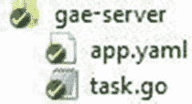

**图 11-2.** 应用目录结构

让我们通过运行 `goapp` 工具，在开发 Web 服务器上运行示例 Web 应用：

```shell
goapp serve gae-server/
```

通过提供 `gae-server` 目录的路径来运行开发 Web 服务器。如果你从应用目录运行 `goapp` 工具，则可以省略应用路径：

```shell
goapp serve
```

图 11-3 显示 Web 开发服务器已启动，正在监听端口 8080 上的请求，并为管理服务器监听端口 8000 上的请求。

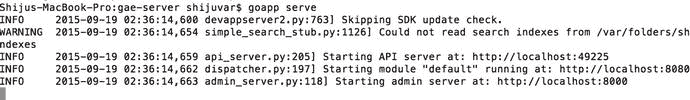

**图 11-3.** 运行开发 Web 服务器

通过在 Web 浏览器中访问以下 URL 来运行和测试 App Engine 应用：`http://localhost:8080/`。

图 11-4 显示该应用正在开发服务器上的 `http://localhost:8080/` 运行。

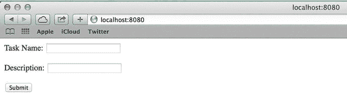

**图 11-4.** 开发 Web 服务器监听端口 8080

> **注意：** 你可以在此处获取有关管理 Web 服务器上 App Engine 实例的信息：`http://localhost:8000/`。

图 11-5 显示管理 Web 服务器正在提供有关在开发 Web 服务器中运行的 App Engine 实例的信息。

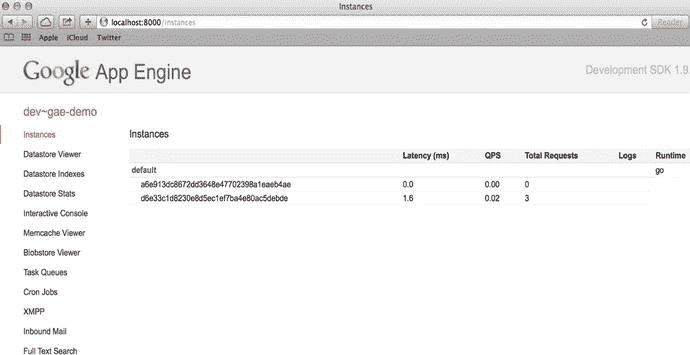

**图 11-5.** 管理服务器监听端口 8000

#### 将 App Engine 应用部署到云端

要将 App Engine 应用部署到云端，你必须在 Google Cloud 平台上为 App Engine 实例创建一个项目。你还必须提供一个唯一的项目 ID，该 ID 将用于将应用部署到云端。在 `app.yaml` 文件中将应用指定为 `项目 ID`。

你通过使用 Google Developers 控制台（参见 [`https://console.developers.google.com/`](https://console.developers.google.com/)）来创建和管理 App Engine 应用。你可以使用自己的 Google 帐户登录 Google Developers 控制台（Google Cloud 提供 60 天免费试用帐户）。

让我们在 Google Developers 控制台中创建一个 App Engine 项目。首先，点击 **创建项目** 按钮。然后你可以指定项目名称、项目 ID 和 App Engine 位置。

图 11-6 显示了 **新项目** 窗口，其中展示了 Google Developers 控制台中的新项目。

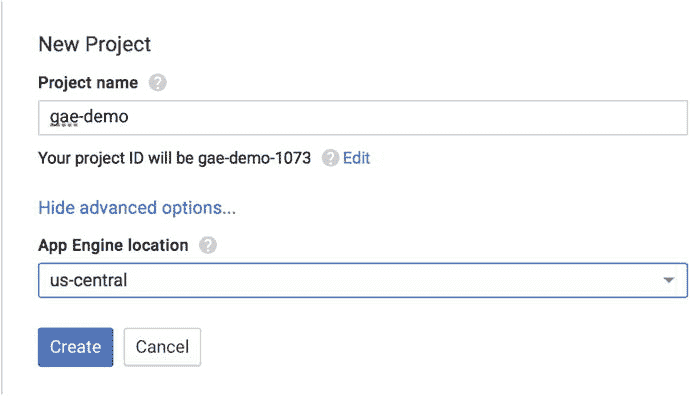

**图 11-6.** 创建新的 App Engine 项目

你在 Google Developers 控制台中创建一个具有唯一项目 ID 的 App Engine 项目（参见图 11-6）。项目 ID 是 `gae-demo-1073`，在部署应用之前，它将用于在 `app.yaml` 中指定应用标识符。

图 11-7 显示了 Google Developers 控制台中新建项目的详细信息。

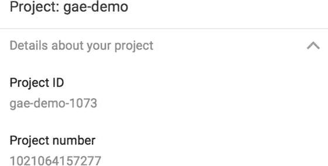

**图 11-7.** App Engine 项目的详细信息

让我们修改 `app.yaml` 配置文件中的应用标识符，以将应用部署到云环境中。

清单 11-3 提供了用于部署到 App Engine 生产环境的 `app.yaml` 文件。

**清单 11-3.** `app.yaml` 中作为应用的项目 ID

```yaml
application: gae-demo-1073
version: 1
runtime: go
api_version: go1
handlers:
- url: /.*
  script: _go_app
```

现在你可以通过从应用的 `根` 目录运行 `goapp` 工具，将 App Engine 应用部署到 Google Cloud 环境中：

```shell
goapp deploy
```


`goapp deploy`命令通过读取`app.yaml`中的配置，将 App Engine 应用部署到 Google Cloud 环境中。该命令从`app.yaml`中获取应用标识符，并将编译后的 Go 程序上传到关联的 App Engine 项目。部署应用时，系统会要求您提供 Google 账户凭证，以访问您在 Google Developer Console 中创建的 App Engine 应用。在 App Engine 生产环境中，会提供一个格式为`https://{project ID}.appspot.com`的 URL。您将收到如下 App Engine 应用的 URL：[`https://gae-demo-1073.appspot.com/`](https://gae-demo-1073.appspot.com/)。

您可以通过访问生产环境的 URL 来验证应用在 Cloud 环境中的运行情况。图 11-8 和 11-9 展示了 App Engine 应用成功运行于 Google App Engine 生产环境中的状态。

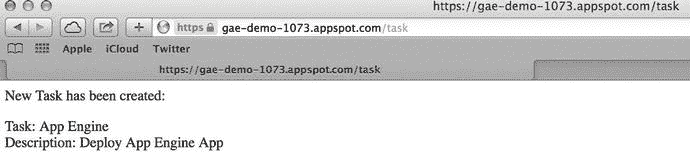

图 11-9. App Engine 应用中 Task 表单的响应页面

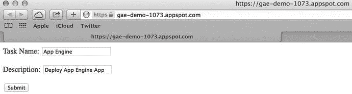

图 11-8. App Engine 应用中的 Task 表单

### 创建混合型独立/App Engine 应用

App Engine 应用与独立应用之间的根本区别非常少。App Engine 环境提供了一个特殊的`main`包，因此您无法为 App Engine 应用使用它。您可以在为 App Engine 应用选择的 Go 包的`init`函数中编写处理逻辑。当开发独立应用时，您需要编写`main`包。

在某些场景下，编写能够在独立环境和 App Engine 环境中运行的混合应用会非常有帮助。假设您想要编写一个 Go Web 应用，该应用需要同时在本地服务器和 Google Cloud 上进行测试和部署。编写一个能在两种环境中运行的混合应用，对于在无需每次部署前修改源代码的情况下，在多个环境中测试和部署应用来说，是非常有用的。您可以通过使用构建约束（build constraints）来开发适用于独立环境和 App Engine 环境的混合应用。

注意

构建约束（也称为构建标签）指定了文件应被包含在包中的条件。构建约束必须作为行注释出现在源文件顶部附近，并以`// +build`开头。构建约束可以出现在任何类型的源文件中，不限于 Go 源文件。

App Engine SDK 提供了一个新的构建约束`appengine`，在编译源代码时，可以用它来区分独立环境和 App Engine 环境中的源代码。通过使用`appengine`构建约束，您可以根据构建环境在构建过程中排除某些源文件。例如，当您使用 App Engine SDK 构建应用源代码时，可以忽略写在`main`包中的源代码。

如果您想让 Go 工具忽略使用 App Engine SDK 构建的源文件，请在源文件顶部添加以下内容：

`// +build appengine`

以下构建约束指定您希望使用 Go 工具进行构建，因此这些源文件将不会在 App Engine SDK 中被编译：

`// +build !appengine`

让我们重写列表 11-1 中的 Web 应用，使其成为一个既适用于 App Engine 环境也适用于独立环境的混合应用。在此混合实现中，您将创建独立的源文件来处理 HTTP 处理逻辑，这些文件使用构建约束来区分 App Engine 应用和独立应用，并将公共逻辑放在一个共享库中。

图 11-10 展示了混合应用的目录结构。

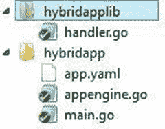

图 11-10. 混合应用的目录结构

`main.go`将由 Go 工具构建，而`appengine.go`将由 App Engine SDK 构建。公共逻辑被放置在一个名为`hybridapplib`的共享库中。

列表 11-4 提供了`hybridapplib`的实现，该库用于处理公共逻辑。

列表 11-4. hybridapplib 中 handler.go 的共享逻辑

```
package hybridapplib

import (
	"fmt"
	"html/template"
	"net/http"
)

type Task struct {
	Name        string
	Description string
}

const taskForm = `
<html>
<body>
<form action="/task" method="post">
<p>Task Name: <input type="text" name="taskname" ></p>
<p> Description: <input type="text" name="description" ></p>
<p><input type="submit" value="Submit"></p>
</form>
</body>
</html>
`

const taskTemplateHTML = `
<html>
<body>
<p>New Task has been created:</p>
<div>Task: {{.Name}}</div>
<div>Description: {{.Description}}</div>
</body>
</html>
`

var taskTemplate = template.Must(template.New("task").Parse(taskTemplateHTML))

func init() {
	http.HandleFunc("/", index)
	http.HandleFunc("/task", task)
}

func index(w http.ResponseWriter, r *http.Request) {
	fmt.Fprint(w, taskForm)
}

func task(w http.ResponseWriter, r *http.Request) {
	task := Task{
		Name:        r.FormValue("taskname"),
		Description: r.FormValue("description"),
	}
	err := taskTemplate.Execute(w, task)
	if err != nil {
		http.Error(w, err.Error(), http.StatusInternalServerError)
	}
}
```

HTTP 处理逻辑被放置在`handler.go`的`init`函数中。`handler.go`源文件中的代码对于独立应用和 App Engine 应用是通用的。

列表 11-5 提供了`main`包中的`main.go`源文件，该文件提供了`main`函数。它由 Go 工具构建。

列表 11-5. main 包中的 main.go

```
// +build !appengine

package main

import (
	"net/http"
	_ "github.com/shijuvar/go-web/chapter-11/hybridapplib"
)

func main() {
	http.ListenAndServe("localhost:8080", nil)
}
```

在`main.go`文件中使用了构建约束`!appengine`，以便在使用 Go 工具构建应用时包含该文件。当使用 Go 工具构建应用时，`main.go`文件被视为`main`包的一部分。在`main`函数中，调用了`http`包的`ListenAndServe`函数来在本地服务器上启动 HTTP 服务器。空白标识符（`_`）被用作`hybridapplib`包的别名，以便在不引用程序中的包标识符的情况下调用其`init`函数。

当您在 App Engine 上运行应用时，不能使用`main`包。列表 11-6 提供了在 App Engine 环境中构建应用的实现，其中调用了`hybridapplib`包的`init`函数。

列表 11-6. task 包中的 appengine.go

```
// +build appengine

package task

import (
	_ "github.com/shijuvar/go-web/chapter-11/hybridapplib"
)

func init() {
}
```

在`appengine.go`文件中使用了构建约束`appengine`，以便在使用 App Engine SDK 构建应用时包含该文件。`appengine.go`文件被视为`task`包的一部分。由于 HTTP 处理代码已在`hybridapplib`包中实现，此源文件保持无任何实现。

当您使用 Go 工具构建应用时，`main.go`源文件会被包含以编译 Go 包，而`appengine.go`源文件则会被排除在编译之外。当使用 App Engine SDK 构建应用时，通过从包的`init`函数中获取处理逻辑，HTTP 服务器在 App Engine 环境中运行，并且`main.go`文件会被忽略。


当您使用各种云服务开发 App Engine 应用时，这种混合方法可能并不实用。例如，假设您想为您的 App Engine 应用使用 Cloud `Datastore` 服务。您可以在本地计算机上测试该应用，因为 App Engine 网络开发服务器会模拟 Datastore，但您无法在本地环境中运行此应用。

### 使用云原生数据库

App Engine 作为 Google Cloud 平台的平台即服务，允许您构建大规模可扩展的网络应用，而无需担心 IT 基础设施的设置。如前面章节所述，Go 开发者可以通过使用 Go 语言的 App Engine SDK 在 App Engine 上开发、测试和部署网络应用，并且这些应用支持自动扩缩容。当您开发可扩展应用时，将数据持久化到可扩展的存储机制中对于实现可扩展性和高可用性至关重要。

当您为 Google Cloud 平台开发应用时，您可以使用任意类型的数据库。第 8 章和第 9 章讨论了 MongoDB，一种 NoSQL 数据存储。您可以设置一个类似 MongoDB 的数据库，它可以与在 Google Cloud 平台上运行的网络应用配合使用。要在 Google Cloud 上使用诸如 MongoDB 之类的数据库，您需要获取一台虚拟机作为 Google Compute Engine (GCE) 服务，该服务是 Google Cloud 中的 IaaS 平台。然后，您需要在该虚拟机实例上设置数据库。这需要 IaaS 实例；管理和扩缩这些数据库可能需要大量的人工干预。

Google Cloud 提供了不同的托管型数据存储服务，这些服务可以与网络应用一起使用，而无需担心设置和管理 IaaS 实例。因此，您不需要为在云上运行的数据库配备运维人员，这为您的 Google Cloud 应用提供了极大的运营灵活性。

在 Google Cloud Platform 中，您可以使用以下数据库来持久化结构化数据：

*   **Google Cloud SQL**：一个兼容 MySQL 的关系型数据库，适用于云端规模。
*   **Google Cloud Datastore**：一个提供可扩展存储的 NoSQL 数据存储。
*   **Google Cloud Bigtable**：一个可扩展到数十亿行和数千列、支持 PB 级数据的 NoSQL 数据库。它是大数据解决方案的理想数据存储。

Google Cloud 既提供 NoSQL 数据库，也提供关系型数据库。Google Cloud 为 NoSQL 提供了两种选择：**Google Cloud Datastore** 和 **Google Cloud Bigtable**。Datastore 和 Bigtable 都旨在提供大规模可扩展的数据存储。

尽管两者都旨在实现大规模可扩展，但在处理 TB 级数据时，Bigtable 是更好的选择。Bigtable 专为与 HBase 兼容而设计，并且可以通过 HBase 1.0 API 的扩展进行访问，因此它与大数据生态系统兼容。在大数据解决方案中，您可以将海量数据存储在 Bigtable 中，并使用 Hadoop 生态系统中的分析工具对其进行分析。

Cloud Datastore 构建在 Bigtable 之上。Datastore 通过复制和数据同步提供高可用性；而 Bigtable 不复制数据，并且在单个数据中心区域内运行。Datastore 支持 ACID 事务和使用 GQL（一种用于从 Datastore 检索实体的类似 SQL 的语言）进行类似 SQL 的查询。对于 App Engine 网络应用来说，Cloud Datastore 是一个绝佳的数据存储选择。

以下部分描述了如何将 Google Cloud Datastore 与 App Engine 应用一起使用。

#### Google Cloud Datastore 简介

Google Cloud Datastore 是一个无模式的 NoSQL 数据存储，为应用提供健壮、可扩展的存储。它具有以下特性：

*   无计划停机
*   原子事务
*   读写操作的高可用性
*   读取和祖先查询的强一致性
*   所有其他查询的最终一致性


##### 数据存储最重要的事

`Datastore` 最重要的特性是它能在多个数据中心区域间复制数据，从而为读写操作提供高可用性。在将`Datastore`与`Bigtable`进行比较时，请注意`Bigtable`运行在单个数据中心上。

##### 实体

`Cloud Datastore` 保存称为实体的数据对象。`Go` 结构体的值会被持久化到实体中，这些实体包含一个或多个属性。`Go` 结构体的字段会成为实体的属性。属性值的类型取自结构体字段。

与许多`NoSQL`数据库一样，`Cloud Datastore` 是一种无模式数据库，这意味着同一实体的数据对象可以拥有不同的属性，且同名属性可以拥有不同的值类型。

`Cloud Datastore` 是一种演进型`NoSQL`数据库，相比传统`NoSQL`数据库具有许多优势。`Cloud Datastore` 允许您使用树状结构的祖先路径来存储分层数据。

##### 祖先与后代

在`Datastore`中创建实体时，您可以选择性地指定另一个实体作为其父实体。通过指定父实体，您可以关联分层结构的数据。如果不指定任何父实体，则该实体被指定为根实体。实体的父级、父级的父级等递归关系构成了其祖先。实体的子级、子级的子级等递归关系构成了其后代。根实体及其所有后代属于同一个实体组。理解实体组的概念有助于您高效地执行查询。

#### 使用 Cloud Datastore

当您使用`App Engine`在`Google Cloud`平台上开发高度可扩展的`云原生`应用时，`Google Cloud Datastore` 是一个绝佳的数据存储选择。`App Engine` 和 `Cloud Datastore` 都能为应用程序提供巨大的可扩展性，而开发人员无需管理基础设施或处理运维工作。当您在`App Engine`应用中使用`Datastore`时，无需进行任何配置即可使用。您只需使用`Cloud Datastore`的`Go`包，即可向`Datastore`持久化数据和查询数据。

让我们创建一个以`Cloud Datastore`作为数据库的示例`App Engine` Web 应用。此示例应用使用简单数据模型，不涉及祖先和后代。

以下`Go`包用于该`App Engine`应用：

- `google.golang.org/appengine`：`appengine`包提供`Google App Engine`的基本功能。
- `google.golang.org/appengine/datastore`：`datastore`包为`App Engine`的数据存储服务提供客户端。

您可以使用`goapp`工具安装这些包：

```
goapp get google.golang.org/appengine
goapp get google.golang.org/appengine/datastore
```

该示例应用程序提供以下功能：

- 应用程序首页显示任务列表。
- 用户可以通过选择`创建任务`选项来创建新任务，该选项会显示一个用于创建新任务的表单。

清单 11-7 提供了一个使用`Cloud Datastore`的`App Engine`应用示例。

## 清单 11-7. 使用 Cloud Datastore 的 App Engine 应用

```go
package task

import (
    "fmt"
    "html/template"
    "net/http"
    "time"

    "google.golang.org/appengine"
    "google.golang.org/appengine/datastore"
)

type Task struct {
    Name        string
    Description string
    CreatedOn   time.Time
}

const taskForm = `
<html>
<body>
<form action="/save" method="post">
<p>Task Name: <input type="text" name="taskname" ></p>
<p> Description: <input type="text" name="description" ></p>
<p><input type="submit" value="Submit"></p>
</form>
</body>
</html>
`

const taskListTmplHTML = `
<html>
<body>
<p>Task List</p>
{{range .}}
<p>{{.Name}} - {{.Description}}</p>
{{end}}
<p><a href="/create">Create task</a> </p>
</body>
</html>
`

var taskListTemplate = template.Must(template.New("taskList").Parse(taskListTmplHTML))

func init() {
```


```go
http.HandleFunc("/", index)
http.HandleFunc("/create", create)
http.HandleFunc("/save", save)
}

func index(w http.ResponseWriter, r *http.Request) {
	c := appengine.NewContext(r)
	q := datastore.NewQuery("tasks").
		Order("-CreatedOn")
	var tasks []Task
	_, err := q.GetAll(c, &tasks)
	if err != nil {
		http.Error(w, err.Error(), http.StatusInternalServerError)
	}
	if err := taskListTemplate.Execute(w, tasks); err != nil {
		http.Error(w, err.Error(), http.StatusInternalServerError)
	}
}

func create(w http.ResponseWriter, r *http.Request) {
	fmt.Fprint(w, taskForm)
}

func save(w http.ResponseWriter, r *http.Request) {
	task := Task{
		Name:        r.FormValue("taskname"),
		Description: r.FormValue("description"),
		CreatedOn:   time.Now(),
	}
	c := appengine.NewContext(r)
	_, err := datastore.Put(c, datastore.NewIncompleteKey(c, "tasks", nil), &task)
	if err != nil {
		http.Error(w, err.Error(), http.StatusInternalServerError)
		return
	}
	http.Redirect(w, r, "/", http.StatusMovedPermanently)
}
```

以下包被导入以配合 App Engine 应用程序使用：

- `google.golang.org/appengine`
- `google.golang.org/appengine/datastore`

声明了一个 `Task struct`，用于将值持久化到 Datastore 实体中。

##### 创建新实体

`Save` 应用处理器创建一个新的 `Task` 对象，并将值持久化到名为 `"tasks"` 的 Datastore 实体中。调用了 `appengine` 包中的 `NewContext` 函数，该函数返回一个用于处理进行中 HTTP 请求的上下文。你必须提供一个上下文对象来与 Datastore 交互。

`datastore.Put` 函数通过提供结构体实例和实体键名的键，在 Datastore 中创建新实体。`Task` 结构体类型实例被提供以保存到 Datastore。

提供键名有多种选择。例如，可以通过向 `datastore.NewKey` 函数传递一个非空字符串 ID 来提供键名，如下所示：

```go
c := appengine.NewContext(r)
key := datastore.NewKey(c, "tasks", "taskgae", 0, nil)
_, err := datastore.Put(c, key, &task)
```

你也可以提供一个空键名，或使用 `datastore.NewIncompleteKey` 函数传递一个新的不完整键。`NewIncompleteKey` 函数创建了一个新的不完整键。Datastore 会自动为实体键生成唯一的数字 ID。

在示例程序中，使用不完整键将记录插入到 `"tasks"` 实体中：

```go
c := appengine.NewContext(r)
key := datastore.NewIncompleteKey(c, "tasks", nil)
_, err := datastore.Put(c, key, &task)
```

`datastore.Put` 函数返回一个 `datastore.PendingKey`，可以通过使用成功事务提交的返回值将其解析为 `datastore.Key` 值。如果键是不完整键，返回的 `PendingKey` 将解析为数据存储生成的唯一键。`PendingKey` 表示新插入实体的键。可以通过调用 `Commit` 的 `Key` 方法将其解析为 `datastore.Key`。

你也可以使用 `datastore.Put` 函数更新现有实体。当更新现有实体时，修改结构体的字段，然后调用 `datastore.Put` 函数更新值。这将覆盖现有实体。

##### 查询 Datastore

Go Datastore API 提供了 Go 语言惯用的方式来查询 Datastore 中的数据。它提供了一个 `datastore.Query` 类型，用于准备和执行查询以从 App Engine Datastore 检索实体。`NewQuery` 函数准备了一个查询对象：

```go
q := datastore.NewQuery("tasks").
    Order("-CreatedOn")
```

Datastore 查询包括以下内容：

-   查询所针对的一个实体（[实体种类](https://cloud.google.com/appengine/docs/go/datastore/entities#Go_Kinds_and_identifiers)）
-   基于实体属性值、键和祖先的零个或多个筛选器
-   用于对结果进行排序的零个或多个排序顺序


##### 运行应用程序

让我们使用 `goapp` 工具将 App Engine 应用程序部署到 Google Cloud 中，并运行该应用程序。

图 11-11 展示了应用程序的索引页面。在此页面中，App Engine 应用程序查询 `"tasks"` 实体并显示数据。该页面显示了通过用于创建新任务的表单插入两个任务后的任务列表。

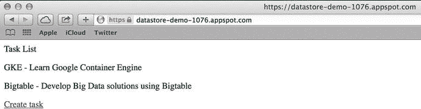

*图 11-11. 任务列表页面*

当你选择“创建任务”链接时，会看到一个允许你创建任务的页面（见图 11-12）。

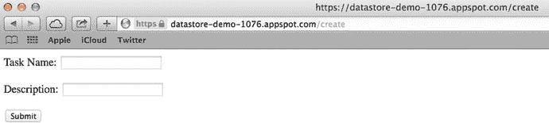

*图 11-12. 创建任务表单*

你可以通过 Google Developers Console 的 Web 界面查询 Datastore 数据。图 11-13 展示了 Google Developers Console 中 `"tasks"` 实体的数据。

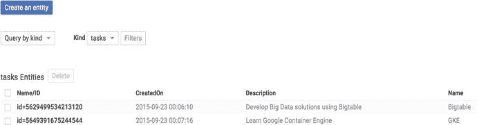

*图 11-13. 来自 Google Developers Console 的数据*

可以看到，当数据对象放入实体时，会分配一个唯一 ID 作为实体键。

### 使用 Cloud Endpoints 构建后端 API

在 Google Cloud 中，App Engine 平台允许 Go 开发者在 App Engine 的沙盒环境中构建后端 API 和 Web 应用程序，该沙盒环境支持自动扩缩。使用 App Engine，你可以利用 Google Cloud 平台提供的工具和 SDK，在 Google 的基础设施上构建大规模可扩展的云原生应用程序。Google Cloud Endpoints 是一项 App Engine 服务，可让你轻松为 Web 客户端和移动客户端创建后端 API。

Google Cloud Endpoints 提供了工具、库和服务，用于从 App Engine 应用程序快速生成 API 和客户端库。Cloud Endpoints 是一个在 App Engine 环境中运行的应用程序，但它为构建 API 后端提供了额外功能，其客户端库在构建移动后端系统时提高了开发者的生产力。

你可以在不借助 Cloud Endpoints 的情况下，直接在 App Engine 平台上创建后端 API。不过，虽然可以使用普通的 App Engine 应用程序创建后端 API，但 Cloud Endpoints 通过提供额外功能简化了开发过程。Cloud Endpoints 允许你为 iOS、Android、JavaScript 和 Dart 生成本地客户端库。由于各种客户端应用程序都可使用原生生成的库，因此你可以快速构建客户端应用程序，而无需编写原生包装器来与后端 API 通信。对于后端开发者而言，这消除了开发 RESTful API 过程中的一些复杂性。

当你使用 Cloud Endpoints 构建 API 时，无需编写任何关于 HTTP `Request` 和 `Response` 对象的内容。你可以像编写普通 Go 函数一样编写 API 方法，无需使用这些对象，并通过使用 Cloud Endpoints 提供的库将其转换为 HTTP API。

图 11-14 展示了 Cloud Endpoints 应用程序的基本架构。


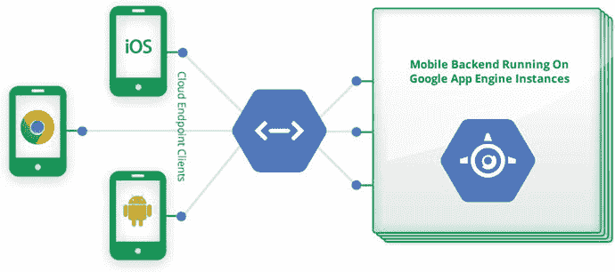

**图 11-14.** Cloud Endpoints 应用程序的基本架构

图 11-14 展示了运行在 App Engine 实例上的后端 API，这些实例作为移动客户端和 JavaScript Web 客户端的后端运行。后端应用的操作通过端点（endpoints）开放给客户端应用，这些端点暴露了一个 API，客户端可以使用 Cloud Endpoints 生成的原生库来调用该 API。Cloud Endpoints 能够提高后端 API 开发者和客户端应用开发者的开发效率。

在第 9 章中，我们开发了一个 RESTful API 作为客户端应用的后端。通过使用 Cloud Endpoints，在 Google Cloud 平台上构建 RESTful API 时，你可以提高开发效率。

#### 适用于 Go 的 Cloud Endpoints

借助 App Engine 及其 SDK 和 Go 工具，你可以使用 Go 构建 Cloud Endpoints 后端 API。你可以使用 Google Cloud 平台提供的 `endpoints` 包，用 Go 语言创建 Cloud Endpoints 后端。

##### 安装 endpoints 包

要安装 `endpoints` 包，请使用 Google App Engine SDK for Go 提供的 `goapp` 工具：

```
goapp get github.com/GoogleCloudPlatform/go-endpoints/endpoints
```

要在 Go 程序中使用 `endpoints` 包，必须在导入列表中包含该包：

```
import (
    "github.com/GoogleCloudPlatform/go-endpoints/endpoints"
)
```

通过使用 `endpoints` 包，你可以快速使用 Go 编写后端 API。

#### 使用 Go 的 Cloud Endpoints 后端 API

在本节中，你将通过一个示例来了解如何使用 Cloud Endpoints 和 Go 编写后端 API。像普通的 App Engine 应用程序一样，你的 Cloud Endpoints 应用程序也可以利用 Google Cloud 提供的各种云服务。在这个示例应用程序中，我们使用 Cloud Datastore 作为持久化存储。

我们来声明一个结构体，用于描述应用程序的数据模型。代码清单 11-8 提供了一个结构体类型，用作 Datastore 实体。

**代码清单 11-8.** 应用程序数据模型

```
// Task 是一个数据存储实体
type Task struct {
    Key         *datastore.Key `json:"id" datastore:"-"`
    Name        string         `json:"name" endpoints:"req"`
    Description string         `json:"description" datastore:",noindex" endpoints:"req"`
    CreatedOn   time.Time      `json:"createdon,omitempty"`
}
```

创建了一个名为 `Task` 的结构体类型，用于描述 Cloud Endpoints 应用程序的应用数据。`Task` 结构体的值会持久化到 Datastore 中，并为 `Task` 结构体的字段提供了必要的标签，以便与 JSON 编码和 Datastore 配合使用。

示例应用程序提供了两个 API 方法：`List` 方法从 Datastore 返回 `Task` 数据列表，`Add` 方法允许你向 Datastore 中创建一个新的 `Task` 实体。我们通过一个稍后可以注册到 Endpoints 的结构体类型来编写这些方法。

代码清单 11-9 提供了包含结构体类型和 API 方法的 Go 源文件，这些方法将作为 Cloud Endpoints 提供的 API 的方法暴露出来。

**代码清单 11-9.** 暴露 API 方法的 TaskService

```
package cloudendpoint

import (
    "time"
    "golang.org/x/net/context"
    "google.golang.org/appengine/datastore"
)

// Task 是一个数据存储实体
type Task struct {
    Key         *datastore.Key `json:"id" datastore:"-"`
    Name        string         `json:"name" endpoints:"req"`
    Description string         `json:"description" datastore:",noindex" endpoints:"req"`
    CreatedOn   time.Time      `json:"createdon,omitempty"`
}

// Tasks 是 TaskService.List 方法的响应类型
type Tasks struct {
    Tasks []Task `json:"tasks"`
}

// 结构体用于添加 API 方法
type TaskService struct {
}
```


```go
// List 从 Datastore 返回所有现有任务的列表。
func (ts *TaskService) List(c context.Context) (*Tasks, error) {
    tasks := []Task{}
    keys, err := datastore.NewQuery("tasks").Order("-CreatedOn").GetAll(c, &tasks)
    if err != nil {
        return nil, err
    }
    for i, k := range keys {
        tasks[i].Key = k
    }
    return &Tasks{tasks}, nil
}

// Add 向 Datastore 插入一个新的 Task
func (ts *TaskService) Add(c context.Context, t *Task) error {
    t.CreatedOn = time.Now()
    key := datastore.NewIncompleteKey(c, "tasks", nil)
    _, err := datastore.Put(c, key, t)
    return err
}
```

编写了一个名为 `TaskService` 的结构类型，并添加了两个方法：`List` 和 `Add`。这些方法后续将通过 `endpoints` 包以后端 API 操作的形式对外暴露。尽管这两个方法将作为 HTTP API 的操作暴露，但它们均未直接使用 HTTP 的 `Request` 和 `Response` 对象。

`context` 包用于承载请求作用域的值。`List` 方法从 `"tasks"` 数据存储实体中查询数据。`GetAll` 方法执行查询并返回所有匹配的键。返回的键集合用于为 `Task` 结构体的 `Key` 字段赋值。

`Add` 方法向 `"tasks"` 数据存储实体中添加新的 `Task`。在常规的 HTTP API 应用程序中，会读取来自 HTTP 请求主体的传入消息，并将 JSON（或 XML）值解码为结构类型。在 `Add` 方法中，提供了一个 `Task` 类型的参数，以便从 HTTP 请求主体中获取值并填充到该参数中。在这里，你不需要编写任何逻辑或将传入的值解析为结构类型；而是提供了一个用于从 HTTP 请求中绑定值的参数。当你使用 **Cloud Endpoints** 构建后端 API 时，可以提高开发者的生产力，因为 Cloud Endpoints 允许你避免编写编写 RESTful API 所需的样板代码。

目前，`List` 和 `Add` 方法还是普通的函数。你需要使用 Cloud Endpoints 将它们变为 HTTP API 的操作。清单 11-10 提供了将 `TaskService` 的方法注册到 Endpoints 的实现，以便这些方法可以作为 HTTP API 的操作暴露出来。

**清单 11-10.** 将 TaskService 注册到 HTTP 服务器

```go
package cloudendpoint

import (
    "log"
    "github.com/GoogleCloudPlatform/go-endpoints/endpoints"
)

// 注册 API 端点
func init() {
    taskService := &TaskService{}
    // 将 TaskService 添加到服务器。
    api, err := endpoints.RegisterService(
        taskService,
        "tasks",
        "v1",
        "Tasks API",
        true,
    )
    if err != nil {
        log.Fatalf("Register service: %v", err)
    }

    // 获取 List 方法的 ServiceMethod 的 MethodInfo
    info := api.MethodByName("List").Info()
    // 为 MethodInfo 提供值 - 名称、HTTP 方法和路径。
    info.Name, info.HTTPMethod, info.Path = "listTasks", "GET", "tasks"

    // 获取 Add 方法的 ServiceMethod 的 MethodInfo
    info = api.MethodByName("Add").Info()
    info.Name, info.HTTPMethod, info.Path = "addTask", "POST", "tasks"

    // 使用默认的 serve mux 调用 DefaultServer 的 HandleHttp 方法
    endpoints.HandleHTTP()
}
```

在 `init` 函数中，使用 `endpoints` 包的 `RegisterService` 函数将 `TaskService` 的方法注册到 HTTP 服务器。`RegisterService` 函数使用 `DefaultServer`（默认的 RPC 服务器）将新服务添加到服务器。`"tasks"` 作为服务名称提供，`"v1"` 作为 HTTP 服务的 API 版本：

```go
api, err := endpoints.RegisterService(
    taskService,
    "tasks",
    "v1",
    "Tasks API",
    true,
)
```

为 HTTP 服务的方法提供了信息。这些信息用于为后端 API 提供发现文档：

```go
// 获取 List 方法的 ServiceMethod 的 MethodInfo
info := api.MethodByName("List").Info()
// 为 MethodInfo 提供值 - 名称、HTTP 方法和路径。
info.Name, info.HTTPMethod, info.Path = "listTasks", "GET", "List Tasks"
```


// 获取 ServiceMethod 中 Add 方法的 MethodInfo
`info = api.MethodByName("Add").Info()`
`info.Name, info.HTTPMethod, info.Path = "addTask", "POST", "Add a new Task"`

最后，调用了 `endpoints` 包中的 `HandleHTTP` 函数，该函数使用默认的 `http.ServeMux` 调用了 `DefaultServer HandleHttp` 方法：

// 使用默认的 serve mux 调用 DefaultServer 的 HandleHttp 方法
`endpoints.HandleHTTP()`

现在，`TaskService` 的方法已作为 RESTful API 的 HTTP 端点提供，可用于构建 Web 和移动客户端应用程序。由于 Cloud Endpoints 应用是一个 App Engine 应用，让我们添加一个 `app.yaml` 文件，供 `goapp` 工具使用，并作为 App Engine 应用的配置。

清单 11-11 提供了用于 App Engine 应用的 `app.yaml` 文件。

**清单 11-11.** 用于 App Engine 应用的 `app.yaml` 文件

`application: go-endpoints`
`version: v1`
`threadsafe: true`
`runtime: go`
`api_version: go1`
`handlers:`
`- url: /.*`
`script: _go_app`
`# 重要！尽管上面有一个全能匹配的路由，`
`# 但没有这两行，它将无法工作。`
`# 请确保你有这个：`
`- url: /_ah/spi/.*`
`script: _go_app`

Cloud Endpoints 应用现已准备好，可在开发 Web 服务器和 App Engine 生产环境中运行。

#### 运行 Cloud Endpoints 后端 API

App Engine Cloud Endpoints 应用已完成。让我们在本地开发服务器中使用 `goapp` 工具运行该应用。从应用的 `root` 目录运行 `goapp` 工具：

`goapp serve`

该应用在本地 Web 开发服务器中运行。API 的发现文档可在 `http://localhost:8080/_ah/api/discovery/v1/apis/tasks/v1/rest` 获取。

API 资源管理器可在 `http://localhost:8080/_ah/api/explorer` 获取。

让我们在浏览器窗口中导航到 API 资源管理器。图 11-15 展示了显示 API 服务的 API 资源管理器。

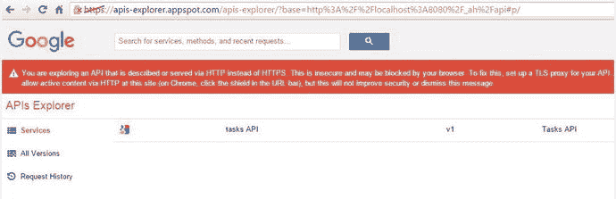

**图 11-15.** 在浏览器窗口中运行的 API 资源管理器

当你点击任何可用的 API 服务时，你会导航到一个窗口，在其中可以查看该服务的可用操作。图 11-16 展示了 tasks API 的操作。

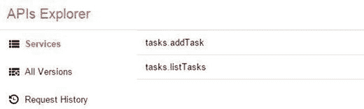

**图 11-16.** tasks API 的操作

当你点击任何操作时，你会导航到一个窗口，在其中可以通过在输入窗口中提供请求数据并点击“执行”按钮来测试 API 操作。

图 11-17 展示了用于测试 `addTask` 操作的输入窗口。

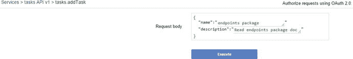

**图 11-17.** `addTask` 操作的输入窗口

图 11-18 展示了 `addTask` 操作的 HTTP `Request` 和 `Response`。

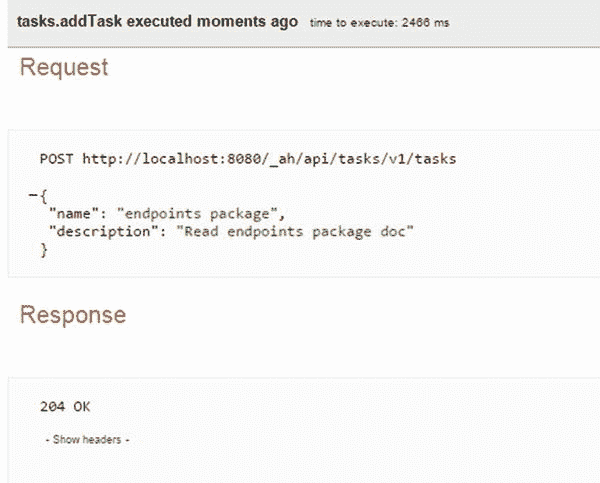

**图 11-18.** `addTask` 操作的 HTTP `Request` 和 `Response`

`addTask` 操作是一个对 URI 端点 `http://localhost:8080/_ah/api/tasks/v1/tasks` 的 HTTP `Post` 请求。

图 11-19 展示了 `listTasks` 操作的 HTTP `Request` 和 `Response`。在 `addTask` 操作执行三次后，再执行 `listTasks` 操作，以便你能看到三条记录。

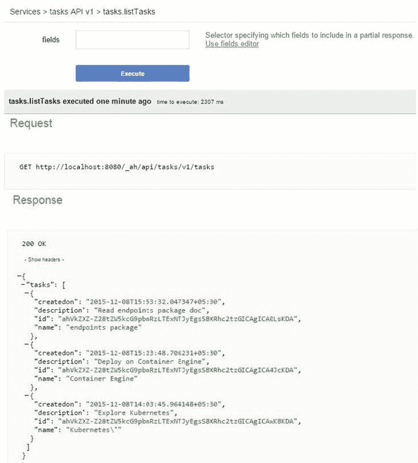

**图 11-19.** `listTasks` 操作的 HTTP `Request` 和 `Response`

`listTasks` 操作是一个对 URI 端点 `http://localhost:8080/_ah/api/tasks/v1/tasks` 的 HTTP `Get` 请求。

该应用已在由 Google App Engine SDK for Go 提供的本地 Web 开发服务器中进行了测试。你可以使用 `goapp` 工具将 Cloud Endpoints 应用部署到 App Engine 的生产环境中。将 Cloud Endpoints 应用部署到生产环境的过程与普通 App Engine 应用完全相同。你必须在 `app.yaml` 文件中提供应用程序 ID 才能部署该应用。第 11.4.4 节提供了在 Google Developer Console 中创建项目和获取应用程序 ID 的说明。要将应用部署到生产环境，请从应用的 `root` 目录运行 `goapp` 工具：

`goapp deploy`

此命令将 Cloud Endpoints 应用部署到由 Google Cloud 平台驱动的 App Engine 生产环境中。

#### 生成客户端库

Cloud Endpoints 应用不仅支持编写后端 API，还为客户端应用提供了有用的功能。Cloud Endpoints 允许你生成用于从客户端应用程序访问 API 的客户端库，并为 iOS、Android、Dart 和 JavaScript 生成本地库。

要为 iOS 生成 tasks API 的客户端库，请在终端窗口中运行以下命令：

```
